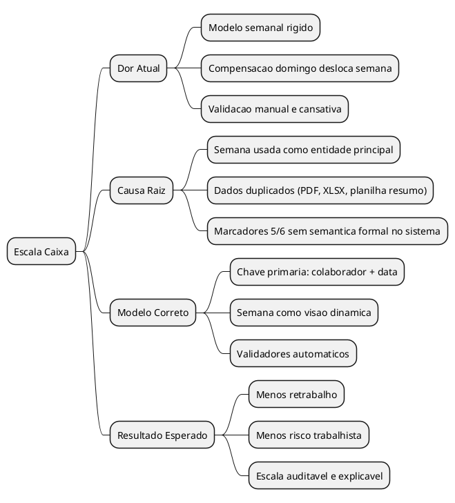
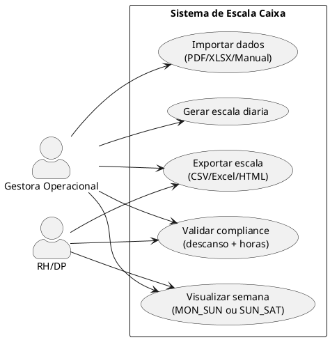
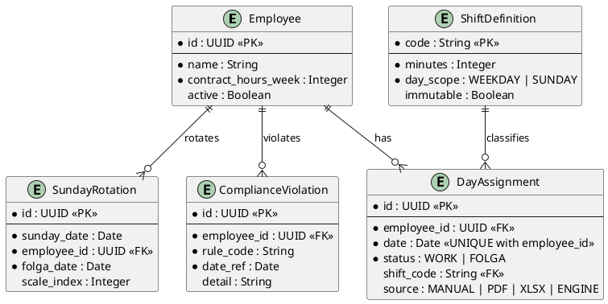
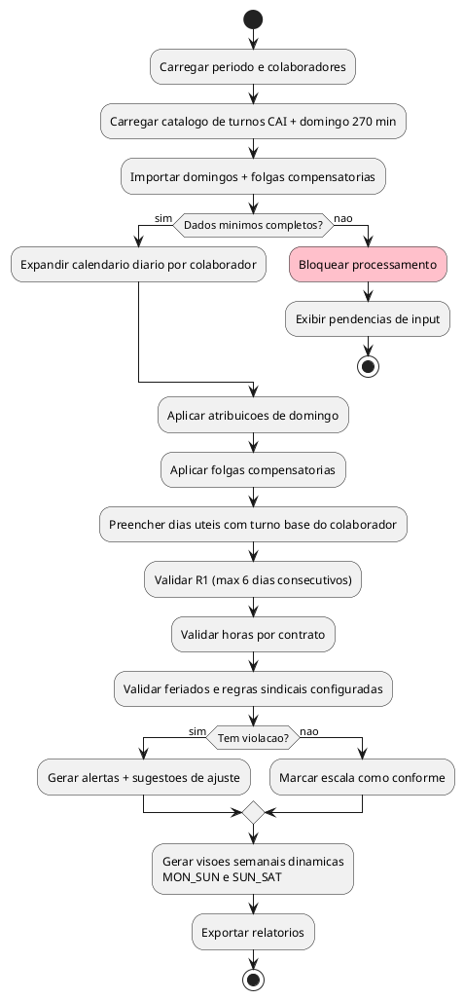

# LOGICA - Escala Caixa (Analyst Completo)

## TL;DR Executivo
O problema nao e "falta de planilha": e **modelo mental errado**. A operacao real e diaria (evento por dia), mas a gestao atual esta amarrada em blocos semanais fixos, o que distorce horas e descanso quando domingo e folga compensatoria caem em semanas diferentes no corte `MON_SUN`.

A solucao correta e tratar **`(colaborador + data)` como chave primaria operacional** e gerar semana apenas como **visao dinamica** (`MON_SUN` ou `SUN_SAT`). Isso remove a dor de fechamento, preserva a logica de 8 escalas e permite compliance automatico.

---

## 1) Briefing Destilado
**O que precisa acontecer no final:**
- A tua mae conseguir montar/ajustar escala sem ficar "quebrando semana" manualmente.
- O sistema validar automaticamente descanso e carga horaria.
- O sistema explicar por que uma escala esta certa/errada (auditavel).

**Quem usa:**
- Gestora operacional (monta escala e corrige conflito).
- RH/DP (confere horas e compliance).
- Time de caixa (consome escala publicada).

**Input -> Output:**
- **Input:** periodo, funcionarios, contratos, turnos CAI, domingos trabalhados, folgas compensatorias, excecoes.
- **Output:** escala diaria validada + resumos semanais configuraveis + alertas de risco trabalhista.

**Escopo:**
- Dentro: Caixa, regras de domingo curto, compensacao, validacao de descanso/carga.
- Fora (agora): otimizar dimensionamento de equipe por demanda e integracao nativa com Secullum.

---

## 2) Maquina (Fixo vs Variavel)

### REGRAS FIXAS (nao mudam)
- R1: nao permitir repouso semanal apos 7o dia consecutivo.
- R2: domingo curto fixo (`08:00-12:30`, 270 min) para quem estiver escalado.
- R3: horarios CAI sao catalogo fixo (nao inventar turno novo).
- R4: contratos semanais devem ser auditados por corte selecionado.
- R5: semana e visao, nao estrutura base dos dados.

### VARIAVEIS (mudam toda vez)
- Periodo (`data_inicio`, `data_fim`).
- Colaboradores ativos e contratos (44/36/30).
- Quem trabalha em cada domingo.
- Data da folga compensatoria associada ao domingo.
- Excecoes (ferias, atestado, afastamento, troca).
- Corte de apuracao para exibicao (`MON_SUN` ou `SUN_SAT`).

### FORMULA CENTRAL
`Evento diario (pessoa+data) + Regras fixas => Escala valida`

---

## 3) Visao Geral (Mind Map)


---

## 4) Quem Faz o Que (Use Case)


---

## 5) Elementos do Sistema (ER)


---

## 6) Fluxo Logico Principal (Activity)


---

## 7) Entradas Variaveis (Mapa de Input)

| Grupo | Campo | Tipo | Obrigatorio | Exemplo |
|---|---|---|---|---|
| Periodo | `period_start`, `period_end` | Date | Sim | `2026-02-08` a `2026-07-19` |
| Pessoas | `employee_id`, `contract_hours_week` | String/Int | Sim | `CLE`, `44` |
| Turnos | `shift_code`, `minutes` | String/Int | Sim | `CAI1=570`, `DOM=270` |
| Domingo | `sunday_date`, `employee_id` | Date/String | Sim | `2026-03-08`, `ALICE` |
| Compensacao | `folga_date` | Date | Sim | `2026-03-12` |
| Apuracao | `week_definition` | Enum | Sim | `MON_SUN` / `SUN_SAT` |
| Excecoes | `absence_type`, `date` | Enum/Date | Nao | Ferias, atestado |
| Regras locais | `cct_rules`, `municipal_rules` | JSON/Text | Sim (para producao) | permissao de feriado |

---

## 8) Processamento (Do Input ao Output)

### 8.1 Pipeline de dados
1. Ingestao e normalizacao das fontes (`PDF`, `XLSX`, manual).
2. Deduplicacao de domingo/folga.
3. Expansao para matriz diaria por colaborador.
4. Aplicacao de regras de turno/foga.
5. Validacao de compliance e horas.
6. Geracao de visoes semanais.
7. Exportacao.

### 8.2 Regras de validacao calculaveis
- `consecutive_work_days(employee) <= 6`
- `sum(minutes worked in week) == contract target` (quando politica exigir fechamento estrito semanal)
- `domingos escalados` com folga compensatoria mapeada.
- `interjornada >= 11h` quando houver troca de turno entre dias.
- `regras de feriado` conforme CCT/legislacao municipal vigente.

### 8.3 Estrutura operacional (ASCII)
```text
ESCALA_CAIXA_ENGINE
|-- ingest
|   |-- parse_pdf_shift
|   |-- parse_pdf_sunday_rotation
|   |-- parse_xlsx_dom_folgas
|   `-- parse_xlsx_caixas
|-- normalize
|   |-- canonical_employee
|   |-- canonical_shift
|   `-- canonical_assignment_day
|-- validate
|   |-- streak_max_6
|   |-- weekly_hours
|   |-- sunday_compensation
|   `-- legal_constraints
`-- present
    |-- day_view
    |-- week_view_mon_sun
    |-- week_view_sun_sat
    `-- export
```

---

## 9) A Dor, sem anestesia (Por que ela esta apanhando)

### 9.1 Causa raiz
- O processo atual organiza por **blocos semanais fixos** (SEMANA 1..8), nao por evento diario.
- Domingo e folga compensatoria sao naturalmente **dias distintos**; quando voce agrega por semana errada, parece erro de horas.

### 9.2 Evidencia objetiva extraida dos dados atuais
- Existem **8 escalas** (indices 1..8) no rodizio.
- Foram extraidos **72 pares** `domingo -> folga`.
- No corte `MON_SUN`, **72/72** pares cruzam semana.
- No corte `SUN_SAT`, **0/72** cruzam semana.

**Conclusao:** o sistema mental semanal (MON_SUN fixo) esta punindo uma operacao que e essencialmente diaria.

### 9.3 Onde ela se ferra na pratica
- Faz escala visualmente correta.
- Vai fechar por semana (planilha/RH).
- A hora de domingo cai numa semana; a folga compensatoria cai na seguinte.
- Resultado: uma semana "estoura", outra "falta", e ela parece errada mesmo sem estar.

---

## 10) Leis Vigentes e Guardrails de Compliance (Brasil)
**Data de referencia da checagem:** 11/02/2026.

### 10.1 Nucleo duro (sempre respeitar)
- **CF/88, art. 7o, XV:** repouso semanal remunerado, preferencialmente aos domingos.
- **CLT, art. 66:** minimo de 11h entre jornadas.
- **CLT, art. 67:** descanso semanal de 24h consecutivas.
- **CLT, art. 68:** trabalho aos domingos depende de permissao/regramento aplicavel.
- **CLT, art. 58 e 59:** referencia de jornada normal e horas extras.

### 10.2 Comercio (domingo/feriado)
- Para comercio, a Lei 10.101/2000 (alterada pela Lei 11.603/2007) e a base para domingo/feriado, incluindo regra de repouso dominical periodico no setor.
- Segundo comunicacao oficial do MTE, a Portaria 3.665/2023 **nao alterou o trabalho aos domingos**; ela trata principalmente de trabalho em feriados.
- Segundo o MTE, a vigencia dessa regra de feriados foi prorrogada para **1 de marco de 2026**.

### 10.3 Guardrails tecnicos no sistema
- Nao permitir escala que ultrapasse 6 dias consecutivos sem folga.
- Bloquear publicacao quando faltar regra sindical/municipal para feriados, se exigivel.
- Registrar trilha de auditoria (quem alterou, quando, por que).

> Importante: regra local de sindicato (CCT/ACT) e legislacao municipal podem adicionar restricoes e prevalecem no desenho operacional.

---

## 11) Regras de Negocio (Pode/Nao Pode)

### PODE / NAO PODE
- [PODE] montar domingo por rodizio com 3 pessoas.
- [PODE] escolher visao semanal (`MON_SUN` ou `SUN_SAT`) para analise.
- [NAO PODE] usar semana como entidade principal de persistencia.
- [NAO PODE] permitir 7 dias consecutivos trabalhados.

### SEMPRE / NUNCA
- [SEMPRE] persistir a escala por dia e colaborador.
- [SEMPRE] recalcular compliance apos qualquer mudanca.
- [NUNCA] inferir folga por heuristica sem data explicita quando houver risco legal.

### CONDICIONAIS
- [SE] trabalhou domingo [ENTAO] deve existir folga compensatoria mapeada.
- [SE] regra sindical exigir [ENTAO] bloquear feriado sem autorizacao valida.
- [SE] corte semanal mudar [ENTAO] apenas muda a visao, nao os dados base.

---

## 12) Casos Praticos

### Caso 1 (modelo atual semanal)
- Antes: domingo em 08/02 e folga em 12/02.
- Acao: fechamento em `MON_SUN`.
- Resultado: domingo entra numa semana, folga em outra; parece erro de carga.

### Caso 2 (modelo diario correto)
- Antes: mesmo evento `08/02 domingo` + `12/02 folga`.
- Acao: base diaria + visao `SUN_SAT` para operacao e `MON_SUN` para analise secundaria.
- Resultado: operacao fecha sem distorcer; relatorios ficam explicaveis.

### Caso 3 (compliance automatizado)
- Antes: ajuste manual cria sequencia de 7 dias sem perceber.
- Acao: validador detecta `streak >= 7` e bloqueia publicacao.
- Resultado: risco trabalhista evitado antes de chegar no ponto/folha.

---

## 13) Perguntas Criticas em Aberto
- Semantica oficial dos marcadores `5` e `6` no `DOM E FOLGAS`.
- Corte oficial de apuracao usado no Secullum dessa empresa (operacao vs fechamento).
- Regras da CCT vigente do sindicato da categoria/localidade.
- Regra municipal para feriados no comercio local.

---

## 14) Plano de Acao Recomendado
1. Formalizar dicionario de dados (incluindo `5/6`).
2. Congelar modelo canonico diario (`employee_id + date`).
3. Implementar validador legal e de carga.
4. Implementar visoes dinamicas de semana.
5. So depois liberar edicao visual e exportacao final.

---

## 15) Disclaimers Criticos
- [CRITICO] Este documento organiza logica e compliance tecnico; validacao juridica final deve ser feita com contador/juridico trabalhista local.
- [CRITICO] As regras de CCT e legislacao municipal podem mudar a permissao de feriados e a forma de compensacao.
- [CRITICO] Sem definir `5/6`, o sistema ainda roda, mas parte da automacao fica dependente de suposicao.

---

## Fontes Legais / Oficiais Consultadas
- Constituicao Federal (art. 7o, XV): [Planalto](https://www.planalto.gov.br/ccivil_03/constituicao/constituicao.htm)
- CLT compilada (arts. 66, 67, 68): [Planalto](https://www.planalto.gov.br/ccivil_03/Decreto-Lei/Del5452compilado.htm)
- Lei 605/1949 (repouso semanal): [Planalto](https://www.planalto.gov.br/ccivil_03/Leis/L0605.htm)
- Lei 11.603/2007 (altera Lei 10.101/2000): [Planalto](https://www.planalto.gov.br/ccivil_03/_Ato2007-2010/2007/Lei/L11603.htm)
- MTE (esclarecimento: Portaria 3.665 nao alterou domingos): [gov.br](https://www.gov.br/trabalho-e-emprego/pt-br/noticias-e-conteudo/2023/novembro/ministerio-do-trabalho-e-emprego-revoga-portaria-no-3-665-sobre-trabalho-aos-feriados)
- MTE - prorrogacao da Portaria 3.665 para 1o/03/2026: [gov.br](https://www.gov.br/trabalho-e-emprego/pt-br/noticias-e-conteudo/2025/junho/mte-prorroga-para-1o-de-marco-de-2026-regra-sobre-trabalho-em-feriados-no-comercio)
