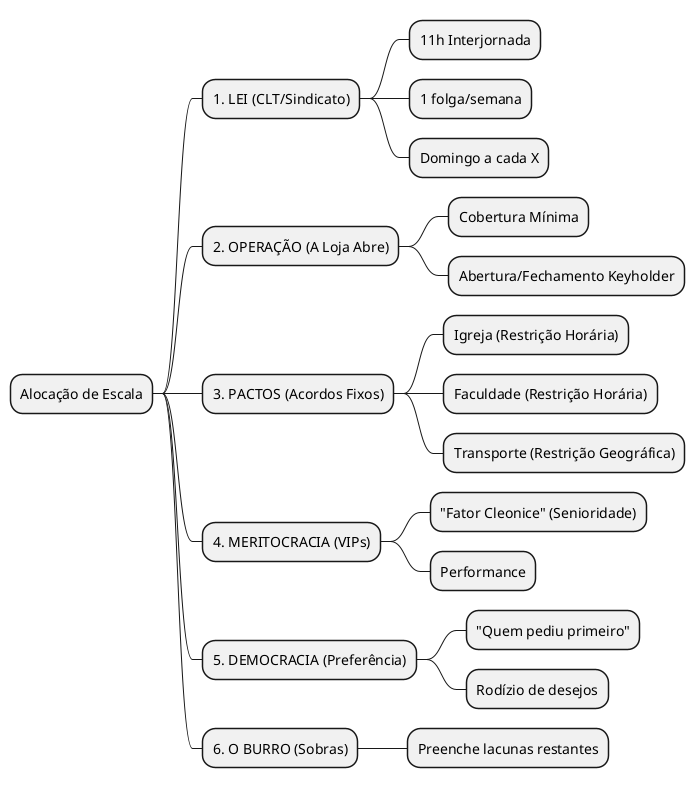
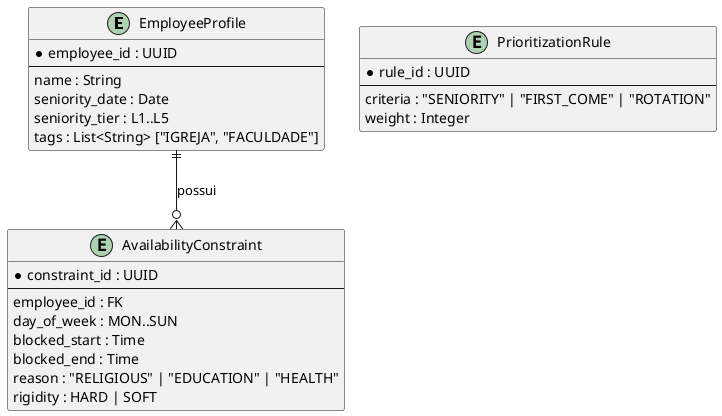
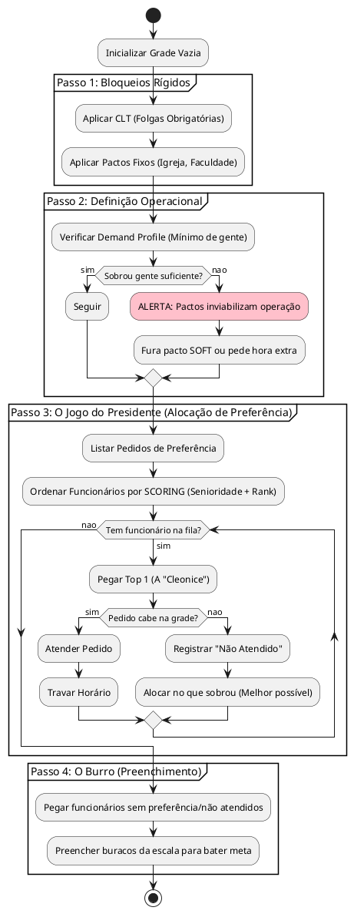

# LÓGICA: O FATOR HUMANO NA ESCALA (JOGO DO PRESIDENTE)

> Gerado por Miss Monday via /analyst em 2026-02-11
> Base: Conversa com Mãe (RH) + Conceito "Burro Bebe Água"

## TL;DR EXECUTIVO
O sistema não pode ser apenas binário (Pode/Não Pode). A realidade operacional exige uma **Fila de Prioridade Baseada em Contexto**. A "Cleonice" não é um `if`, é uma **Regra de Senioridade**. A "Igreja" não é exceção aleatória, é uma **Restrição de Disponibilidade Pactuada**. O "Jogo do Presidente" é o algoritmo de resolução de conflitos.

---

## 1. O CONCEITO "BURRO BEBE ÁGUA" (Priority Queue)

Na teoria dos jogos (e na vida real), recursos escassos (folgas no domingo, turnos bons) são alocados por ordem de poder.

### A Pirâmide de Prioridade



---

## 2. TRADUÇÃO: DE "DONA CLEONICE" PARA "SISTEMA"

Não podemos hardcodar nomes. Precisamos de **Atributos Qualificadores**.

| O que a mãe disse | O que o sistema entende (Atributo) | Tipo de Regra |
|---|---|---|
| "Faz 26 anos que ela trabalha" | `seniority_score` (int) ou `tags: ["VIP_LEGACY"]` | Tie-breaker (Desempate) |
| "Vá na igreja" | `availability_constraints` (TimeWindow bloqueada) | Hard Constraint (pessoal) |
| "Pergunto qual dia prefere" | `preference_request` (Input dinâmico) | Soft Constraint (Maximizar) |
| "Prioridade de sair mais cedo" | `preferred_shift_pattern` | Soft Constraint |

---

## 3. MODELAGEM LÓGICA (ER Estendido)

Precisamos estender o modelo do `Employee` para suportar essa complexidade sem código espaguete.



---

## 4. ALGORITMO DE ALOCAÇÃO (Fluxo)

O motor não roda aleatório. Ele roda em **Passadas (Passes)**.



---

## 5. IMPACTO NO SCHEMA (Ação Imediata)

Para suportar isso, o `compliance_policy.schema.json` e o `employee_registry` precisam evoluir.

### Novo Objeto Sugerido: `PickingRules`

```json
"picking_rules": {
  "method": "weighted_score",
  "criteria": [
    { "field": "seniority_years", "weight": 10 },
    { "field": "tags", "match": "VIP", "weight": 50 },
    { "field": "last_request_granted", "weight": -5 }  // Rodízio: quem ganhou antes, perde agora
  ]
}
```

---

## CONCLUSÃO ANALYTICA

O "Micro gerenciamento" que a mãe faz é intuitivo, mas segue um algoritmo claro de **Ranking**.
Se o sistema tentar tratar todos como iguais (Democracia Pura), vai falhar na realidade da loja (onde a Cleonice manda).

**O sistema precisa de um campo `priority_score` calculado para cada funcionário.**
Quem tem score maior, tem seus pedidos processados primeiro pelo motor de alocação.
