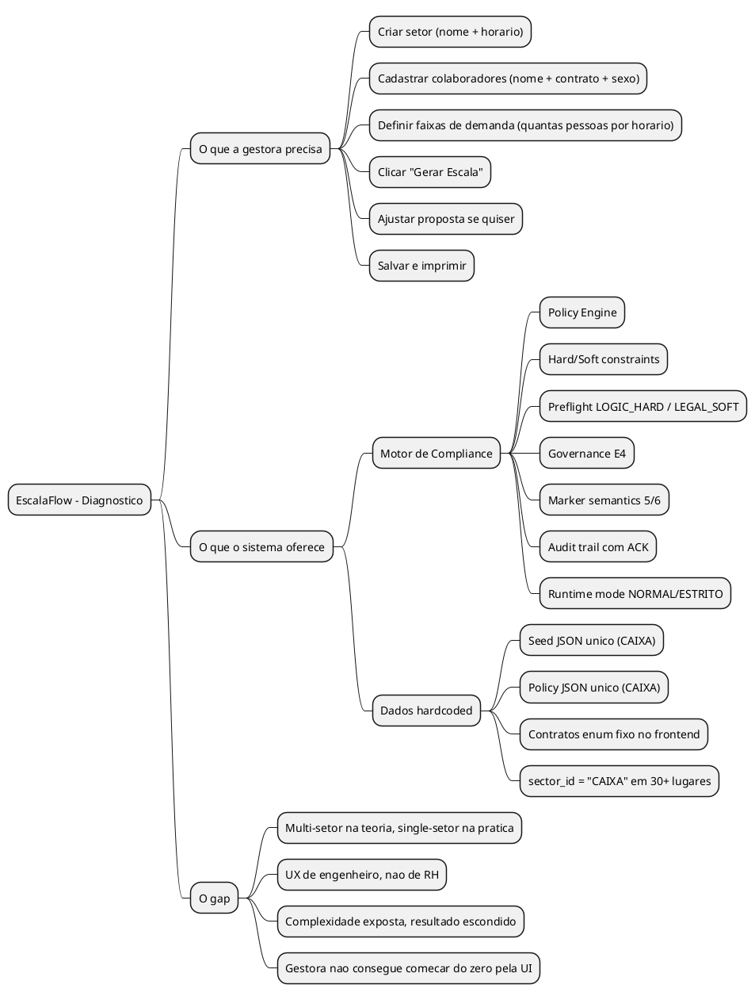
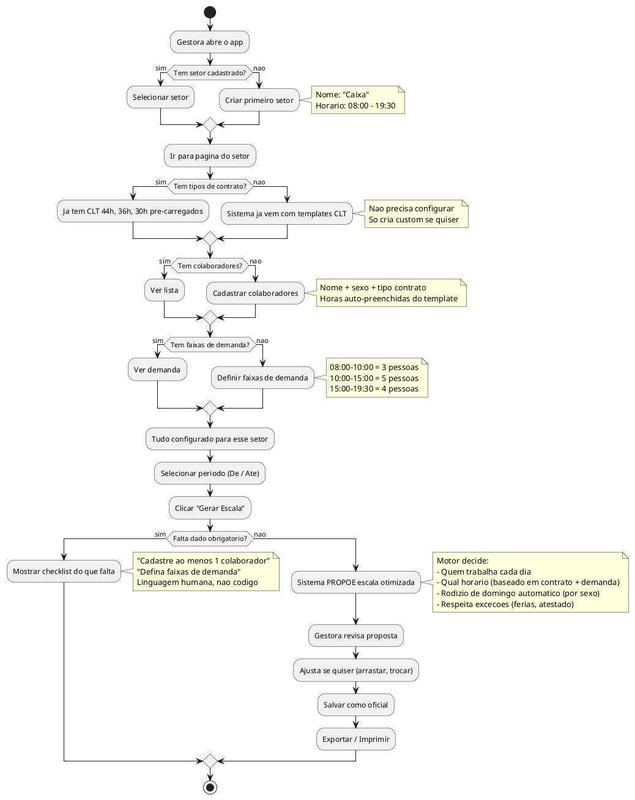
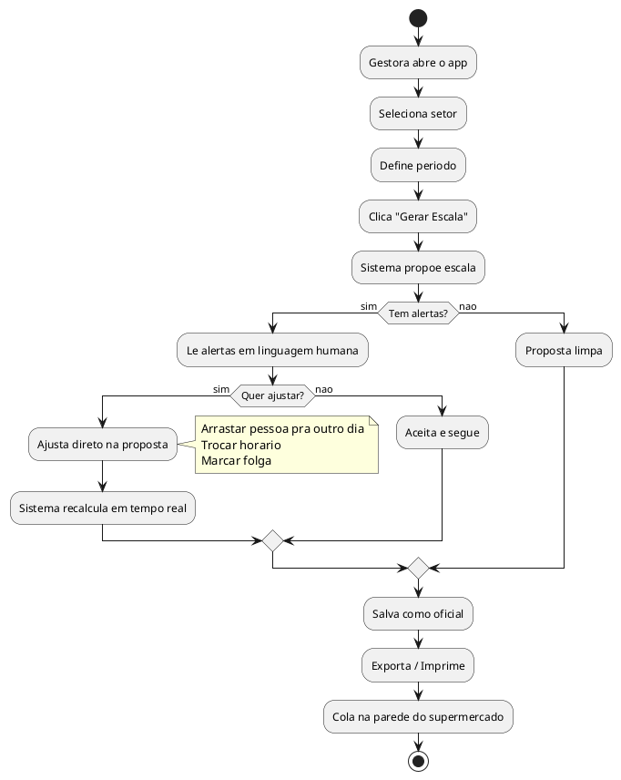
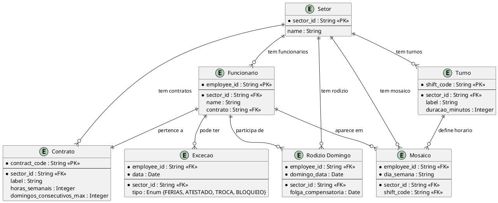
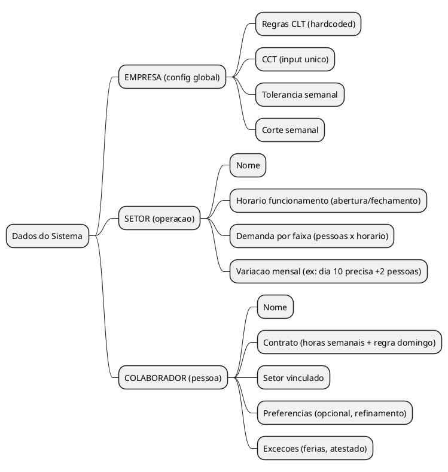
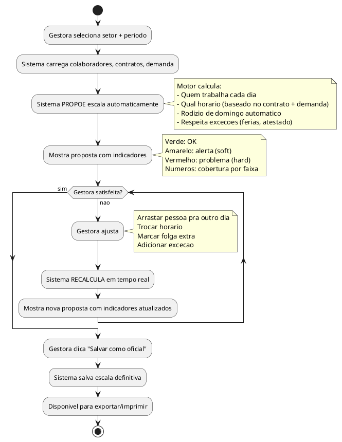
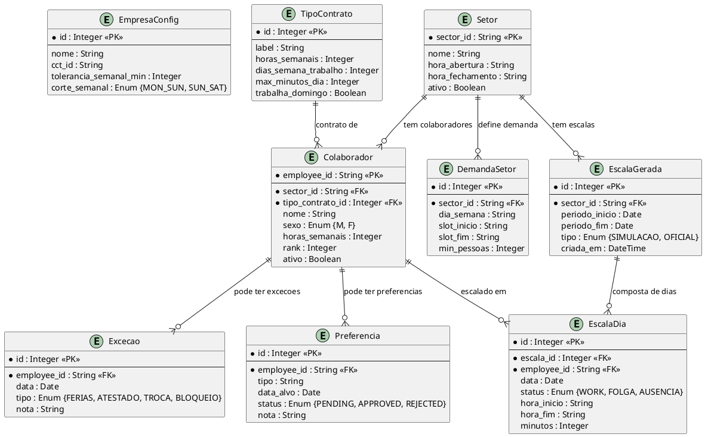

# ANALYST: De "Motor de Compliance" para "Gerador de Escalas Multi-Setor"

> Diagnostico: por que o sistema funciona tecnicamente mas nao resolve o problema como produto.
> Data: 2026-02-13

---

## TL;DR EXECUTIVO

O backend ja suporta multi-setor. O frontend esta 100% travado no CAIXA. A UX foi desenhada para um engenheiro de compliance, nao para uma gestora de RH de supermercado. O sistema precisa de tres coisas: (1) seletor de setor ativo na UI, (2) cadastro de contratos dinamico pela UI, (3) simplificacao da jornada — esconder a maquinaria, mostrar o resultado.

---

## 1. A DOR REAL (Origem)

**Fonte:** Transcricao de audio com a mae do operador (RH do Supermercado Fernandes), 2026-02-11.

### O que foi pedido (literal):

1. **Escala legivel para o funcionario** — qual dia trabalha, qual horario, qual domingo, qual folga
2. **Para TODOS os setores** — Caixa, Acougue, Padaria, FLV, etc.
3. **Ciclo que se repete** — achar um padrao (6, 8, 10, 12 semanas) e deixar rodando
4. **Autoservico** — gestora configura tudo, sem programador, sem seed, sem JSON

### Duas camadas de decisao:

```
CAMADA A: DIA (trabalha ou folga?)
    |
CAMADA B: HORARIO (se trabalha, qual turno?)
    |
RESTRICOES: contrato (44h/36h/30h), max 6 dias seguidos,
            rodizio domingo, cobertura por faixa
    |
SAIDA: tabela colada na parede do supermercado
```

### O que NAO foi pedido:

- Governanca E4
- Markers 5/6
- Preflight com categorias LOGIC_HARD / LEGAL_SOFT
- Compliance policy versionada com vigencia
- Audit trail de ACK com motivo
- Modo NORMAL vs ESTRITO

Tudo isso existe no sistema. Nada disso e linguagem do RH.

---

## 2. DIAGNOSTICO: O QUE FOI CONSTRUIDO vs O QUE ERA NECESSARIO

### 2.1 Mapa da desconexao



### 2.2 Raio-X tecnico: onde o CAIXA esta hardcoded

| Camada | Suporta multi-setor? | Evidencia |
|--------|---------------------|-----------|
| **Database (SQLite)** | SIM | Todas as tabelas tem `sector_id` como coluna |
| **Domain Models** | SIM | Employee, Shift, Contract, Policy com `sector_id` |
| **Repositories** | QUASE | Todos aceitam `sector_id`, mas default = `"CAIXA"` |
| **API Routes** | QUASE | Query param `?sector_id=X` funciona, mas default = `"CAIXA"` |
| **Frontend API wrapper** | NAO | `sector_id = 'CAIXA'` hardcoded em `lib/api.ts` |
| **Pagina Colaboradores** | NAO | Contract enum fixo: `H44_CAIXA / H36_CAIXA / H30_CAIXA` |
| **Seed** | NAO | JSON unico para CAIXA |
| **Policy** | NAO | JSON unico para CAIXA |

**Conclusao:** O motor funciona para qualquer setor. A casca (UI + dados) trava tudo no CAIXA.

### 2.3 O PROBLEMA FUNDAMENTAL: SISTEMA CONSTRUIDO EM CIMA DE EXEMPLO

O sistema depende de dois arquivos JSON para funcionar:
- `schemas/compliance_policy.example.json` — policy com contratos, turnos, regras, jurisdicao
- `data/fixtures/seed_supermercado_fernandes.json` — funcionarios, mosaico, rodizio

**Remove esses dois arquivos e o sistema nao liga.**

Isso significa que o "sistema" nao e um sistema. E uma **demonstracao hardcoded com UI bonita por cima**. Tudo que esta nesses JSONs — contratos, turnos, jurisdicao ("Maringa/PR"), regras, CCT — sao dados de EXEMPLO criados durante discussoes de arquitetura. Nao sao dados reais. Nao vieram do usuario. Nao foram configurados pela UI.

O motor de compliance le a policy. A policy e um JSON fixo. Entao o motor valida contra regras que ninguem configurou — foram escritas por um programador durante o design. Mudar qualquer regra exige editar JSON na mao.

```
O QUE PARECE:
[UI bonita] → [Motor de compliance] → [Escala validada]

O QUE REALMENTE E:
[JSON de exemplo] → [Motor de compliance] → [Escala do exemplo validada]
[UI bonita] → [Exibe o resultado do exemplo]
```

**A UI nao alimenta o motor. O JSON alimenta. A UI so mostra.**

Para ser um sistema de verdade:
- Contratos vem do USUARIO (cadastro pela UI)
- Turnos vem do USUARIO (cadastro pela UI)
- Regras sao CLT padrao (hardcoded no motor, nao no JSON)
- Customizacoes vem do USUARIO (se necessario)
- JSONs de exemplo = apenas dados de demo/seed, nao dependencia

### 2.4 A ARMADILHA DO TRABALHO MANUAL DIGITAL

> Reclamacao real dos pais (RH do supermercado):
> "Nas tabelas do Excel e em tentativas anteriores de automacao,
> a gente acabava fazendo o trabalho na mao."

**O sistema atual esta indo para o mesmo caminho.**

O mosaico (quem trabalha em qual dia, em qual turno) e o rodizio de domingos sao preenchidos **manualmente pela gestora** antes de gerar a escala. Ou seja:

```
O QUE OS PAIS FAZIAM NO EXCEL:
1. Abrir planilha
2. Preencher cada funcionario em cada dia
3. Verificar na cabeca se quebrou regra
4. Ajustar manualmente
5. Imprimir

O QUE O SISTEMA PEDE HOJE:
1. Abrir app
2. Preencher cada funcionario em cada dia (mosaico)
3. Preencher cada domingo (rodizio)
4. Clicar "Gerar"
5. Sistema verifica regras e mostra violacoes
6. Imprimir

A DIFERENCA REAL: so o passo 5. O resto e a mesma coisa.
```

**O sistema digitalizou o trabalho manual, mas nao eliminou ele.**

O valor REAL de um gerador de escala e:
- Gestora cadastra **regras e restricoes** (contratos, turnos, cobertura)
- Sistema **PROPOE** a escala otimizada
- Gestora **AJUSTA** o que quiser (nao monta do zero)

Hoje o fluxo esta invertido:
- Gestora **MONTA** a escala inteira (mosaico = grade manual)
- Sistema **VALIDA** se ta certo (compliance)
- Gestora **CORRIGE** violacoes

### 2.5 Espectro de automacao: onde queremos estar

```
MANUAL ◄──────────────────────────────────────────► AUTOMATICO

Excel          Sistema hoje       Ideal MVP        Ideal futuro
(tudo na mao)  (monta + valida)   (propoe + ajusta) (gera + aprova)
     │               │                  │                 │
     └── Preenche    └── Preenche       └── Cadastra      └── Cadastra
         grade           mosaico            regras             regras
         verifica        gera               sistema            sistema
         na cabeca       valida             propoe             gera
         ajusta          ajusta             ajusta             notifica
                                            se quiser
```

**O MVP real nao e "montar mosaico e validar".
E "cadastrar regras e receber proposta".**

Porem, existe uma realidade pratica: o mosaico ja existe na operacao (os pais ja tem o padrao de quem trabalha em qual dia). Entao o caminho mais curto e:

1. **Fase 1 (agora):** Mosaico como INPUT (gestora informa o padrao que ja usa), sistema gera + valida. Isso ja resolve a dor imediata.
2. **Fase 2 (proximo):** Motor de sugestao — sistema propoe mosaico otimizado a partir dos contratos, turnos e demanda.
3. **Fase 3 (futuro):** Geracao automatica com ajuste fino — gestora so aprova ou faz micro-ajustes.

A Fase 1 ja funciona se destravarmos multi-setor. A Fase 2 e onde o sistema para de ser "Excel bonito" e vira produto.

---

## 3. SEPARACAO: MAQUINA vs COMBUSTIVEL

### 3.1 O que e REGRA FIXA (nao muda entre setores)

```
REGRAS CLT (valem para todos):
- Max 6 dias consecutivos de trabalho
- Min 11h de intervalo entre jornadas
- Rodizio de domingo proporcional ao contrato
- Limite diario de jornada
- Meta semanal por contrato
```

### 3.2 O que e DADO VARIAVEL (muda por setor)

```
COMBUSTIVEL POR SETOR:
- Nome do setor (Caixa, Acougue, Padaria)
- Funcionarios do setor (nome, contrato)
- Contratos do setor (44h, 36h, 30h - com nomes livres)
- Turnos do setor (codigos, duracao, horarios)
- Mosaico semanal (quem trabalha em qual dia)
- Rodizio de domingos (quem trabalha em qual domingo)
- Demanda por faixa (minimo de pessoas por horario)
- Excecoes (ferias, atestados, trocas)
```

### 3.3 O que e COMPLEXIDADE DESNECESSARIA PARA O USUARIO

| Conceito tecnico | O que a gestora entende | Acao |
|-----------------|------------------------|------|
| Compliance Policy JSON | "Regras da empresa" | Gerar automaticamente a partir dos cadastros |
| Governance E4 | Nada | Esconder. Rodar internamente |
| Markers 5/6 | Nada | Esconder. Decisao interna |
| Preflight LOGIC_HARD | "Nao da pra gerar, falta X" | Mostrar como checklist simples |
| Preflight LEGAL_SOFT | "Cuidado com regra Y" | Mostrar como alerta amigavel |
| Runtime mode NORMAL/ESTRITO | Nada | Default NORMAL, sem expor |
| Audit trail ACK | Nada | Registrar em background |
| MON_SUN vs SUN_SAT | "Semana" | Usar o padrao da empresa, sem perguntar |

---

## 4. COMO DEVERIA FUNCIONAR: JORNADA DO USUARIO

### 4.1 Fluxo proposto - Onboarding de setor (REVISADO v2)

> Fluxo atualizado: sistema PROPOE escala. Gestora NAO monta mosaico, NAO configura rodizio, NAO cadastra turnos.



### 4.2 Uso diario (apos onboarding) — REVISADO v2



---

## 5. MAPA DE ENTIDADES (SUPERADO — ver secao 10.1 para modelo v2)

> **ATENCAO:** Este ER e da primeira analise (multi-setor). O modelo foi revisado drasticamente nas secoes 9-13.
> Mosaico, Rodizio, Turno e Contrato per sector foram ELIMINADOS. Ver secao 10.1 para o ER atual.



**Nota:** Tudo que a gestora toca esta neste diagrama. O motor de compliance roda POR BAIXO, invisivel.

---

## 6. REGRAS DE NEGOCIO (SUPERADO — ver secoes 9.1-9.6 e 13)

> **ATENCAO:** Estas regras sao da primeira analise. Regras como "NUNCA gerar sem mosaico"
> foram eliminadas — o sistema agora PROPOE a escala, nao depende de mosaico manual.

```
PODE / NAO PODE:
- PODE: Gerar escala para qualquer setor cadastrado
- PODE: Ter contratos diferentes por setor
- PODE: Ter turnos diferentes por setor
- NAO PODE: Funcionario em mais de 6 dias seguidos
- NAO PODE: Intervalo menor que 11h entre jornadas
- NAO PODE: Ultrapassar limite diario de jornada

SEMPRE / NUNCA:
- SEMPRE: Rodizio de domingo conforme contrato
- SEMPRE: Folga compensatoria para domingo trabalhado
- SEMPRE: Validar carga semanal contra contrato
- NUNCA: Gerar escala sem mosaico + rodizio configurados

CONDICIONAIS:
- SE falta dado obrigatorio ENTAO mostrar checklist amigavel
- SE regra CLT violada ENTAO mostrar alerta em linguagem humana
- SE excecao cadastrada (ferias/atestado) ENTAO respeitar na escala
```

---

## 7. O QUE PRECISA MUDAR (SUPERADO — ver secao 12 para plano atualizado)

> **ATENCAO:** Este plano era sobre "destravar multi-setor no frontend atual".
> A decisao agora e criar frontendv2/ do zero. Ver secao 12 e 13.7.

### 7.1 Prioridade 1 - Destravar multi-setor na UI

| # | O que | Onde | Esforco |
|---|-------|------|---------|
| 1 | **Seletor de setor global** | Header ou sidebar - dropdown que filtra TUDO | Medio |
| 2 | **Contexto de setor no api.ts** | Substituir `'CAIXA'` hardcoded por setor ativo | Baixo |
| 3 | **Contratos dinamicos** | ColaboradoresPage - carregar contratos do DB | Baixo |
| 4 | **CRUD de contratos na UI** | ConfiguracaoPage - nova aba ou secao | Medio |
| 5 | **Labels de contrato dinamicos** | format.ts - carregar do DB em vez de dict fixo | Baixo |

### 7.2 Prioridade 2 - Simplificar UX

| # | O que | Acao |
|---|-------|------|
| 6 | **Esconder Governance E4** | Remover da UI ou mover para settings avancado |
| 7 | **Traduzir violacoes** | "R1_MAX_CONSECUTIVE" -> "Ana trabalhou 7 dias seguidos (max 6)" |
| 8 | **Traduzir preflight** | "LOGIC_HARD: EMPTY_WEEKDAY_TEMPLATE" -> "Faltou montar o mosaico" |
| 9 | **Checklist de onboarding** | Ao entrar num setor vazio, mostrar "Passo 1: Cadastre turnos..." |
| 10 | **Remover mode ESTRITO da UI** | Default NORMAL, compliance roda invisivel |

### 7.3 Prioridade 3 - Policy automatica

| # | O que | Acao |
|---|-------|------|
| 11 | **Template de policy padrao** | Ao criar setor, gerar policy CLT automatica |
| 12 | **Heranca de regras** | Novos setores herdam regras CLT padrao |
| 13 | **Eliminar dependencia de JSON** | Policy vive no DB, editavel pela UI se necessario |

---

## 8. FLUXO COMPARATIVO: HOJE vs PROPOSTO

### HOJE (o que a gestora precisa fazer)

```
1. Rodar seed.py (precisa de terminal)
2. Abrir app
3. Tudo ja vem configurado para CAIXA
4. Nao consegue criar outro setor funcional
5. Para mudar contrato, precisa editar codigo
6. Conceitos como "E4", "preflight", "markers" na tela
```

### PROPOSTO v2 (o que a gestora faria)

```
1. Abrir app (tipos de contrato CLT ja vem pre-carregados)
2. Criar setor "Caixa" (nome + horario abertura/fechamento)
3. Definir faixas de demanda (08-10h = 3 pessoas, etc.)
4. Cadastrar colaboradores (nome + sexo + tipo contrato)
5. Clicar "Gerar Escala" + definir periodo
6. Sistema PROPOE escala otimizada (quem, quando, qual horario)
7. Gestora ajusta se quiser (arrastar, trocar)
8. Salvar como oficial
9. Imprimir / Exportar
10. Repetir para "Acougue", "Padaria", etc.

DIFERENCA CRITICA:
  Passos 1-4 = cadastro (uma vez)
  Passos 5-9 = operacao (toda semana)
  O SISTEMA monta a escala, NAO a gestora
```

---

## 9. RESPOSTAS AS PERGUNTAS DO OPERADOR (2026-02-13)

> Analise ponto a ponto do que o operador levantou, cruzado com o codigo real do motor.

### 9.1 A logica existente gera escalas a partir de funcionario + setor + contrato?

**NAO. O motor atual NAO gera escala. Ele PROJETA um template e VALIDA.**

O que o codigo faz (leitura real de `engines.py`):

```
CycleGenerator:
  1. build_weekday_template() → Le o MOSAICO (grade manual funcionario x dia)
  2. build_scale_cycle()      → Combina mosaico + RODIZIO (grade manual de domingos)
  3. project_cycle_to_period() → Projeta o ciclo no calendario (data real)

PolicyEngine:
  4. validate_consecutive_days()  → R1: max 6 seguidos
  5. validate_intershift_rest()   → R2: min 11h entre jornadas
  6. validate_sunday_rotation()   → R3: rodizio de domingo
  7. validate_weekly_hours()      → R4: meta semanal
  8. validate_demand_coverage()   → R5: cobertura por faixa
  9. validate_daily_minutes()     → R6: limite diario
```

O motor e um **projetor de template + validador**. Ele pega o que a gestora montou na mao (mosaico + rodizio), projeta no calendario, e diz se ta certo ou nao.

**O que FALTA para gerar escala de verdade:**
Um `ScheduleGenerator` (ou `ScheduleProposer`) que receba:
- Lista de funcionarios com seus contratos (horas semanais, regra domingo)
- Horario de funcionamento do setor (abertura/fechamento)
- Demanda por faixa horaria (quantas pessoas por slot)
- Regras CLT (max consecutivos, min descanso, etc)

E retorne:
- Proposta de escala otimizada (quem trabalha quando)
- Com violacoes zero ou minimizadas

Isso e um **problema de satisfacao de restricoes** (constraint satisfaction). O PolicyEngine JA SABE validar — falta o gerador que TENTA montar antes de validar.

**Veredicto:** O motor de validacao (PolicyEngine) SERVE. O motor de geracao NAO EXISTE. Precisa ser construido.

---

### 9.2 Precisamos de policy por setor?

**NAO. Policy e GLOBAL (empresa/CLT). Setor tem apenas horario e demanda.**

O operador ta certo. Olhando o que a policy contem hoje vs o que realmente varia:

| Campo na policy | Varia por setor? | Onde deveria morar |
|-----------------|-----------------|-------------------|
| `max_consecutive_work_days` (6) | NAO | Global CLT (hardcoded no motor) |
| `min_intershift_rest_minutes` (660) | NAO | Global CLT (hardcoded no motor) |
| `max_daily_minutes` (585/600) | NAO | Global CLT (hardcoded no motor) |
| `weekly_minutes_tolerance` (30) | NAO | Global empresa (config unica) |
| `week_definition` (MON_SUN) | NAO | Global empresa (config unica) |
| `marker_semantics` (5/6) | NAO | Irrelevante (esconder) |
| `picking_rules` | NAO | Global empresa (config unica) |
| `jurisdiction` (CLT, CCT) | NAO | Global empresa (config unica) |
| Horario de funcionamento | SIM | Setor |
| Demanda por faixa (min pessoas) | SIM | Setor |
| Turnos especificos (se houver) | TALVEZ | Setor (derivavel) |

**Modelo simplificado proposto:**

```
EMPRESA (global, config unica):
├── Regras CLT: max 6 consecutivos, 11h descanso, etc.
├── CCT: identificador da convencao coletiva
├── Tolerancia semanal: 30 min
└── Corte semanal: MON_SUN (ou SUN_SAT)

CONTRATO (por pessoa, NAO por setor):
├── Horas semanais: 44h, 36h, 30h
├── Regra domingo: max 1 consecutivo (mulher) ou max 2 (homem)
└── Label: "44h semanal"

SETOR (apenas operacao):
├── Horario funcionamento: 08:00 - 19:30
├── Demanda por faixa: min 3 pessoas das 08:00 as 10:00, etc.
└── Funcionarios vinculados
```

**ZERO policy por setor. Contrato e da PESSOA. Regra e da LEI. Setor e horario + gente.**

Isso elimina:
- `compliance_policy.example.json` como dependencia
- `policy_loader.py` como ponto de entrada
- Conceito de "policy versionada por vigencia" (overengineering)
- Qualquer cadastro de policy pela UI

---

### 9.3 Turnos: configurar ou derivar?

**DERIVAR quando possivel. Configurar so se necessario.**

O operador ta certo de novo. Turno (no sentido de "CAI1 = 570min") e um OUTPUT, nao INPUT. O que e INPUT:
- Setor abre as 08:00, fecha as 19:30
- Pessoa tem contrato de 44h (= ~528min/dia em 5 dias, ou ~440min/dia em 6 dias)
- Precisa de 3 pessoas das 08:00 as 10:00, 5 das 10:00 as 15:00, etc.

O sistema deveria CALCULAR:
- "Joao trabalha das 08:00 as 17:30 (570min)"
- Nao porque alguem configurou "CAI1", mas porque o contrato e 44h e o setor precisa dele nesse horario

**Porem:** na pratica, supermercados tem turnos padrao que ja usam. A mae ja sabe "turno da manha e das 8 as 17:30". Entao o caminho pragmatico:

```
FASE 1 (agora):
  Input minimo: setor tem horario X-Y
  Sistema calcula duracao do turno a partir do contrato
  Ex: 44h/semana, 5.5 dias = ~480min/dia = turno de 8h
  Gestora pode ajustar se quiser

FASE 2 (proximo):
  Sistema propoe QUAIS horarios (manha/tarde) baseado na demanda
  Ex: precisa 5 pessoas das 10-15 → sugere 3 manha + 2 tarde

FASE 3 (futuro):
  Otimizacao completa: sistema gera turnos ideais para maximizar
  cobertura com minimo de gente
```

**Para o MVP:** turno pode ser SEMI-AUTOMATICO. O sistema sugere baseado no contrato + horario do setor, gestora confirma ou ajusta. Nao precisa de catalogo manual de 7 turnos.

---

### 9.4 Dados espalhados: como consolidar?

**Modelo proposto: 3 entidades centrais, tudo derivado.**



**O que SAI da UI:**

| Pagina | O que o usuario cadastra | O que NAO precisa |
|--------|------------------------|-------------------|
| **Setores** | Nome, horario abertura/fechamento, demanda por faixa | Policy, turnos, mosaico, rodizio |
| **Colaboradores** | Nome, contrato, setor | Shift catalog, scale cycle |
| **Escala** | Periodo, clicar "gerar" | Mosaico manual, rodizio manual |

**Onde fica cada dado:**

```
ANTES (espalhado):
policy.json → contratos, turnos, regras, jurisdicao
seed.json → funcionarios, mosaico, rodizio
DB → tudo duplicado parcialmente
UI → nao alimenta nada

DEPOIS (consolidado):
DB → tudo
  └── empresa_config (1 registro global)
  └── setores (nome, horario, demanda)
  └── colaboradores (nome, contrato, setor)
  └── excecoes (ferias, atestado por colaborador)
  └── escalas_geradas (output do motor)
Motor → le do DB, gera, valida, salva no DB
UI → alimenta o DB, mostra resultado
JSON → zero dependencia
```

---

### 9.5 UI: Dashboard + Paginas de detalhe

**Concordo com o modelo proposto. Aqui a traducao em logica:**

#### Dashboard principal (home)

```
Widgets informativos:
├── Total colaboradores (por setor, filtro)
├── Setores ativos
├── Proxima escala (semana atual)
├── Alertas/problemas de match
└── Resumo: quem ta de ferias, quem ta escalado

NAO E local de criacao. E local de VISAO GERAL.
Cada widget leva para a pagina relevante.
```

#### Pagina de Setores (dash de cards)

```
CRUD Header: [Pesquisar] [Filtrar] [+ Novo Setor] [Arquivados]

Cards:
┌─────────────────────┐
│ [icon]  CAIXA       │
│ 6 colaboradores     │
│ 08:00 - 19:30       │
│ [Editar] [Arquivar] │
└─────────────────────┘

Clicar no card → abre pagina do setor
Arquivar → modal: "3 funcionarios serao desvinculados"
```

#### Pagina do Setor (detalhe)

```
Header: [< Voltar] CAIXA [Salvar]

Secoes:
├── Info basica (nome, horario abertura/fechamento)
├── Demanda por faixa (blocos arrastáveis por dia da semana)
│   └── Variacao mensal (ex: semana do dia 10 = +2 pessoas)
├── Colaboradores vinculados (lista com link pro perfil)
└── Ultima escala gerada (preview)

Salvar → volta pro dash de setores
```

#### Pagina de Colaboradores (dash de cards)

```
CRUD Header: [Pesquisar] [Filtrar por setor] [+ Novo] [Arquivados]

Cards:
┌─────────────────────┐
│ [icon]  Ana Julia    │
│ 44h semanal         │
│ Setor: Caixa        │
│ [Editar] [Arquivar] │
└─────────────────────┘

Clicar → abre pagina do colaborador
Arquivar → modal: "Escala sera recalculada"
```

#### Pagina do Colaborador (detalhe)

```
Header: [< Voltar] Ana Julia [Salvar]

Secoes:
├── Info basica (nome, setor)
├── Contrato (horas semanais, regra domingo)
├── Excecoes ativas (ferias, atestado com datas)
├── Preferencias (opcional: "nao quero trabalhar sabado")
└── Historico de escalas (ultimas semanas)

Salvar → volta pro dash de colaboradores
```

---

### 9.6 Componente core: simulacao iterativa

**CERTO. O core nao e "gerar e mostrar". E "propor, ajustar, iterar, salvar".**



**Separacao de ambientes:**

| Ambiente | O que e | Onde fica |
|----------|---------|-----------|
| **Simulacao** | Rascunho iterativo. Pode mudar a vontade | Pagina principal do setor ou aba dedicada |
| **Oficial** | Escala salva e aprovada | Aba separada ou pagina de historico |
| **Exportacao** | HTML/MD para imprimir | Botao dentro do oficial |

---

### 9.7 O que existe, o que serve, o que falta

| Componente | Existe? | Serve? | Precisa mudar? |
|-----------|---------|--------|----------------|
| **PolicyEngine (validacao R1-R6)** | SIM | SIM | Pouco — tirar dependencia do JSON, hardcodar regras CLT |
| **CycleGenerator (projecao)** | SIM | PARCIAL | Pode servir como fallback, mas o gerador novo substitui |
| **Modelos de dominio** | SIM | SIM | Tirar `sector_id` do Contract, tornar global |
| **Repositorios DB** | SIM | SIM | Trocar defaults de "CAIXA" para obrigatorio |
| **API routes** | SIM | SIM | Trocar defaults, adicionar rotas novas |
| **Frontend inteiro** | SIM | NAO | Reescrever UX (dash + detail pages + simulacao) |
| **ScheduleGenerator** | NAO | - | CRIAR — core novo do sistema |
| **Config global empresa** | NAO | - | CRIAR — tabela + API + UI |
| **Simulacao iterativa** | NAO | - | CRIAR — componente frontend novo |

**O motor de validacao (PolicyEngine) e a unica peca que funciona e serve.**
O resto e casca que precisa ser refeita ou logica que precisa ser criada.

---

## 10. MODELO DE DADOS REVISADO

### 10.1 ER simplificado (proposta v2 — com TipoContrato e sexo)



### 10.2 O que MUDOU do modelo v1 para v2

| Mudanca | Motivo |
|---------|--------|
| **ADICIONADO: `TipoContrato`** | Templates de contrato (CLT 44h, 36h, Estagiario). Evita redigitar horas pra cada pessoa. Sistema vem pre-carregado com CLT padrao |
| **ADICIONADO: `sexo` no Colaborador** | Motor DERIVA regra de domingo: mulher = max 1 consecutivo, homem = max 2 (CLT). Nao e campo configuravel |
| **ADICIONADO: `slot_fim` na DemandaSetor** | Faixa horaria precisa de inicio E fim pra fazer sentido |
| **MOVIDO: `horas_semanais` no Colaborador** | Inicializado pelo template do contrato, mas editavel por pessoa (override). Motor le da pessoa, nao do template |
| **REMOVIDO: `domingos_consecutivos_max`** | Derivado de `sexo` + regras CLT. Nao precisa persistir |
| **REMOVIDO: `variacao_mensal`** | Fase 2 — MVP usa padrao por dia da semana |

### 10.3 O que JA TINHA SUMIDO (do sistema original)

| Removido | Por que |
|----------|---------|
| `ContractProfile` (entidade separada) | Virou `TipoContrato` (template) + `horas_semanais` inline no Colaborador |
| `ShiftDefinition` (catalogo de turnos) | Turno e CALCULADO, nao cadastrado |
| `PolicyVersion` (versionamento) | Regras CLT sao fixas, nao versionam |
| `ScaleCycle` (template abstrato) | Sistema gera direto, nao precisa de template intermediario |
| `ScaleCycleAssignment` (pattern) | Substituido por EscalaDia (resultado concreto) |
| `WeeklySnapshot` (visao semanal) | Derivado em runtime, nao persiste |
| `SundayRotation` (tabela separada) | Motor calcula automaticamente pelo sexo + CLT |
| `compliance_policy.json` | Regras no motor, nao em JSON |
| `seed.json` | Dados vem da UI |

---

## 11. DISCLAIMERS CRITICOS (REVISADO)

- O **PolicyEngine (validacao)** funciona e serve. Preservar.
- O **CycleGenerator** e um projetor de template — nao e um gerador. Pode virar fallback.
- Precisa **construir um ScheduleGenerator** que resolva o problema de satisfacao de restricoes.
- O **frontend precisa ser reescrito** com novo modelo de UX (dash + detail + simulacao).
- O **modelo de dados simplifica drasticamente** — menos entidades, menos dependencia.
- Regras CLT sao **hardcoded no motor**, nao configuraveis pelo usuario. Nao faz sentido o RH "configurar" que max e 6 dias — e LEI.
- A **simulacao iterativa** e o core do produto. Sem ela, e Excel com validacao.

---

## 12. RESUMO FINAL (REVISADO v2)

```
O QUE EXISTE E SERVE:
- PolicyEngine (validacao R1-R6) .............. MANTER
- Database com sector_id ...................... MANTER (simplificar schema)
- API FastAPI ................................. MANTER (ajustar rotas)

O QUE EXISTE E NAO SERVE:
- CycleGenerator (projetor de template) ....... SUBSTITUIR por ScheduleGenerator
- Policy JSON ................................. ELIMINAR dependencia
- Seed JSON ................................... ELIMINAR dependencia
- Frontend inteiro ............................ REESCREVER como frontendv2/
- Mosaico manual .............................. ELIMINAR (sistema gera)
- Rodizio manual .............................. ELIMINAR (sistema calcula)
- Governance E4 ............................... ELIMINAR da UI
- Contract per sector ......................... MUDAR para TipoContrato global

O QUE FALTA CONSTRUIR:
- ScheduleGenerator (motor de proposta) ....... CORE NOVO (backend)
- TipoContrato com templates ................. BACKEND + UI (seed CLT)
- Campo sexo no Colaborador .................. BACKEND + UI (deriva domingo)
- frontendv2/ (clean slate) .................. UI NOVA COMPLETA
- Simulacao iterativa ........................ CORE NOVO (frontend)
- Dashboard com widgets ...................... UI NOVA
- Paginas detalhe (setor + colaborador) ...... UI NOVA
- Config de faixas de demanda por setor ...... UI NOVA (dentro do setor)
- Config global empresa ...................... BACKEND + UI

ESTRUTURA DE PASTAS:
apps/
├── backend/      ← AJUSTAR
├── frontend/     ← LEGADO (referencia)
└── frontendv2/   ← NOVO

ESFORCO REAL:
- Backend: medio (generator novo + TipoContrato + ajustar schema)
- Frontend: alto (frontendv2 do zero)
- Complexidade algoritmica: media (constraint satisfaction basico)
- Risco: baixo (validacao ja existe, so falta geracao)
```

---

## 13. REFINAMENTOS DO OPERADOR — ANALISE CRITICA (2026-02-13 #2)

> Respostas ao segundo round de perguntas. Cada ponto validado, criticado e traduzido em logica.

### 13.1 Tipo de Contrato como entidade com templates

**IDEIA DO OPERADOR:** Pagina de config da empresa com tipos de contrato. Templates pre-carregados (CLT 44h, CLT 36h, Estagiario). Usuario pode criar custom. Ao criar pessoa, puxa o template. Campos editaveis.

**ANALISE CRITICA:**

A ideia e BOA, mas com um freio importante: **isso nao e um sistema de RH. E um sistema de ESCALAS.** O "contrato" so importa pro motor na medida em que afeta scheduling.

O que o motor PRECISA do contrato:

```
CAMPOS QUE AFETAM SCHEDULING:
├── horas_semanais ............. quantas horas pra distribuir na semana
├── dias_semana_trabalho ....... em quantos dias distribuir (5? 6?)
├── max_minutos_dia ............ teto por dia (9h30? 8h? 6h?)
└── trabalha_domingo ........... participa do rodizio? (sim/nao)

CAMPOS QUE NAO AFETAM SCHEDULING (nao incluir):
├── salario .................... irrelevante pro motor
├── data_admissao .............. irrelevante pro motor
├── tipo_vinculo ............... irrelevante pro motor
├── CNPJ/CPF ................... irrelevante pro motor
└── beneficios ................. irrelevante pro motor
```

**Se incluir qualquer campo da segunda lista, fugiu do escopo e virou sistema de RH.**

**MODELO APROVADO:**

```
TipoContrato (entidade leve):
├── label: "CLT 44h"
├── horas_semanais: 44
├── dias_semana_trabalho: 6
├── max_minutos_dia: 570
└── trabalha_domingo: true

SEED DO SISTEMA (vem pre-carregado):
├── CLT 44h: 44h, 6 dias, 570min, domingo=sim
├── CLT 36h: 36h, 5 dias, 480min, domingo=sim
├── CLT 30h: 30h, 5 dias, 360min, domingo=sim
└── Estagiario 20h: 20h, 5 dias, 240min, domingo=nao

CUSTOM (usuario cria):
└── Ex: "Teste 1 semana", "Temporario 20h", "Meio periodo"
```

**UX na pagina de contratos:**

```
┌─────────────────────────────────────────────────────┐
│  TIPOS DE CONTRATO               [+ Novo tipo]      │
├─────────────────────────────────────────────────────┤
│                                                      │
│  ┌──────────────┐  ┌──────────────┐  ┌───────────┐ │
│  │ CLT 44h      │  │ CLT 36h      │  │ CLT 30h   │ │
│  │ 44h/sem      │  │ 36h/sem      │  │ 30h/sem   │ │
│  │ 6 dias       │  │ 5 dias       │  │ 5 dias    │ │
│  │ [Editar]     │  │ [Editar]     │  │ [Editar]  │ │
│  └──────────────┘  └──────────────┘  └───────────┘ │
│                                                      │
│  ┌──────────────┐                                    │
│  │ Estagiario   │                                    │
│  │ 20h/sem      │                                    │
│  │ 5 dias       │                                    │
│  │ [Editar]     │                                    │
│  └──────────────┘                                    │
│                                                      │
└─────────────────────────────────────────────────────┘

[+ Novo tipo] → Abre form:
  Label: ________
  Horas/semana: ____
  Dias/semana: ____
  Max horas/dia: ____
  Trabalha domingo: [sim/nao]
  [Salvar]
```

**NOTA SOBRE FRICCAO:** Sistema vem com 4 templates. Usuario NAO precisa configurar nada pra comecar. Se o supermercado so tem CLT 44h, a gestora ignora essa pagina e vai direto cadastrar pessoas. Os templates sao SEED util, nao "compliance_policy.json" — e diferente porque sao dados universais (CLT e lei), nao dados inventados por programador.

**DIFERENCA DO SEED ANTIGO vs SEED NOVO:**

```
SEED ANTIGO (lixo):
  "Maringa/PR", jurisdicao, CCT inventada, mosaico ficticio
  → Dados de EXEMPLO que o sistema DEPENDE pra funcionar

SEED NOVO (util):
  CLT 44h = 44h/sem, 6 dias, 570min
  → Dados UNIVERSAIS que TODO supermercado brasileiro usa
  → Sistema funciona SEM eles (usuario pode criar do zero)
  → Sistema funciona MELHOR com eles (menos friccao)
```

---

### 13.2 Sexo, genero e a regra de domingo

**PERGUNTA DO OPERADOR:** "Nao sei onde o lance de sexo envolve isso."

**RESPOSTA:**

CLT + CCT do comercio brasileiro define:
- **Mulher:** max 1 domingo consecutivo trabalhado → folga no proximo
- **Homem:** max 2 domingos consecutivos trabalhados → folga no proximo

Isso NAO e configuravel. E LEI. Entao:

```
ERRADO (modelo anterior):
  Colaborador.domingos_consecutivos_max = 2
  → Quem configurou? Por que 2? E se for mulher?

CERTO (modelo novo):
  Colaborador.sexo = F
  → Motor DERIVA: domingos_consecutivos_max = 1 (CLT)
  → Zero configuracao. Zero erro.
```

**ONDE FICA NA UI:**

No form de criar/editar colaborador, campo `Sexo` com opcoes M/F. Nao e opcional — o motor PRECISA pra calcular domingo. Mas nao aparece como "regra de domingo" pra gestora. E invisivel. Ela so informa o sexo e o motor faz o resto.

**EDGE CASE:** Se uma CCT especifica mudar essa regra (improvavel), a gente adiciona override depois. Pra MVP: CLT pura, derivacao automatica.

---

### 13.3 MON_SUN vs SUN_SAT: onde fica?

**PERGUNTA DO OPERADOR:** "Nao sei se o lance do MON e SUN e SUN_SAT precisaria entrar neste aspecto."

**RESPOSTA:** NAO entra no contrato. E config da EMPRESA.

`corte_semanal` define como o motor conta "a semana" pra bater horas. A maioria das empresas brasileiras usa segunda-domingo (MON_SUN). Alguns segmentos usam domingo-sabado (SUN_SAT).

```
ONDE FICA:
  EmpresaConfig.corte_semanal = MON_SUN (default)

ONDE NAO FICA:
  TipoContrato → nao, e da empresa
  Colaborador → nao, e da empresa
  Setor → nao, e da empresa

NA UI:
  Pagina de config da empresa (se existir) como campo avancado
  OU simplesmente hardcoded como MON_SUN e so muda se pedir

PRA MVP:
  Default MON_SUN. Nao mostrar na UI. Se precisar, add depois.
```

---

### 13.4 Override de contrato por pessoa

**IDEIA DO OPERADOR:** "As variaveis do contrato estao disponiveis para flexibilizar as opcoes em cada pessoa tipo o lance das horas semanais."

**ANALISE CRITICA:**

A ideia e valida mas perigosa. Se TUDO for editavel por pessoa, o template perde o sentido e vira burocracia extra (mais um clique sem valor).

**MODELO APROVADO:**

```
Ao criar colaborador:
1. Gestora seleciona TipoContrato → "CLT 44h"
2. Campo horas_semanais auto-preenche com 44
3. Campo e EDITAVEL (gestora pode mudar pra 42 se quiser)
4. Os outros campos (dias/semana, max/dia, domingo) NAO aparecem
   pra editar na pessoa — sao do template

POR QUE SO horas_semanais:
- E o unico campo que REALMENTE varia entre pessoas do mesmo tipo
- "CLT 44h" pode ter alguem fazendo 42h por acordo individual
- Mas "dias_semana_trabalho" e "max_minutos_dia" sao derivados
  das horas — nao faz sentido editar separado
```

**Na pratica, o motor le:**

```python
# Pseudo-codigo
pessoa.horas_semanais          # editavel (inicializado do template)
pessoa.tipo_contrato.trabalha_domingo  # do template
pessoa.sexo                    # da pessoa → deriva regra domingo
pessoa.tipo_contrato.max_minutos_dia   # do template
```

Se no futuro precisar de mais overrides, adicionamos. Pra MVP, so `horas_semanais`.

---

### 13.5 Demanda por dia especifico (alem de dia da semana)

**INSIGHT DO OPERADOR:** "Tu ta incluindo o lance de dia alem da questao de semana, porque pode ser que dias de recebimento, ou dias especificos precisem de demanda por faixa diferente."

**ANALISE CRITICA:**

Insight correto. Na realidade de supermercado:
- Dia 5 e 10 do mes = pico (vale-alimentacao, pagamento)
- Vespera de feriado = pico
- Segunda pos-feriado = vale
- Sabado antes do natal = caos

Mas isso e REFINAMENTO, nao MVP.

```
MVP (Fase 1):
  DemandaSetor por dia da semana (SEG, TER, ... DOM)
  Cobre 90% dos casos — a maioria dos dias segue o padrao semanal

FASE 2:
  Override por data especifica ou padrao recorrente
  Ex: "Todo dia 10 = +2 pessoas no caixa"
  Ex: "Vespera de feriado = +3 pessoas"

MODELO FUTURO (nao implementar agora):
  DemandaOverride:
    sector_id, data (ou regra recorrente), slot, min_pessoas_extra
```

**VEREDICTO:** Nao incluir no modelo v2 agora. Manter como nota de evolucao. O padrao por dia da semana resolve a dor imediata.

---

### 13.6 Faixas de demanda: como configurar na UI

**PERGUNTA DO OPERADOR:** "Tem que ter o cadastro de faixa ne? isso pode ser algo apenas ai na UI da montagem de faixa e quantidade de pessoas."

**RESPOSTA:**

Sim. As faixas sao configuradas DENTRO da pagina de detalhe do setor. Nao e uma pagina separada.

```
PAGINA DO SETOR (detalhe) > Secao "Demanda por faixa"

┌──────────────────────────────────────────────────────┐
│  DEMANDA POR FAIXA                   [+ Nova faixa]  │
├──────────────────────────────────────────────────────┤
│                                                       │
│  Padrao semanal: (aplica pra todos os dias uteis)     │
│                                                       │
│  ┌─────────────┬──────────────┬──────────────────┐   │
│  │ 08:00-10:00 │ 3 pessoas    │ [Editar][Remover]│   │
│  │ 10:00-15:00 │ 5 pessoas    │ [Editar][Remover]│   │
│  │ 15:00-19:30 │ 4 pessoas    │ [Editar][Remover]│   │
│  └─────────────┴──────────────┴──────────────────┘   │
│                                                       │
│  Variacao por dia: (opcional, sobrescreve o padrao)   │
│  ┌───┬───┬───┬───┬───┬───┬───┐                      │
│  │SEG│TER│QUA│QUI│SEX│SAB│DOM│                      │
│  │ = │ = │ = │ = │+1 │+2 │-1 │                      │
│  └───┴───┴───┴───┴───┴───┴───┘                      │
│  (= usa padrao, +N/-N ajusta)                        │
│                                                       │
└──────────────────────────────────────────────────────┘
```

**O modelo de dados ja suporta isso:**
- `DemandaSetor` tem `dia_semana` + `slot_inicio` + `slot_fim` + `min_pessoas`
- Se `dia_semana` = null → e o padrao (aplica pra todos)
- Se `dia_semana` = "SAB" → override pro sabado

**Pra MVP:** comeca simples — padrao unico pra semana inteira. Se precisar variar por dia, e so cadastrar registros com `dia_semana` preenchido.

---

### 13.7 DECISAO ARQUITETURAL: frontendv2

**PEDIDO DO OPERADOR:** "Cria o frontendv2 para que a gente nao seja poluido. E que possamos planejar ela como Brasilia foi planejada."

**ANALISE:** Concordo 100%. Nao e capricho — e necessidade tecnica.

**Por que nao refatorar o frontend atual:**

```
FRONTEND ATUAL (apps/frontend/):
├── Construido em cima de premissas ERRADAS:
│   ├── CAIXA-only em 30+ arquivos
│   ├── Mosaico manual como fluxo central
│   ├── Contract enum hardcoded
│   ├── Governance E4 exposta na UI
│   └── Policy-from-JSON como dependencia
├── Refatorar = lutar contra a estrutura em cada arquivo
├── Risco de quebrar o que existe sem ganhar o que precisa
└── Tempo gasto desmontando > tempo gasto construindo novo
```

**Estrutura proposta:**

```
apps/
├── backend/        ← AJUSTAR (nao reescrever)
│   ├── Simplificar schema
│   ├── Adicionar TipoContrato + rotas novas
│   ├── Tirar dependencia de JSON
│   └── Criar ScheduleGenerator
├── frontend/       ← LEGADO (manter como referencia)
│   └── Nao tocar. So referencia visual/componentes
└── frontendv2/     ← NOVO (clean slate)
    ├── Planejado do zero com as premissas corretas
    ├── Dashboard + detail pages + simulacao
    ├── Multi-setor nativo
    ├── TipoContrato com templates
    └── Zero dependencia de JSON
```

**Para o backend:** ajustar e suficiente. O domain model ta perto do que precisa. As rotas precisam de limpeza + rotas novas. O ScheduleGenerator e codigo novo mas encaixa na arquitetura existente.

**Para o frontend:** reescrever. A estrutura de paginas, o model mental, o fluxo de dados — tudo muda. Tentar adaptar e mais trabalho que comecar limpo.

---

### 13.8 RESUMO DAS DECISOES DESTE ROUND

| Decisao | Status | Detalhe |
|---------|--------|---------|
| TipoContrato como entidade com templates | APROVADO | 4 campos pro motor, pre-carregado com CLT |
| Sexo no Colaborador → deriva regra domingo | APROVADO | CLT pura, zero configuracao |
| MON_SUN como config empresa | APROVADO | Default fixo, nao mostrar no MVP |
| Override horas_semanais por pessoa | APROVADO | So esse campo, inicializado do template |
| Demanda por dia especifico | FASE 2 | MVP = padrao por dia da semana |
| Faixas de demanda na UI do setor | APROVADO | Dentro da pagina de detalhe do setor |
| frontendv2 como clean slate | APROVADO | apps/frontendv2/ — planejado do zero |
| backendv2 separado | REJEITADO | Ajustar o existente e suficiente |
