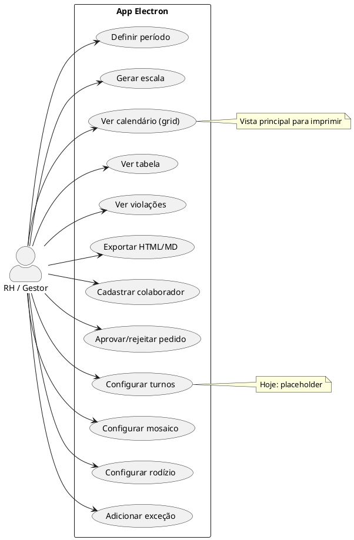
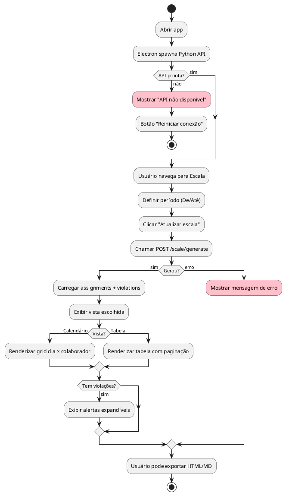
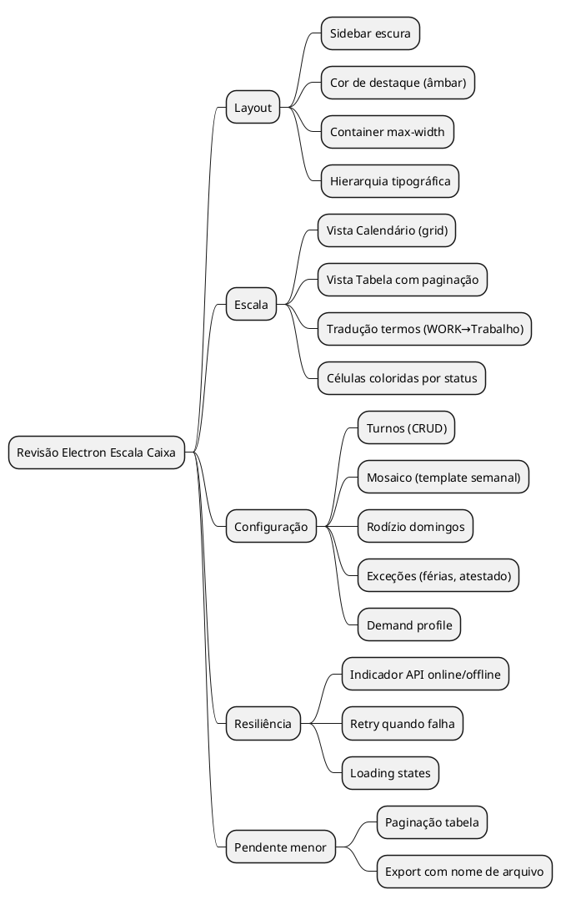
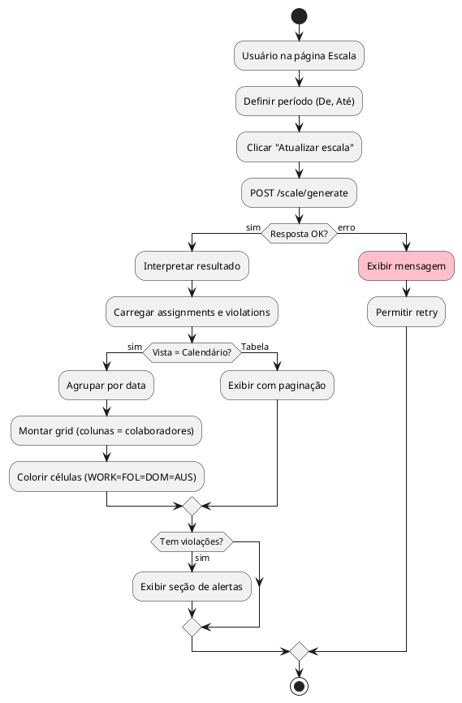
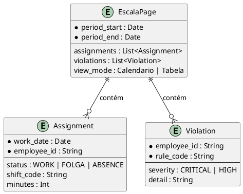

# LOGICA — Revisão Electron Escala de Caixa (Analyst v2)

> Destilação de gaps, layout e roadmap. O que existe, o que falta, o que está feio e por quê.
> Data: 2026-02-12

---

## TL;DR EXECUTIVO

O app Electron + shadcn está **funcional em MVP** (API, spawn Python, páginas básicas) mas **incompleto e visualmente genérico**. O layout usa shadcn default sem identidade; a página Escala não oferece visão calendário (grid para imprimir); a Configuração é placeholder; faltam tratamento de API offline, tradução de termos técnicos e hierarquia visual clara. O protótipo em `frontend-prototype/` foi removido (sistema limpo); a direção visual (sidebar escura, âmbar, grid calendário) está documentada no WARLOG.

---

## FASE 1 — ESCUTA ATIVA

**O que o usuário QUER:**
- Revisão honesta: "longe de acabar" + "layout é lixo"
- Especificação executável: o que falta, em que ordem, com critérios claros

**O que ENTRA:** Código atual, docs (FLUXO_USUARIO, DADOS_E_REVISAO), protótipo anterior.

**O que SAI:** Documento com gaps priorizados, proposta de layout e checklist de implementação.

---

## FASE 2 — SEPARACAO: O QUE É FIXO vs O QUE FALTA

### 2.1 O que JÁ EXISTE (regras fixas do sistema)

| Componente | Status | Comentário |
|------------|--------|------------|
| API FastAPI | ✅ | Endpoints prontos |
| Spawn Python | ✅ | Main process inicia uvicorn |
| Layout base | ✅ | Sidebar + main |
| EscalaPage | ⚠️ Parcial | Período + gerar + tabela + violações + export |
| ColaboradoresPage | ⚠️ Parcial | CRUD colaboradores e setores |
| PedidosPage | ⚠️ Parcial | Pendentes + novo pedido |
| ConfiguracaoPage | ❌ Placeholder | Apenas tabs vazias |

### 2.2 O que FALTA (variáveis / trabalho pendente)

```
MAQUINA: Implementação Electron Escala de Caixa

REGRAS FIXAS (referência):
- FLUXO_USUARIO.md define jornada do RH
- API já expõe o necessário
- Protótipo definiu calendário grid como formato principal

TRABALHO PENDENTE (prioridade):
1. LAYOUT: Identidade visual (sidebar escura, cor de destaque, hierarquia)
2. ESCALA: Vista calendário (grid dia×colaborador) além da tabela
3. CONFIGURAÇÃO: Conteúdo real (Turnos, Mosaico, Rodízio, Exceções, Demand)
4. RESILIÊNCIA: API offline, loading, retry
5. UX: Tradução WORK→Trabalho, FOLGA→Folga, etc.
6. PAGINAÇÃO: Tabela de alocações sem limite 50
```

---

## FASE 3 — MAPA DE ENTIDADES (visão do produto)



### Hierarquia de telas

```
APP
├── LAYOUT
│   ├── Sidebar (navegação)
│   └── Main (conteúdo)
├── ESCALA
│   ├── Período + Ação
│   ├── Vista Calendário (grid) ← FALTA
│   ├── Vista Tabela
│   ├── Violações
│   └── Export
├── COLABORADORES
│   ├── Colaboradores (CRUD)
│   └── Setores (CRUD)
├── PEDIDOS
│   ├── Pendentes (aprovar/rejeitar)
│   └── Novo pedido
└── CONFIGURAÇÃO ← QUASE TUDO FALTA
    ├── Turnos
    ├── Mosaico
    ├── Rodízio
    ├── Exceções
    └── Demand
```

---

## FASE 4 — FLUXO LOGICO: Jornada do usuário



---

## FASE 5 — REGRAS DO LAYOUT E GAPS

### 5.1 Problemas de layout identificados

| Problema | Descrição | Referência |
|----------|-----------|------------|
| **Genericidade** | shadcn default neutro, sem identidade | Protótipo tinha stone-900 + amber |
| **Sidebar** | Clara demais, pouco contraste | Layout atual: `bg-muted/40` |
| **Cor de destaque** | Nenhum accent forte | Protótipo: amber-600 no ativo |
| **Content width** | Sem max-width, conteúdo se espalha | Protótipo: `max-w-6xl mx-auto` |
| **Hierarquia** | Títulos fracos | Falta peso visual nos H1/H2 |
| **Células calendário** | Não existem | Protótipo: cores por status (verde/âmbar/azul) |

### 5.2 Regras de layout propostas

```
REGRAS DE LAYOUT — Escala Caixa

PODE:
- Sidebar escura (neutral-900 / slate-900)
- Cor de destaque âmbar ou laranja suave
- max-w-6xl no main para leitura confortável
- Grid calendário com células coloridas por status

DEVE:
- Item ativo na nav com destaque claro
- Título da página em destaque
- Tab Calendário como default na Escala

NÃO DEVE:
- Deixar termos técnicos (WORK, FOLGA) sem tradução
- Ocultar erros de API em silêncio
- Mostrar tabela com "50 de N" sem paginação real
```

### 5.3 Tabela de decisão: Layout

```
┌──────────────────┬─────────────────────┬────────────────────────────┐
│ Elemento         │ Estado atual        │ Ação                       │
├──────────────────┼─────────────────────┼────────────────────────────┤
│ Sidebar          │ bg-muted/40         │ Sidebar escura (slate-900)  │
│ Nav ativo        │ bg-accent           │ Amber/laranja destaque      │
│ Main content     │ Sem max-width       │ max-w-6xl mx-auto           │
│ Escala vista     │ Só tabela           │ Tab Calendário + Tabela     │
│ Células status   │ Badge texto         │ Cores (verde/âmbar/azul)    │
│ Configuração     │ Placeholder         │ Implementar ou remover tab  │
│ API offline      │ Erro genérico       │ Estado dedicado + retry     │
└──────────────────┴─────────────────────┴────────────────────────────┘
```

---

## FASE 6 — DIAGRAMAS PLANTUML

### 6.1 Mind Map — Escopo da revisão



### 6.2 Activity — Fluxo de geração da escala



### 6.3 ER — Entidades da UI (simplificado)



---

## FASE 7 — ROADMAP EXECUTÁVEL

### Prioridade 1 — Layout (impacto visual imediato)

| # | Tarefa | Critério de done |
|---|--------|------------------|
| 1 | Sidebar escura | `bg-slate-900` ou `bg-neutral-900`, texto claro |
| 2 | Cor de destaque | Item ativo com amber-600 ou laranja |
| 3 | Container main | `max-w-6xl mx-auto` no conteúdo |
| 4 | Tipografia | H1/H2 com peso e hierarquia clara |

### Prioridade 2 — Escala (funcionalidade principal)

| # | Tarefa | Critério de done |
|---|--------|------------------|
| 5 | Tab Calendário | Grid dia×colaborador com células coloridas |
| 6 | Tab Tabela | Manter, adicionar paginação real |
| 7 | Tradução | WORK→Trabalho, FOLGA→Folga, ABSENCE→Ausência |
| 8 | Células coloridas | Verde trabalho, âmbar folga, azul domingo, vermelho ausência |

### Prioridade 3 — Resiliência

| # | Tarefa | Critério de done |
|---|--------|------------------|
| 9 | Indicador API | Badge/indicador "Conectado" ou "API offline" |
| 10 | Retry | Botão "Reconectar" quando API falha |
| 11 | Loading | Skeleton ou spinner durante generate |

### Prioridade 4 — Configuração

| # | Tarefa | Critério de done |
|---|--------|------------------|
| 12 | Turnos | Listar turnos da API, edição mínima |
| 13 | Exceções | Listar + adicionar (API já existe) |
| 14 | Demand | Listar + adicionar slots (API já existe) |
| 15 | Mosaico / Rodízio | Ou integrar ou remover tab até ter backend |

---

## DISCLAIMERS CRÍTICOS

- **API Python:** O spawn assume `python3` no PATH. Em máquinas sem venv ativo, pode falhar.
- **Configuração:** Mosaico e Rodízio dependem de seed/CSV hoje; API não expõe CRUD completo. Ou documentar "carregar via seed" ou expandir API.
- **Export:** `window.open` para download pode ser bloqueado por pop-up em alguns contextos.

---

## RESUMO FINAL

```
┌─────────────────────────────────────────────────────────────────┐
│  O QUE TEM:  MVP funcional — API, spawn, CRUD básico, export     │
│  O QUE FALTA: Identidade visual, calendário grid, Config real   │
│  O QUE MUDAR: Layout = sidebar escura + accent + grid          │
│  ORDEM: Layout → Escala grid → Resiliência → Config             │
└─────────────────────────────────────────────────────────────────┘
```

**O protótipo tinha a direção certa.** O Electron atual perdeu identidade ao adotar shadcn "virgem". A revisão deve recuperar: sidebar escura, cor de destaque, grid calendário como vista principal e conteúdo real nas abas de Configuração.
