# ARQUITETURA: Motor de Compliance de Escalas (Core Multi-Setor, Piloto Caixa)

> Fonte única de arquitetura para o motor.
> Última revisão: 2026-02-12

---

## 0. Fonte de Verdade e Escopo

### 0.0 Prioridade de produto (contexto validação)
**Escala legível para o funcionário é o output principal.** Deve responder: em qual dia trabalha, em qual horário, qual domingo trabalha, qual dia de folga naquela semana. Sem esse output humano, o resto não resolve o problema.

### 0.1 Decisao oficial de escopo
- Este BUILD e a fonte unica de arquitetura para o motor.
- O **core do motor** e desenhado para operar por `sector_id` (multi-setor).
- O **piloto operacional atual** (dados reais, regras homologadas e UI) e **somente Caixa**.
- **Acougue e demais setores nao entram no MVP atual**; entram via onboarding de setor (policy + turnos + cobertura + excecoes).

### 0.2 Regra de leitura para evitar ambiguidade
- Quando o documento disser "Escala Caixa", ler como "instancia piloto atual".
- Quando o documento disser "Motor de Compliance", ler como "core reaproveitavel para qualquer setor".

### 0.3 Matriz de cobertura atual

| Escopo | Status hoje | Fonte |
|---|---|---|
| Core de validacao (hard/soft/semana/preferencia) | Implementado | `src/domain/engines.py`, `src/application/use_cases.py` |
| Dados e regras Caixa | Cobertos | `schemas/compliance_policy.example.json` + datasets extraidos |
| Acougue/outros setores | Nao onboarded | Sem policy/versionamento/demand profile dedicado |

## 1. Visao Geral

### 1.1 Escopo (Mind Map)
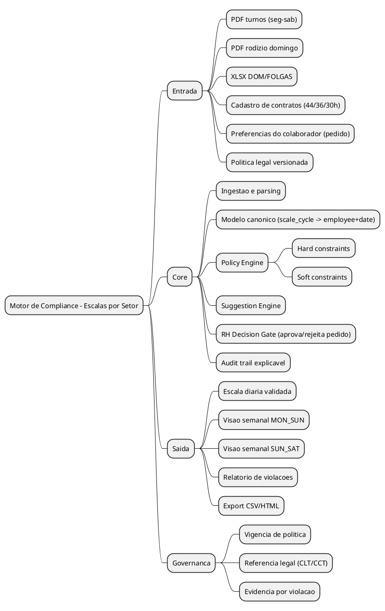

### 1.2 Casos de Uso (Use Case)
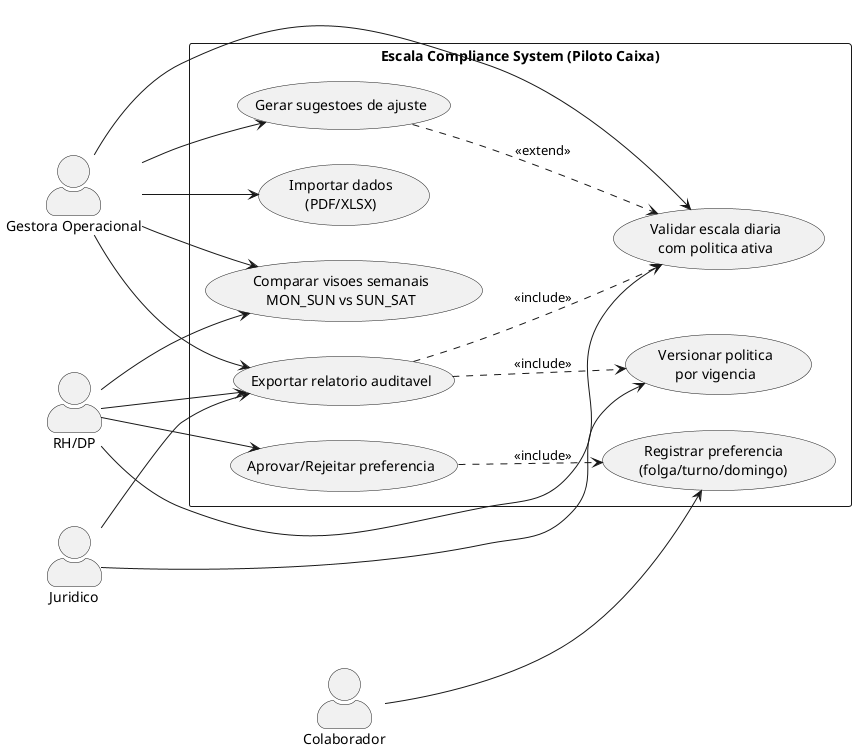

### 1.3 Componentes (Component Diagram)
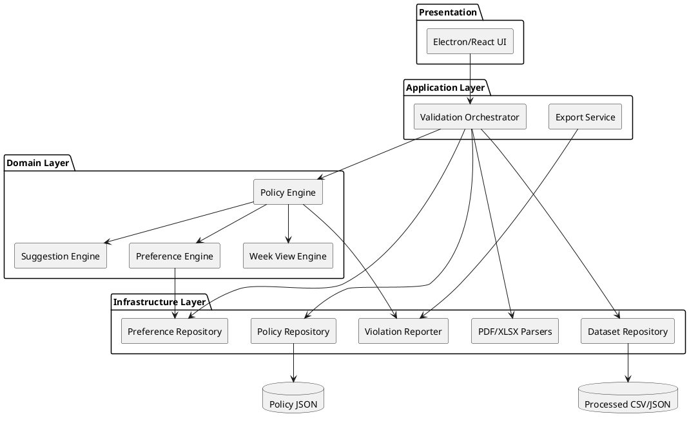

---

## 2. Fluxos Principais

### 2.1 Fluxo A - Ingestao + Validacao Completa

#### Sequencia
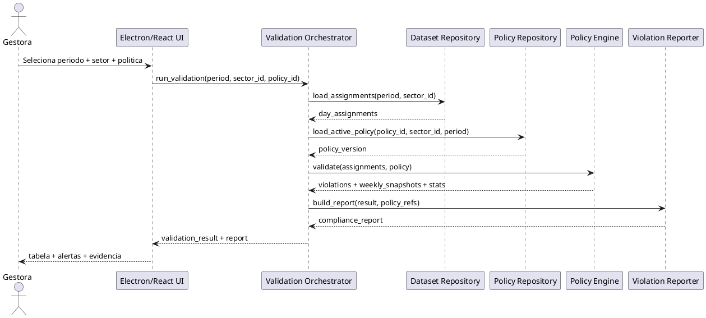

#### Processo (Activity)
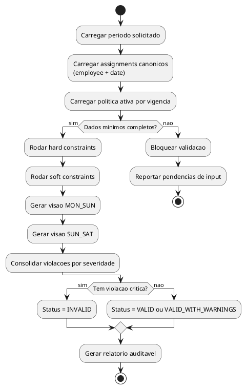

### 2.2 Fluxo B - Sugestao de Ajuste para Quebrar Violacao

#### Sequencia
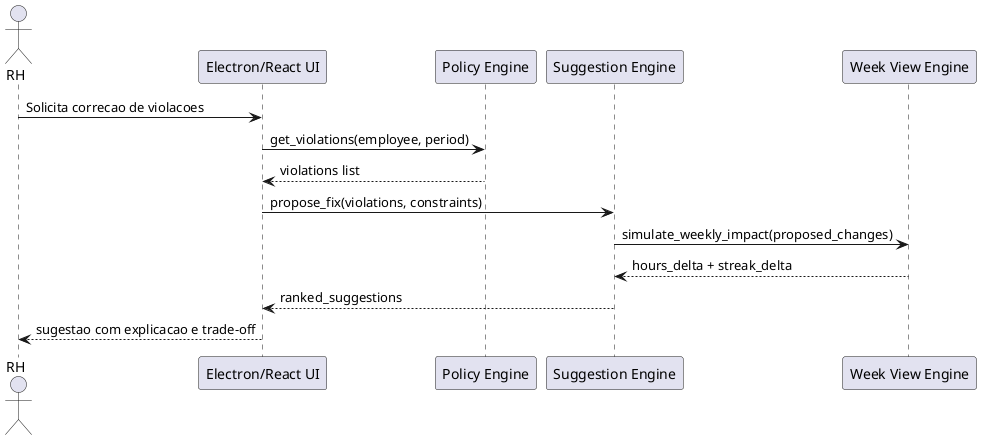

#### Processo (Activity)
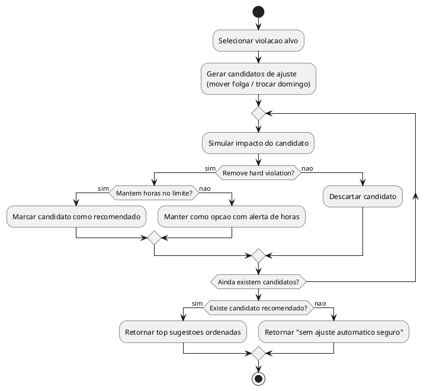

### 2.3 Fluxo C - Acordo Colaborador x RH (pedido dinamico)

#### Sequencia
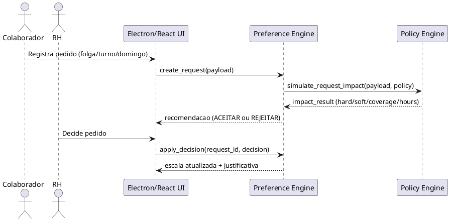

#### Processo (Activity)
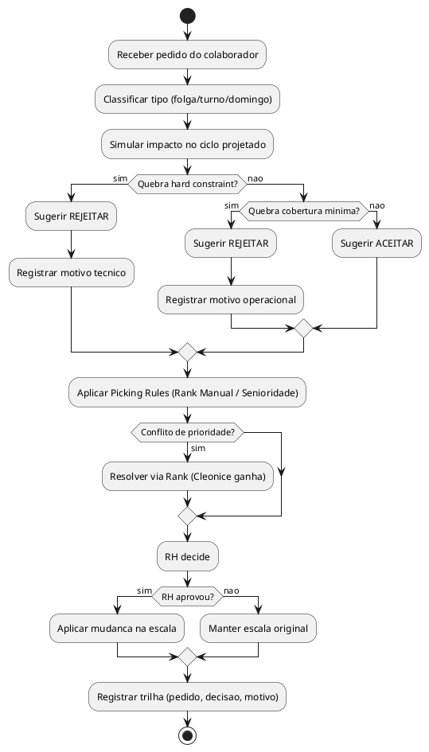

---

## 3. Estrutura de Dados

### 3.1 Modelo ER
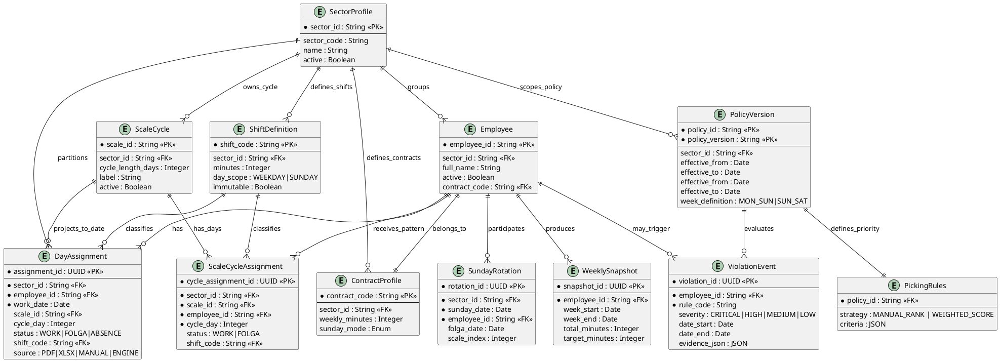

### 3.2 Estado do Ciclo de Escala
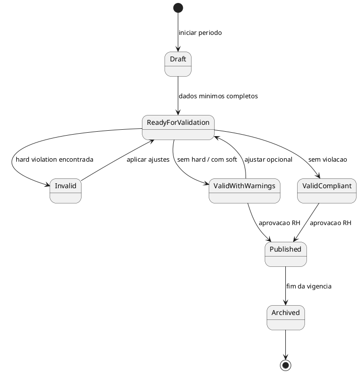

### 3.3 Entradas Necessarias + Ordem de Alimentacao

#### Modelo de referencia
- Primary key estrutural: `sector_id + scale_id + employee_id + cycle_day`.
- Projecao operacional: `sector_id + employee_id + work_date` (unico por dia).
- Semana: sempre derivada da data (`MON_SUN` ou `SUN_SAT`), nunca chave base.

#### Entradas obrigatorias

| Ordem | Dataset de entrada | Obrigatorio | Chave minima | Observacao |
|---|---|---|---|---|
| 0 | `sector_registry` | Sim | `sector_id` | Define setores ativos no motor (ex.: `CAIXA`, `ACOUGUE`) |
| 1 | `compliance_policy` | Sim | `sector_id + policy_id + policy_version` | Regras legais/operacionais por setor |
| 2 | `employee_registry` | Sim | `sector_id + employee_id` | Nome vira atributo, nao chave |
| 3 | `shift_catalog` | Sim | `sector_id + shift_code` | Turnos validos por setor |
| 4 | `scale_cycle_template` | Sim | `sector_id + scale_id + cycle_day + employee_id` | Padrao fixo da escala |
| 5 | `cycle_projection_context` | Sim | `sector_id + period_start + period_end + anchor_date + anchor_cycle_day` | Ancoragem real do ciclo no calendario |
| 6 | `sunday_rotation` | Condicional | `sector_id + employee_id + sunday_date` | Obrigatorio para setor com trabalho aos domingos |
| 7 | `demand_profile` | Condicional | `sector_id + date + slot_start` | Cobertura minima por faixa horaria (picos/vales) |
| 8 | `employee_preferences` | Nao | `sector_id + employee_id + request_date + request_type` | Pedido do colaborador (folga/turno/domingo) |
| 9 | `exceptions` | Nao | `sector_id + employee_id + date + type` | Ferias, atestado, trocas, bloqueios |

#### Ordem de ingestao (pipeline)
1. Selecionar `sector_id` e validar existencia em `sector_registry`.
2. Validar `compliance_policy` + `shift_catalog` do setor.
3. Validar `employee_registry` do setor e resolver aliases.
4. Rodar preflight de consistencia entre fontes criticas (ex.: PDF vs XLSX domingo) com fail-fast.
5. Carregar `scale_cycle_template` do setor e checar completude por ciclo.
6. Projetar ciclo para calendario com `cycle_projection_context` (anchor explicito).
7. Aplicar `sunday_rotation` (quando setor operar domingo).
8. Aplicar `demand_profile` para validar cobertura por faixa horaria.
9. Aplicar `employee_preferences` (simulacao + decisao RH).
10. Aplicar `exceptions`.
11. Gerar `day_assignments` canonicos.
12. Rodar compliance e gerar visoes semanais (oficial + diagnostica).

#### Regras de correlacao (como os dados se ligam)

| Relacao | Chave primaria | Fallback | Regra de conflito |
|---|---|---|---|
| Particionamento global | `sector_id` | Nenhum | Nao misturar registros entre setores |
| Funcionario em qualquer fonte | `sector_id + employee_id` | `name_normalized` + alias map (dentro do setor) | Se ambiguo, bloquear |
| Turno | `sector_id + shift_code` | Nenhum | Codigo desconhecido invalida input |
| Padrao de ciclo | `sector_id + scale_id + cycle_day + employee_id` | Nenhum | Duplicata invalida template |
| Evento de dia projetado | `sector_id + employee_id + work_date` | Nenhum | Duplicata invalida projecao |
| Domingo x folga compensatoria | `sector_id + employee_id + sunday_date` | Nenhum | Sem folga vinculada => violacao |
| Pedido de preferencia | `sector_id + employee_id + request_date + request_type` | Nenhum | Se ambiguo ou sem decisao RH, nao aplica |

#### Resultado canonico apos ingestao
- `scale_cycle_assignments` (fixo, reutilizavel, particionado por `sector_id`).
- `day_assignments` (instancia por periodo, particionado por `sector_id`).
- `weekly_views` (somente leitura/analise por corte).

---

## 4. Estrutura de Codigo

### 4.1 Arvore de arquivos alvo
```text
horario/
|-- app.py
|-- pages/
|   |-- 1_Colaboradores.py
|   |-- 2_Pedidos.py
|   `-- 3_Configuracao.py
|-- scripts/
|   `-- seed.py
|-- data/
|   |-- fixtures/          # Seed canônico único
|   |   `-- seed_supermercado_fernandes.json
|   `-- processed/        # Saída da validação (gerado em runtime)
|-- docs/
|   `-- BUILD_ARQUITETURA_MOTOR_COMPLIANCE_ESCALA_CAIXA.md
|-- schemas/
|   |-- compliance_policy.schema.json
|   `-- compliance_policy.example.json
|-- src/
|   |-- application/
|   |   `-- use_cases.py
|   |-- domain/
|   |   |-- models.py
|   |   |-- policy_loader.py
|   |   `-- engines.py
|   `-- infrastructure/
|       |-- database/
|       |-- parsers/legacy/
|       `-- repositories_db.py
```

### 4.2 Responsabilidades

| Camada | Responsabilidade | Resultado |
|---|---|---|
| `scripts/` | Extrair e normalizar dados brutos | CSV/JSON confiavel para processamento |
| `src/domain/` | Regras de negocio e compliance | Violacoes + sugestoes deterministicas |
| `src/application/` | Orquestrar casos de uso | Fluxo completo de validacao/exportacao |
| `src/infrastructure/` | IO, parser, repositorios e apresentacao | Integracao com arquivos e UI |
| `schemas/` | Contrato de politica versionada | Validador de configuracao legal/operacional |
| `tests/` | Regressao de regras criticas | Confianca para evoluir sem quebrar |

---

## 5. Consolidacao

### TL;DR
- O core do sistema e multi-setor, sempre particionado por `sector_id`; o piloto atual homologado e Caixa.
- O sistema deve usar `scale_cycle` como base estrutural e projetar para granularidade diaria (`employee + date`).
- Semana deve existir apenas como visao derivada.
- O motor de compliance fica separado da ingestao de dados para reduzir acoplamento.
- Politica legal/operacional precisa ser versionada por vigencia para nao hardcodar regra.
- Saida deve ser explicavel (regra, evidencias, impacto e sugestao) para RH/Juridico.
- Schema de politica e o contrato central para previsibilidade de execucao.

### Documentos de suporte
- **SISTEMA_ESCALAFLOW.md**: Doc unificado — fluxo do usuario, fixtures, processados, setup, arquitetura resumida.

### Checklist de implementacao (ordem obrigatoria)

| # | Item | Tipo | Dependencia |
|---|---|---|---|
| 1 | Formalizar `sector_registry` + particionamento `sector_id` em todo input/output | Data contract | - |
| 2 | Definir semantica oficial dos marcadores `5/6` e bloquear publish com `UNKNOWN` | Product/Data | 1 |
| 3 | Definir corte semanal oficial de bloqueio (`MON_SUN` ou `SUN_SAT`) | Product/RH | 1 |
| 4 | [DONE] Implementar preflight fail-fast de conflito entre fontes criticas (PDF vs XLSX) | Infrastructure | 1 |
| 5 | Implementar `ScaleCycle -> DayAssignment` com ancoragem explicita (`anchor_date + anchor_cycle_day`) | Domain | 1 |
| 6 | Implementar aplicacao real de `exceptions` (ferias/atestado/troca) com precedencia definida | Domain | 5 |
| 7 | Implementar interjornada auditavel (inicio/fim por turno e por dia) | Domain | 5 |
| 8 | Implementar validacao de cobertura por faixa horaria (`demand_profile`) | Domain | 5 |
| 9 | Consolidar detector de streak em bloco unico (sem ruido 7/8/9 repetido) | Domain | 5 |
| 10 | [WIP] Promover `PreferenceEngine` com Picking Rules (Rank Manual / Fator Cleonice) | Domain/Application | 6, 7, 8 |
| 11 | Integrar no `app.py` com dashboard de violacoes + fila de pedidos | Presentation | 10 |
| 12 | Criar testes de regressao com datasets reais por setor (Caixa primeiro) | QA | 4, 6, 7, 8, 10 |

### Dependencias externas
- [ ] Definicao oficial da semantica dos marcadores `5` e `6`.
- [ ] Definicao oficial de corte semanal da operacao (`MON_SUN` ou `SUN_SAT`).
- [ ] Validacao juridica interna sobre regra aplicavel de domingo/feriado (CCT + CNAE + vigencia).
- [ ] Definir ordem de onboarding dos proximos setores (ex.: Acougue, Padaria, FLV) e dono de cada policy.

### Riscos identificados

| Risco | Impacto | Mitigacao |
|---|---|---|
| Escopo misturado (Caixa vs multi-setor) | Alto | Toda entrada/saida particionada por `sector_id` + onboarding por setor |
| Semantica de marcador errada | Alto | Tratar como configuracao obrigatoria no schema e bloquear publish sem mapa valido |
| Semana de apuracao divergente de RH | Alto | Calcular e exibir as duas visoes simultaneamente ate definicao oficial |
| Mudanca legal no meio do periodo | Alto | Versionar politica por vigencia e registrar referencia legal em cada violacao |
| Dados de entrada com ruido (nomes/linhas espurias) | Medio | Pipeline de normalizacao + limpeza deterministica + testes com fixtures reais |
| Heuristica de ajuste gerar efeito colateral | Medio | Rodar simulacao completa e impedir recomendacao que cria hard violation nova |
| Pedido de colaborador conflitar com cobertura/compliance | Alto | Passar por gate RH + simulacao obrigatoria com motivo de aceite/rejeicao |
