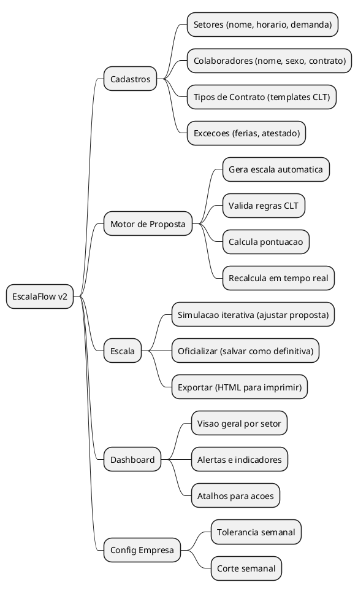
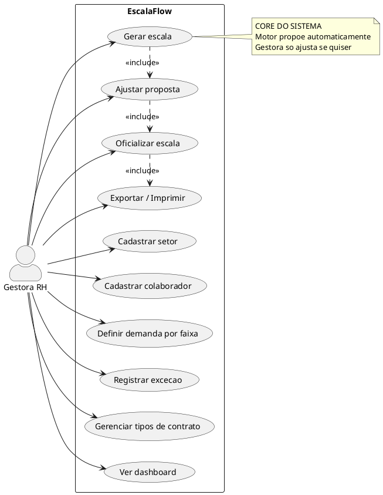
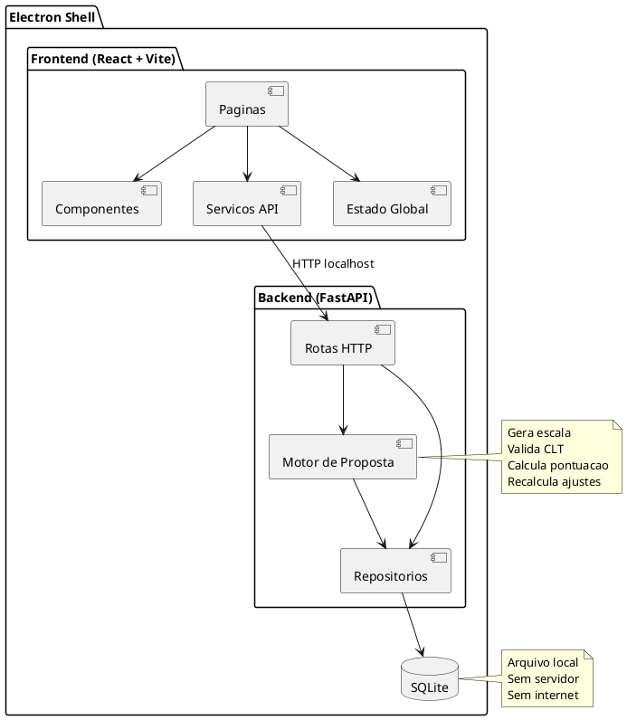
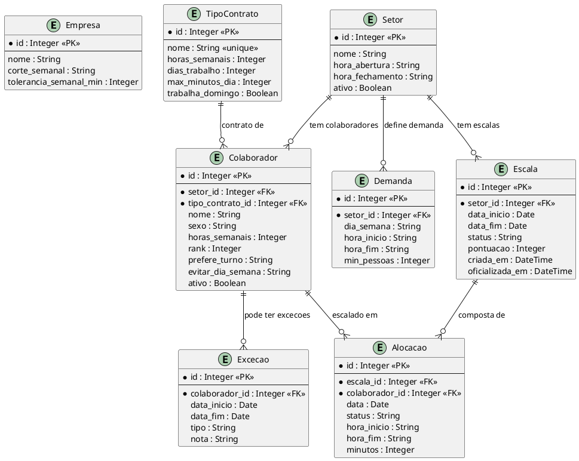
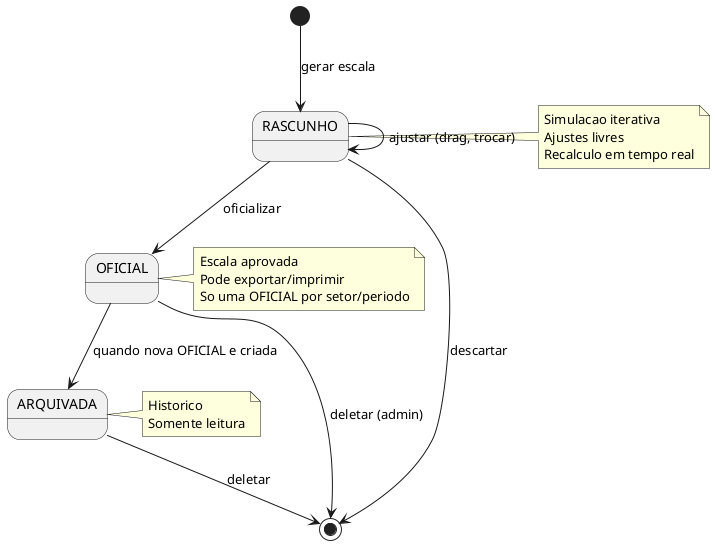
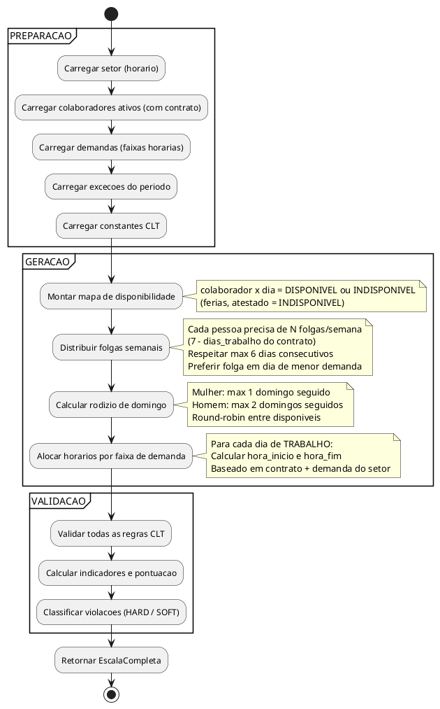
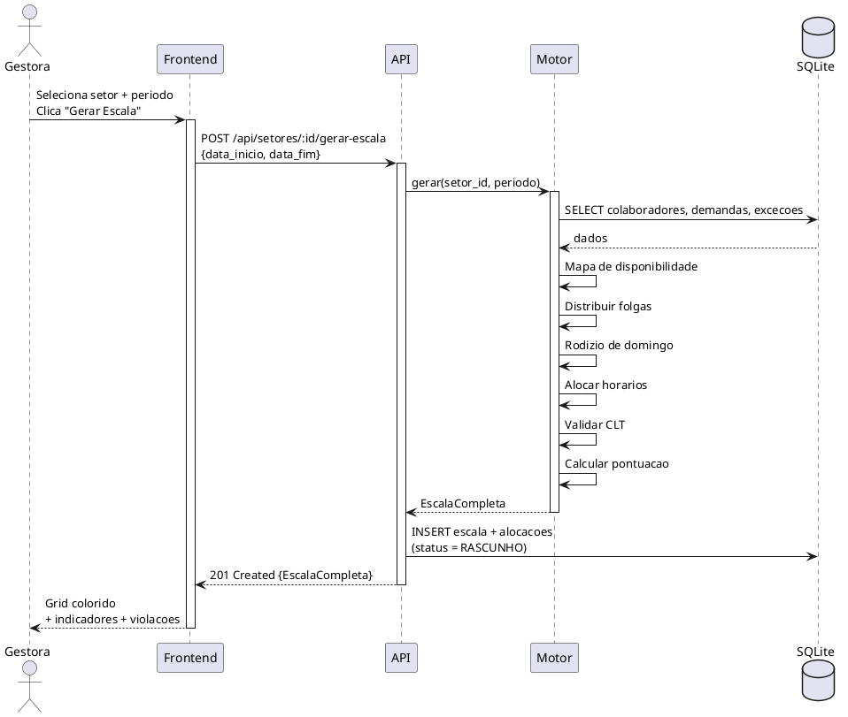
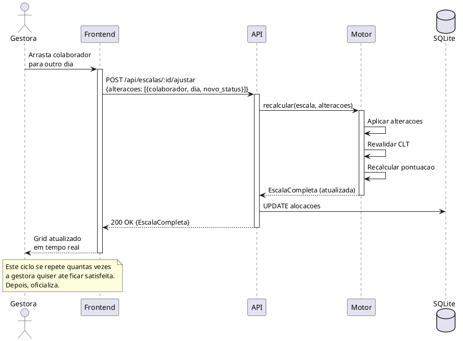
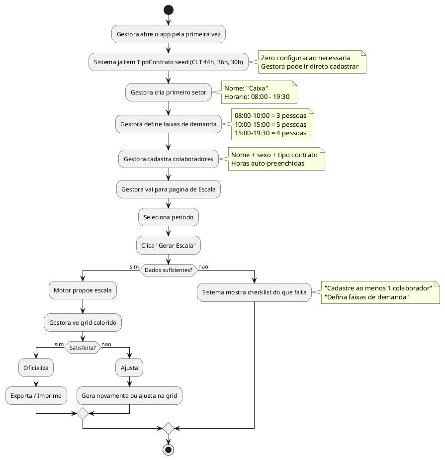

# BUILD: EscalaFlow v2

> Arquitetura completa para construcao do zero.
> Qualquer desenvolvedor ou IA le este documento e constroi o sistema inteiro.
> Nenhuma referencia a componentes anteriores. Clean slate.
> Data: 2026-02-13

---

## 1. O QUE E ESTE SISTEMA

**EscalaFlow** e um app desktop (Electron) que gera escalas de trabalho para supermercados.

**Quem usa:** Gestora de RH (nao tecnica, nao TI, nao programadora).

**O que faz:**
1. Gestora cadastra setores (Caixa, Acougue, Padaria)
2. Gestora cadastra colaboradores (nome, contrato, sexo)
3. Gestora define quantas pessoas precisa por faixa horaria
4. Sistema PROPOE escala otimizada automaticamente
5. Gestora ajusta se quiser (arrastar, trocar)
6. Gestora salva, exporta, imprime, cola na parede

**O que NAO e:**
- Nao e sistema de RH (sem salario, admissao, beneficios)
- Nao e relogio de ponto
- Nao e SaaS (app local, sem login, sem internet)
- Nao e planilha (sistema PROPOE, gestora AJUSTA)

**Principio fundamental:** menor quantidade possivel de input para gerar escala.

---

## 2. CONVENCOES DE NOMENCLATURA

> A mesma palavra aparece no banco, na API, no codigo e na tela. Zero traducao.

### 2.1 Vocabulario do dominio (portugues em toda parte)

| Termo | Onde aparece | Significado |
|-------|-------------|-------------|
| `Setor` | DB, API, Python, TS, UI | Departamento do supermercado |
| `Colaborador` | DB, API, Python, TS, UI | Funcionario |
| `TipoContrato` | DB, API, Python, TS | Template de contrato (CLT 44h, etc.) |
| `Demanda` | DB, API, Python, TS, UI | Faixa horaria com minimo de pessoas |
| `Excecao` | DB, API, Python, TS, UI | Ferias, atestado, bloqueio |
| `Escala` | DB, API, Python, TS, UI | Escala gerada (rascunho ou oficial) |
| `Alocacao` | DB, API, Python, TS | Um dia de um colaborador numa escala |
| `Empresa` | DB, API, Python, TS, UI | Config global da empresa |

### 2.2 Padroes por camada

| Camada | Padrao | Exemplo |
|--------|--------|---------|
| Tabela DB | snake_case plural | `setores`, `colaboradores`, `tipos_contrato` |
| Coluna DB | snake_case | `horas_semanais`, `setor_id` |
| Modelo Python | PascalCase | `TipoContrato`, `Colaborador` |
| Campo Python | snake_case | `horas_semanais` |
| Rota API | `/api/{kebab-plural}` | `/api/setores`, `/api/tipos-contrato` |
| Chave JSON | snake_case | `horas_semanais` |
| Interface TS | PascalCase | `TipoContrato`, `Colaborador` |
| Campo TS | snake_case | `horas_semanais` (igual ao JSON — zero adapter) |
| Componente React | PascalCase | `SetorCard`, `EscalaGrid` |
| Arquivo React | PascalCase.tsx | `SetorCard.tsx`, `EscalaGrid.tsx` |
| Rota frontend | `/{kebab}` | `/setores`, `/tipos-contrato` |
| Pasta | kebab-case | `tipos-contrato/` |
| Hook React | use + PascalCase | `useSetor`, `useEscala` |
| Variavel TS | camelCase | `setorAtivo`, `escalaAtual` |
| Label UI | Portugues natural | "Tipo de Contrato", "Hora de Abertura" |

### 2.3 Regra de ouro

```
DB column  =  JSON key  =  TS interface field
horas_semanais = horas_semanais = horas_semanais

Nenhum camelCase ↔ snake_case. Nenhum adapter. Nenhum mapper.
O que sai do banco e EXATAMENTE o que chega no componente React.
```

---

## 3. VISAO GERAL

### 3.1 Escopo



### 3.2 Casos de Uso



### 3.3 Arquitetura de componentes



---

## 4. MODELO DE DADOS

### 4.1 Entidades e Relacionamentos



### 4.2 Detalhamento dos campos

**Empresa** (singleton — 1 registro no banco):
| Campo | Tipo | Default | Descricao |
|-------|------|---------|-----------|
| `id` | Integer PK | auto | — |
| `nome` | String | "" | Nome da empresa (exibicao) |
| `corte_semanal` | String | "SEG_DOM" | Como contar "a semana" para horas |
| `tolerancia_semanal_min` | Integer | 30 | Tolerancia em minutos na meta semanal |

**TipoContrato** (templates de contrato):
| Campo | Tipo | Descricao |
|-------|------|-----------|
| `id` | Integer PK | — |
| `nome` | String unique | Label visivel: "CLT 44h", "Estagiario 20h" |
| `horas_semanais` | Integer | Meta de horas por semana (ex: 44) |
| `dias_trabalho` | Integer | Dias de trabalho por semana (ex: 6) |
| `max_minutos_dia` | Integer | Teto de minutos por dia (ex: 570 = 9h30) |
| `trabalha_domingo` | Boolean | Participa do rodizio de domingo? |

**Setor**:
| Campo | Tipo | Default | Descricao |
|-------|------|---------|-----------|
| `id` | Integer PK | auto | — |
| `nome` | String | — | "Caixa", "Acougue", "Padaria" |
| `hora_abertura` | String | — | "08:00" |
| `hora_fechamento` | String | — | "19:30" |
| `ativo` | Boolean | true | Soft delete (ver secao 8.5 Arquivamento) |

**Demanda** (faixas horarias por setor):
| Campo | Tipo | Descricao |
|-------|------|-----------|
| `id` | Integer PK | — |
| `setor_id` | Integer FK | Setor dono |
| `dia_semana` | String nullable | null = padrao todos os dias. "SEG", "SAB" = override |
| `hora_inicio` | String | "08:00" |
| `hora_fim` | String | "10:00" |
| `min_pessoas` | Integer | Minimo de pessoas nesta faixa |

**Colaborador**:
| Campo | Tipo | Default | Descricao |
|-------|------|---------|-----------|
| `id` | Integer PK | auto | — |
| `setor_id` | Integer FK | — | Setor onde trabalha |
| `tipo_contrato_id` | Integer FK | — | Template de contrato |
| `nome` | String | — | Nome completo |
| `sexo` | String | — | "M" ou "F" (motor deriva regra de domingo) |
| `horas_semanais` | Integer | do template | Inicializado do TipoContrato, editavel por pessoa |
| `rank` | Integer | 0 | Prioridade de escolha — em empates, quem tem rank maior escolhe primeiro (folga, domingo, horario). Gerenciado por DnD na pagina do setor |
| `prefere_turno` | String nullable | null | "MANHA" ou "TARDE" ou null. Soft constraint: motor TENTA respeitar, nao garante |
| `evitar_dia_semana` | String nullable | null | "SEG".."DOM" ou null. Soft constraint: motor TENTA colocar folga neste dia |
| `ativo` | Boolean | true | Soft delete (ver secao 8.5 Arquivamento) |

**Excecao** (ferias, atestado, bloqueio):
| Campo | Tipo | Descricao |
|-------|------|-----------|
| `id` | Integer PK | — |
| `colaborador_id` | Integer FK | Colaborador |
| `data_inicio` | Date | Inicio do periodo |
| `data_fim` | Date | Fim do periodo (inclusive) |
| `tipo` | String | "FERIAS", "ATESTADO", "TROCA", "BLOQUEIO" |
| `nota` | String nullable | Observacao livre |

**Escala** (escala gerada):
| Campo | Tipo | Default | Descricao |
|-------|------|---------|-----------|
| `id` | Integer PK | auto | — |
| `setor_id` | Integer FK | — | Setor desta escala |
| `data_inicio` | Date | — | Inicio do periodo |
| `data_fim` | Date | — | Fim do periodo |
| `status` | String | "RASCUNHO" | "RASCUNHO", "OFICIAL", "ARQUIVADA" |
| `pontuacao` | Integer nullable | — | 0-100 (qualidade da escala) |
| `criada_em` | DateTime | now() | Quando foi gerada |
| `oficializada_em` | DateTime nullable | — | Quando virou oficial |

**Alocacao** (cada dia de cada pessoa numa escala):
| Campo | Tipo | Descricao |
|-------|------|-----------|
| `id` | Integer PK | — |
| `escala_id` | Integer FK | Escala pai |
| `colaborador_id` | Integer FK | Colaborador |
| `data` | Date | Dia |
| `status` | String | "TRABALHO", "FOLGA", "AUSENCIA" |
| `hora_inicio` | String nullable | "08:00" (null se FOLGA/AUSENCIA) |
| `hora_fim` | String nullable | "17:30" (null se FOLGA/AUSENCIA) |
| `minutos` | Integer nullable | 570 (null se FOLGA/AUSENCIA) |

### 4.3 Ciclo de vida da Escala



### 4.4 Seed inicial (dados que o sistema traz de fabrica)

```python
SEED_TIPOS_CONTRATO = [
    {
        "nome": "CLT 44h",
        "horas_semanais": 44,
        "dias_trabalho": 6,
        "max_minutos_dia": 570,
        "trabalha_domingo": True,
    },
    {
        "nome": "CLT 36h",
        "horas_semanais": 36,
        "dias_trabalho": 5,
        "max_minutos_dia": 480,
        "trabalha_domingo": True,
    },
    {
        "nome": "CLT 30h",
        "horas_semanais": 30,
        "dias_trabalho": 5,
        "max_minutos_dia": 360,
        "trabalha_domingo": True,
    },
    {
        "nome": "Estagiario 20h",
        "horas_semanais": 20,
        "dias_trabalho": 5,
        "max_minutos_dia": 240,
        "trabalha_domingo": False,
    },
]

SEED_EMPRESA = {
    "nome": "",
    "corte_semanal": "SEG_DOM",
    "tolerancia_semanal_min": 30,
}
```

**Estes dados sao UNIVERSAIS** (CLT e lei brasileira). O sistema funciona sem eles (usuario pode criar do zero), mas funciona MELHOR com eles (menos friccao no primeiro uso).

### 4.5 Constantes CLT (hardcoded no motor, NAO configuraveis)

```python
# Regras CLT imutaveis
CLT_MAX_DIAS_CONSECUTIVOS = 6
CLT_MIN_DESCANSO_ENTRE_JORNADAS_MIN = 660  # 11 horas
CLT_MAX_JORNADA_DIARIA_MIN = 600           # 10 horas (max absoluto)

# Regra de domingo por sexo (CLT + CCT comercio)
CLT_MAX_DOMINGOS_CONSECUTIVOS = {
    "M": 2,  # homem: max 2 domingos seguidos trabalhados
    "F": 1,  # mulher: max 1 domingo seguido trabalhado
}
```

---

## 5. API

### 5.1 Rotas

```
BASE: http://localhost:8000/api

# ─── EMPRESA (singleton) ─────────────────────────────
GET    /api/empresa                          → Empresa
PUT    /api/empresa                          → Empresa

# ─── TIPOS DE CONTRATO ───────────────────────────────
GET    /api/tipos-contrato                   → TipoContrato[]
POST   /api/tipos-contrato                   → TipoContrato
GET    /api/tipos-contrato/:id               → TipoContrato
PUT    /api/tipos-contrato/:id               → TipoContrato
DELETE /api/tipos-contrato/:id               → void

# ─── SETORES ──────────────────────────────────────────
GET    /api/setores                          → Setor[]
GET    /api/setores?ativo=true               → Setor[] (filtro ativos)
POST   /api/setores                          → Setor
GET    /api/setores/:id                      → Setor
PUT    /api/setores/:id                      → Setor
DELETE /api/setores/:id                      → void

# ─── DEMANDAS (pertence a setor) ─────────────────────
GET    /api/setores/:id/demandas             → Demanda[]
POST   /api/setores/:id/demandas             → Demanda
PUT    /api/demandas/:id                     → Demanda
DELETE /api/demandas/:id                     → void

# ─── COLABORADORES ────────────────────────────────────
GET    /api/colaboradores                    → Colaborador[]
GET    /api/colaboradores?setor_id=:id       → Colaborador[] (filtro)
GET    /api/colaboradores?ativo=true         → Colaborador[] (filtro ativos)
POST   /api/colaboradores                    → Colaborador
GET    /api/colaboradores/:id                → Colaborador
PUT    /api/colaboradores/:id                → Colaborador
DELETE /api/colaboradores/:id                → void

# ─── RANK (pertence ao contexto do setor) ────────────
PUT    /api/setores/:id/rank                 → void (reordena colaboradores por DnD)

# ─── EXCECOES (pertence a colaborador) ────────────────
GET    /api/colaboradores/:id/excecoes       → Excecao[]
POST   /api/colaboradores/:id/excecoes       → Excecao
PUT    /api/excecoes/:id                     → Excecao
DELETE /api/excecoes/:id                     → void

# ─── ESCALA (o core) ─────────────────────────────────
POST   /api/setores/:id/gerar-escala         → EscalaCompleta
POST   /api/escalas/:id/ajustar              → EscalaCompleta
PUT    /api/escalas/:id/oficializar          → Escala
GET    /api/setores/:id/escalas              → Escala[]
GET    /api/escalas/:id                      → EscalaCompleta
DELETE /api/escalas/:id                      → void

# ─── DASHBOARD ────────────────────────────────────────
GET    /api/dashboard/resumo                 → DashboardResumo
```

### 5.2 Tipos de resposta

```typescript
// ─── Entidades base (espelho do banco) ───────────────

interface Empresa {
  id: number
  nome: string
  corte_semanal: string
  tolerancia_semanal_min: number
}

interface TipoContrato {
  id: number
  nome: string
  horas_semanais: number
  dias_trabalho: number
  max_minutos_dia: number
  trabalha_domingo: boolean
}

interface Setor {
  id: number
  nome: string
  hora_abertura: string
  hora_fechamento: string
  ativo: boolean
}

interface Demanda {
  id: number
  setor_id: number
  dia_semana: string | null
  hora_inicio: string
  hora_fim: string
  min_pessoas: number
}

interface Colaborador {
  id: number
  setor_id: number
  tipo_contrato_id: number
  nome: string
  sexo: 'M' | 'F'
  horas_semanais: number
  rank: number
  prefere_turno: 'MANHA' | 'TARDE' | null
  evitar_dia_semana: string | null   // "SEG".."DOM" ou null
  ativo: boolean
}

interface Excecao {
  id: number
  colaborador_id: number
  data_inicio: string   // "2026-03-01"
  data_fim: string      // "2026-03-15"
  tipo: 'FERIAS' | 'ATESTADO' | 'TROCA' | 'BLOQUEIO'
  nota: string | null
}

interface Escala {
  id: number
  setor_id: number
  data_inicio: string
  data_fim: string
  status: 'RASCUNHO' | 'OFICIAL' | 'ARQUIVADA'
  pontuacao: number | null
  criada_em: string
  oficializada_em: string | null
}

interface Alocacao {
  id: number
  escala_id: number
  colaborador_id: number
  data: string
  status: 'TRABALHO' | 'FOLGA' | 'AUSENCIA'
  hora_inicio: string | null
  hora_fim: string | null
  minutos: number | null
}

// ─── Tipos compostos (respostas enriquecidas) ────────

interface EscalaCompleta {
  escala: Escala
  alocacoes: Alocacao[]
  indicadores: Indicadores
  violacoes: Violacao[]
}

interface Indicadores {
  cobertura_percent: number      // 0-100
  violacoes_hard: number         // CLT (bloqueante)
  violacoes_soft: number         // qualidade (alerta)
  equilibrio: number             // 0-100 (distribuicao justa)
  pontuacao: number              // 0-100 (score geral)
}

interface Violacao {
  tipo: 'HARD' | 'SOFT'
  regra: string                  // "MAX_DIAS_CONSECUTIVOS"
  colaborador_id: number
  colaborador_nome: string
  mensagem: string               // "Ana trabalhou 7 dias seguidos (max 6)"
  data: string | null
}

interface DashboardResumo {
  total_setores: number
  total_colaboradores: number
  total_em_ferias: number
  total_em_atestado: number
  setores: SetorResumo[]
  alertas: AlertaDashboard[]
}

interface SetorResumo {
  id: number
  nome: string
  total_colaboradores: number
  escala_atual: 'SEM_ESCALA' | 'RASCUNHO' | 'OFICIAL'
  proxima_geracao: string | null
  violacoes_pendentes: number
}

interface AlertaDashboard {
  tipo: 'ESCALA_VENCIDA' | 'VIOLACAO_HARD' | 'SEM_ESCALA' | 'POUCOS_COLABORADORES'
  setor_id: number
  setor_nome: string
  mensagem: string   // "Caixa: escala vence em 2 dias"
}
```

### 5.3 Request bodies

```typescript
// POST /api/setores/:id/gerar-escala
interface GerarEscalaRequest {
  data_inicio: string   // "2026-03-01"
  data_fim: string      // "2026-03-31"
}

// POST /api/escalas/:id/ajustar
interface AjustarEscalaRequest {
  alteracoes: AlteracaoEscala[]
}

interface AlteracaoEscala {
  colaborador_id: number
  data: string
  novo_status: 'TRABALHO' | 'FOLGA'
  nova_hora_inicio?: string
  nova_hora_fim?: string
}

// POST /api/colaboradores
interface CriarColaboradorRequest {
  setor_id: number
  tipo_contrato_id: number
  nome: string
  sexo: 'M' | 'F'
  horas_semanais?: number        // se omitido, usa do TipoContrato
  rank?: number
  prefere_turno?: 'MANHA' | 'TARDE' | null
  evitar_dia_semana?: string | null
}

// PUT /api/setores/:id/rank (reordenar colaboradores por DnD)
interface ReordenarRankRequest {
  colaborador_ids: number[]   // lista ordenada — posicao 0 = rank mais alto
}
```

### 5.4 Validacoes e protecoes da API

> Regras que a API aplica ANTES de aceitar a operacao.

| Operacao | Validacao | Resposta |
|----------|-----------|----------|
| `DELETE /api/tipos-contrato/:id` | Se tem colaboradores usando | 409: "{N} colaboradores usam este contrato. Mova-os antes de deletar." |
| `POST /api/setores/:id/demandas` | hora_inicio < setor.hora_abertura | 422: "Faixa inicia antes da abertura do setor ({hora_abertura})" |
| `POST /api/setores/:id/demandas` | hora_fim > setor.hora_fechamento | 422: "Faixa termina depois do fechamento do setor ({hora_fechamento})" |
| `POST /api/setores/:id/gerar-escala` | Setor sem colaboradores ativos | 422: "Setor nao tem colaboradores ativos. Cadastre ao menos 1." |
| `POST /api/setores/:id/gerar-escala` | Setor sem demandas cadastradas | 422: "Setor nao tem faixas de demanda. Defina ao menos 1." |
| `PUT /api/escalas/:id/oficializar` | Escala tem violacao HARD | 409: "Escala tem {N} violacoes criticas. Corrija antes de oficializar." |
| `PUT /api/escalas/:id/oficializar` | Ja existe OFICIAL para mesmo setor+periodo | Auto: escala anterior vira ARQUIVADA |
| `PUT /api/colaboradores/:id` | Mudar setor_id com escala RASCUNHO aberta | 422: "Colaborador tem escala em rascunho no setor atual. Descarte antes de mover." |

---

## 6. MOTOR DE PROPOSTA (Algoritmo)

> O coracao do sistema. Recebe dados, gera escala otimizada.

### 6.1 Visao geral



### 6.2 Passo a passo detalhado

**FASE 1 — PREPARACAO (com lookback)**

```
Input:
  setor_id: Integer
  data_inicio: Date
  data_fim: Date

Carregar:
  setor = SELECT * FROM setores WHERE id = setor_id
  colaboradores = SELECT * FROM colaboradores
                  WHERE setor_id = setor_id AND ativo = true
                  JOIN tipos_contrato ON tipo_contrato_id
                  ORDER BY rank DESC
  demandas = SELECT * FROM demandas WHERE setor_id = setor_id
  excecoes = SELECT * FROM excecoes
             WHERE colaborador_id IN (colaboradores.ids)
             AND data_inicio <= data_fim
             AND data_fim >= data_inicio

Lookback (continuidade entre periodos):
  escala_anterior = SELECT * FROM escalas
    WHERE setor_id = setor_id
    AND status = 'OFICIAL'
    AND data_fim < data_inicio
    ORDER BY data_fim DESC LIMIT 1

  Se escala_anterior existe:
    ultimos_dias = SELECT * FROM alocacoes
      WHERE escala_id = escala_anterior.id
      AND data >= (data_inicio - 6 dias)
      ORDER BY data DESC

    Para cada colaborador C:
      C.dias_consecutivos_iniciais = contar TRABALHO seguidos ate o fim
      C.domingos_consecutivos_iniciais = contar domingos trabalhados seguidos

  Se NAO existe escala_anterior:
    Para cada colaborador C:
      C.dias_consecutivos_iniciais = 0
      C.domingos_consecutivos_iniciais = 0
```

**FASE 2 — MAPA DE DISPONIBILIDADE**

```
Para cada colaborador C:
  Para cada dia D no periodo:
    Se existe excecao cobrindo D:
      mapa[C][D] = INDISPONIVEL (tipo da excecao)
    Senao:
      mapa[C][D] = DISPONIVEL
```

**FASE 3 — DISTRIBUICAO DE FOLGAS**

```
Ordenar colaboradores por rank DESC (maior rank escolhe folga primeiro)

Para cada colaborador C (na ordem de rank):
  dias_trabalho_semana = C.tipo_contrato.dias_trabalho  (ex: 6)
  folgas_por_semana = 7 - dias_trabalho_semana          (ex: 1)
  consecutivos = C.dias_consecutivos_iniciais  // do lookback

  Para cada semana W no periodo:
    dias_disponiveis = dias de W onde mapa[C][D] = DISPONIVEL
    dias_para_folga = folgas_por_semana

    Ordenar dias_disponiveis por:
      1. Se C.evitar_dia_semana corresponde → preferir esse dia pra folga
      2. Dia com MENOR demanda (preferir folga em dia tranquilo)
      3. Desempate: distribuir uniformemente

    Para cada folga a distribuir:
      Escolher dia pelo criterio acima
      MAS garantir que nao crie sequencia > 6 dias consecutivos
      (usar 'consecutivos' como estado inicial na primeira semana)

    Marcar dias escolhidos como FOLGA
    Marcar restantes como TRABALHO (provisorio)
    Atualizar 'consecutivos' pro estado final desta semana
```

**FASE 4 — RODIZIO DE DOMINGO (com lookback)**

```
domingos = todos os domingos no periodo
colaboradores_domingo = [C for C in colaboradores if C.tipo_contrato.trabalha_domingo]

Para cada colaborador C em colaboradores_domingo:
  max_consecutivos = CLT_MAX_DOMINGOS_CONSECUTIVOS[C.sexo]
  contador_consecutivos = C.domingos_consecutivos_iniciais  // do lookback

Para cada domingo D em domingos:
  necessidade = demanda de domingo para o setor
  disponiveis = [C for C in colaboradores_domingo
                 if mapa[C][D] = DISPONIVEL
                 AND C.contador_consecutivos < C.max_consecutivos]

  Ordenar disponiveis por:
    1. Quem tem menos domingos trabalhados (equilibrio)
    2. Rank (prioridade)

  Escalar os primeiros N (onde N = necessidade)
  Para os escalados: contador_consecutivos += 1
  Para os NAO escalados: contador_consecutivos = 0, marcar FOLGA
```

**FASE 5 — ALOCACAO DE HORARIOS (com preferencia e rank)**

```
Para cada dia D no periodo:
  colaboradores_dia = [C for C in colaboradores where resultado[C][D] = TRABALHO]
  Ordenar colaboradores_dia por rank DESC (maior rank escolhe horario primeiro)

  Para cada colaborador C em colaboradores_dia:
    meta_diaria_min = C.horas_semanais * 60 / C.tipo_contrato.dias_trabalho
    max_dia = C.tipo_contrato.max_minutos_dia
    minutos = min(meta_diaria_min, max_dia)

    faixas_ordenadas = demandas do setor para dia_semana(D)
                       ordenadas por (min_pessoas - ja_alocados) DESC

    Se C.prefere_turno = "MANHA":
      Reordenar faixas: mover faixas de manha (hora_inicio < 12:00)
      pra cima, mantendo prioridade de necessidade como segundo criterio

    Se C.prefere_turno = "TARDE":
      Reordenar faixas: mover faixas de tarde (hora_inicio >= 12:00)
      pra cima, mantendo prioridade de necessidade como segundo criterio

    hora_inicio = faixa_escolhida.hora_inicio
    hora_fim = hora_inicio + minutos

    Se hora_fim > setor.hora_fechamento:
      hora_inicio = setor.hora_fechamento - minutos
      hora_fim = setor.hora_fechamento

    resultado[C][D] = {
      status: "TRABALHO",
      hora_inicio: hora_inicio,
      hora_fim: hora_fim,
      minutos: minutos
    }
```

**FASE 6 — VALIDACAO**

```
violacoes = []

Para cada colaborador C:
  # R1: Max dias consecutivos
  Se sequencia de TRABALHO > CLT_MAX_DIAS_CONSECUTIVOS:
    violacoes.add(HARD, "MAX_DIAS_CONSECUTIVOS",
      "{C.nome} trabalhou {N} dias seguidos (max {CLT_MAX_DIAS_CONSECUTIVOS})")

  # R2: Min descanso entre jornadas
  Para cada par de dias consecutivos (D1, D2) com TRABALHO:
    descanso = D2.hora_inicio - D1.hora_fim (em minutos)
    Se descanso < CLT_MIN_DESCANSO_ENTRE_JORNADAS_MIN:
      violacoes.add(HARD, "DESCANSO_ENTRE_JORNADAS",
        "{C.nome}: so {descanso}min entre {D1} e {D2} (min 660min)")

  # R3: Rodizio domingo
  Se domingos consecutivos trabalhados > CLT_MAX_DOMINGOS_CONSECUTIVOS[C.sexo]:
    violacoes.add(HARD, "RODIZIO_DOMINGO",
      "{C.nome}: {N} domingos seguidos (max {max})")

  # R4: Meta semanal de horas
  Para cada semana W:
    total_min = soma de minutos em W
    meta = C.horas_semanais * 60
    desvio = abs(total_min - meta)
    Se desvio > empresa.tolerancia_semanal_min:
      violacoes.add(SOFT, "META_SEMANAL",
        "{C.nome}: {total_min}min na semana (meta {meta}min)")

  # R6: Max minutos diarios
  Para cada dia D com TRABALHO:
    Se D.minutos > CLT_MAX_JORNADA_DIARIA_MIN:
      violacoes.add(HARD, "MAX_JORNADA_DIARIA",
        "{C.nome}: {D.minutos}min em {D.data} (max {CLT_MAX_JORNADA_DIARIA_MIN}min)")

  # R7: Preferencia de dia nao atendida (soft)
  Se C.evitar_dia_semana != null:
    dias_trabalhados_no_dia = count de TRABALHO em dias que correspondem a evitar_dia_semana
    Se dias_trabalhados_no_dia > 0:
      violacoes.add(SOFT, "PREFERENCIA_DIA",
        "{C.nome}: trabalhou {dias_trabalhados_no_dia}x em {C.evitar_dia_semana} (prefere folga)")

  # R8: Preferencia de turno nao atendida (soft)
  Se C.prefere_turno != null:
    Para cada dia D com TRABALHO:
      Se C.prefere_turno = "MANHA" AND D.hora_inicio >= "12:00":
        violacoes.add(SOFT, "PREFERENCIA_TURNO",
          "{C.nome}: alocado a tarde em {D.data} (prefere manha)")
      Se C.prefere_turno = "TARDE" AND D.hora_inicio < "12:00":
        violacoes.add(SOFT, "PREFERENCIA_TURNO",
          "{C.nome}: alocado de manha em {D.data} (prefere tarde)")

# R5: Cobertura por faixa
Para cada dia D no periodo:
  Para cada faixa de demanda F:
    alocados = count de colaboradores trabalhando na faixa F no dia D
    Se alocados < F.min_pessoas:
      violacoes.add(SOFT, "COBERTURA",
        "{D.data} {F.hora_inicio}-{F.hora_fim}: {alocados}/{F.min_pessoas} pessoas")
```

**FASE 7 — SCORING**

```
cobertura = (faixas atendidas / total faixas) * 100
hard = count de violacoes HARD
soft = count de violacoes SOFT
equilibrio = 100 - (desvio_padrao_horas_entre_colaboradores * fator)

pontuacao = media ponderada:
  cobertura * 0.4
  + (100 se hard == 0 senao 0) * 0.3
  + equilibrio * 0.2
  + (100 - soft * 10) * 0.1

classificacao:
  VERDE   = hard == 0 AND cobertura > 90
  AMARELO = hard == 0 AND (cobertura 70-90 OR soft > 0)
  VERMELHO = hard > 0 OR cobertura < 70
```

---

## 7. FLUXOS CRITICOS

### 7.1 Gerar Escala (core flow)



### 7.2 Ajustar Escala (simulacao iterativa)



### 7.3 Primeiro uso (onboarding)



---

## 8. FRONTEND

### 8.1 Stack

```
React 18+
Vite (bundler)
Electron (shell desktop)
React Router (navegacao)
shadcn/ui + Tailwind CSS (componentes visuais)
Zustand (estado global minimo: setor ativo)
fetch nativo (HTTP client — app local, sem necessidade de axios)
```

### 8.2 Rotas

| Rota | Pagina | Descricao |
|------|--------|-----------|
| `/` | Dashboard | Visao geral: widgets, alertas, atalhos |
| `/setores` | SetorLista | Cards de setores com CRUD + Arquivados |
| `/setores/:id` | SetorDetalhe | Info + demanda + colaboradores (DnD rank) |
| `/setores/:id/escala` | EscalaPagina | **CORE** — 3 tabs: Simulacao / Oficial / Historico |
| `/colaboradores` | ColaboradorLista | Cards de colaboradores (filtro por setor) + Arquivados |
| `/colaboradores/:id` | ColaboradorDetalhe | Info + contrato + preferencias + excecoes + historico |
| `/tipos-contrato` | ContratoLista | Cards de tipos de contrato |
| `/empresa` | EmpresaConfig | Config da empresa (raro) |

### 8.3 Estrutura de pastas

```
apps/frontendv2/
├── src/
│   ├── paginas/                         # 1 arquivo por rota
│   │   ├── Dashboard.tsx
│   │   ├── SetorLista.tsx
│   │   ├── SetorDetalhe.tsx
│   │   ├── EscalaPagina.tsx             # ← CORE DO PRODUTO
│   │   ├── ColaboradorLista.tsx
│   │   ├── ColaboradorDetalhe.tsx
│   │   ├── ContratoLista.tsx
│   │   └── EmpresaConfig.tsx
│   │
│   ├── componentes/
│   │   ├── ui/                          # shadcn primitives (Button, Input, etc.)
│   │   ├── AppShell.tsx                 # Layout principal (sidebar + content)
│   │   ├── Sidebar.tsx                  # Navegacao lateral
│   │   ├── CardGrid.tsx                 # Grid de cards reutilizavel (pesquisar, filtrar, arquivados)
│   │   ├── DetalheLayout.tsx            # Layout [< Voltar] Titulo [Salvar]
│   │   ├── ArquivarModal.tsx            # Modal de confirmacao de arquivamento (cascade warning)
│   │   ├── RankList.tsx                 # Lista com DnD para reordenar rank de colaboradores
│   │   ├── EscalaGrid.tsx              # ← CORE: grid pessoa x dia
│   │   ├── EscalaIndicadores.tsx        # Badges verde/amarelo/vermelho
│   │   ├── EscalaViolacoes.tsx          # Lista de violacoes em humano
│   │   ├── EscalaHistorico.tsx          # Lista de escalas ARQUIVADAS (somente leitura)
│   │   ├── DemandaEditor.tsx            # Editor de faixas horarias
│   │   ├── ExcecaoForm.tsx              # Form de ferias/atestado
│   │   ├── PreferenciaForm.tsx          # Form de preferencia (turno, evitar dia)
│   │   └── ExportarEscala.tsx           # Gera HTML para imprimir
│   │
│   ├── servicos/                        # Comunicacao com API
│   │   ├── api.ts                       # fetch wrapper base
│   │   ├── setores.ts
│   │   ├── colaboradores.ts
│   │   ├── tipos-contrato.ts
│   │   ├── excecoes.ts
│   │   ├── escalas.ts
│   │   ├── empresa.ts
│   │   └── dashboard.ts
│   │
│   ├── tipos/
│   │   └── index.ts                     # TODAS as interfaces TS (espelho da API)
│   │
│   ├── estado/
│   │   └── store.ts                     # Zustand: setor ativo, escala aberta
│   │
│   ├── lib/
│   │   ├── constantes.ts               # CLT constants (espelho do backend)
│   │   ├── formatadores.ts             # formatDate, formatMinutos, etc.
│   │   └── cores.ts                    # Cores por status (TRABALHO=verde, etc.)
│   │
│   ├── App.tsx
│   ├── router.tsx
│   └── main.tsx
│
├── electron/
│   └── main.ts                          # Electron entry point
│
├── index.html
├── vite.config.ts
├── tailwind.config.ts
├── tsconfig.json
└── package.json
```

### 8.4 Componentes chave

**EscalaGrid** (o componente mais importante do sistema):

```
┌──────────────────────────────────────────────────────────────────────┐
│  ESCALA: Caixa — 01/03 a 31/03/2026            Pontuacao: 87 🟢     │
├──────────┬─────┬─────┬─────┬─────┬─────┬─────┬─────┬───────────────┤
│          │ SEG │ TER │ QUA │ QUI │ SEX │ SAB │ DOM │ Horas/sem     │
│          │ 01  │ 02  │ 03  │ 04  │ 05  │ 06  │ 07  │               │
├──────────┼─────┼─────┼─────┼─────┼─────┼─────┼─────┼───────────────┤
│ Ana      │ 🟢  │ 🟢  │ 🟢  │ 🟢  │ 🟢  │ 🟢  │ ⬜  │ 44h ✅       │
│          │ 8-17│ 8-17│ 8-17│ 8-17│ 8-17│ 8-13│     │               │
├──────────┼─────┼─────┼─────┼─────┼─────┼─────┼─────┼───────────────┤
│ Carlos   │ 🟢  │ 🟢  │ 🟢  │ ⬜  │ 🟢  │ 🟢  │ 🔵  │ 43h ✅       │
│          │ 8-17│10-19│ 8-17│     │10-19│ 8-13│ 8-13│               │
├──────────┼─────┼─────┼─────┼─────┼─────┼─────┼─────┼───────────────┤
│ Maria    │ 🟢  │ ⬜  │ 🟢  │ 🟢  │ 🟢  │ 🟢  │ 🟡  │ 38h ⚠️       │
│          │10-19│     │10-19│10-19│10-19│ 8-13│ 8-13│               │
├──────────┼─────┼─────┼─────┼─────┼─────┼─────┼─────┼───────────────┤
│ COBERT.  │ 5/5 │ 4/5 │ 5/5 │ 4/5 │ 5/5 │ 5/4 │ 3/3 │               │
└──────────┴─────┴─────┴─────┴─────┴─────┴─────┴─────┴───────────────┘

LEGENDA:
  🟢 TRABALHO (com horario)
  ⬜ FOLGA
  🔵 DOMINGO (trabalhado)
  🟡 ALERTA (violacao soft)
  🔴 PROBLEMA (violacao hard)
  COBERT. = cobertura real/necessaria por dia

INTERACOES:
  Clicar celula = toggle TRABALHO/FOLGA
  Arrastar celula = mover alocacao para outro dia
  Clicar horario = editar hora inicio/fim
  Cada mudanca dispara POST /api/escalas/:id/ajustar
```

**CardGrid** (padrao reutilizado em SetorLista, ColaboradorLista, ContratoLista):

```
┌────────────────────────────────────────────────────────────────────┐
│  [Titulo da lista]    [Pesquisar] [Filtrar ▾] [+ Novo] [Arquivados (N)] │
├────────────────────────────────────────────────────────────────────┤
│                                                                     │
│  ┌──────────────────┐  ┌──────────────────┐  ┌────────────────┐   │
│  │ [icon] Nome       │  │ [icon] Nome       │  │ [icon] ...     │   │
│  │ Metadado 1        │  │ Metadado 1        │  │ ...            │   │
│  │ Metadado 2        │  │ Metadado 2        │  │                │   │
│  │ [Abrir] [Arquivar]│  │ [Abrir] [Arquivar]│  │                │   │
│  └──────────────────┘  └──────────────────┘  └────────────────┘   │
│                                                                     │
└────────────────────────────────────────────────────────────────────┘

FILTRAR: Dropdown com opcoes contextuais
  SetorLista: nenhum filtro extra (poucos setores)
  ColaboradorLista: filtrar por setor
  ContratoLista: nenhum filtro extra

ARQUIVADOS: Abre lista de itens inativos com botao [Restaurar]
```

**DetalheLayout** (padrao base reutilizado em SetorDetalhe, ColaboradorDetalhe):

```
┌──────────────────────────────────────────────────────┐
│  [< Voltar]    TITULO                     [Salvar]   │
├──────────────────────────────────────────────────────┤
│                                                       │
│  Secao 1: Info basica                                │
│  ┌──────────────────────────────────────────────┐   │
│  │ Campo 1: [valor editavel]                     │   │
│  │ Campo 2: [valor editavel]                     │   │
│  └──────────────────────────────────────────────┘   │
│                                                       │
│  Secao 2: Itens relacionados          [+ Adicionar] │
│  ┌──────────────────────────────────────────────┐   │
│  │ Item 1                        [Editar][Apagar]│   │
│  │ Item 2                        [Editar][Apagar]│   │
│  └──────────────────────────────────────────────┘   │
│                                                       │
└──────────────────────────────────────────────────────┘
```

**SetorDetalhe** (instancia especifica com DnD de rank):

```
┌──────────────────────────────────────────────────────────┐
│  [< Voltar]    CAIXA                          [Salvar]   │
├──────────────────────────────────────────────────────────┤
│                                                           │
│  Secao 1: Info basica                                    │
│  ┌──────────────────────────────────────────────────┐   │
│  │ Nome: [Caixa         ]                            │   │
│  │ Abertura: [08:00]  Fechamento: [19:30]            │   │
│  └──────────────────────────────────────────────────┘   │
│                                                           │
│  Secao 2: Demanda por faixa                [+ Faixa]    │
│  ┌──────────────────────────────────────────────────┐   │
│  │ 08:00-10:00  3 pessoas               [Ed.][Rem.] │   │
│  │ 10:00-15:00  5 pessoas               [Ed.][Rem.] │   │
│  │ 15:00-19:30  4 pessoas               [Ed.][Rem.] │   │
│  └──────────────────────────────────────────────────┘   │
│                                                           │
│  Secao 3: Colaboradores                    [+ Vincular] │
│  ┌──────────────────────────────────────────────────┐   │
│  │ ≡ 1. Ana Julia      CLT 44h   F   [Ver perfil]   │   │
│  │ ≡ 2. Carlos Silva   CLT 44h   M   [Ver perfil]   │   │
│  │ ≡ 3. Maria Santos   CLT 36h   F   [Ver perfil]   │   │
│  │ ≡ 4. Pedro Souza    CLT 44h   M   [Ver perfil]   │   │
│  └──────────────────────────────────────────────────┘   │
│  (≡ = drag handle para reordenar rank)                   │
│  (rank 1 = prioridade maxima em empates de alocacao)     │
│                                                           │
│  Secao 4: Escala atual                                   │
│  ┌──────────────────────────────────────────────────┐   │
│  │ Status: OFICIAL (01/03 - 31/03) Pontuacao: 87    │   │
│  │ [Abrir escala]  [Gerar nova]                      │   │
│  └──────────────────────────────────────────────────┘   │
│                                                           │
└──────────────────────────────────────────────────────────┘
```

**ColaboradorDetalhe** (instancia especifica com preferencia):

```
┌──────────────────────────────────────────────────────────┐
│  [< Voltar]    ANA JULIA                      [Salvar]   │
├──────────────────────────────────────────────────────────┤
│                                                           │
│  Secao 1: Info basica                                    │
│  ┌──────────────────────────────────────────────────┐   │
│  │ Nome: [Ana Julia     ]                            │   │
│  │ Sexo: [F ▾]   Setor: [Caixa ▾]                   │   │
│  └──────────────────────────────────────────────────┘   │
│                                                           │
│  Secao 2: Contrato                                       │
│  ┌──────────────────────────────────────────────────┐   │
│  │ Tipo: [CLT 44h ▾]                                │   │
│  │ Horas semanais: [44] (editavel, auto do template) │   │
│  └──────────────────────────────────────────────────┘   │
│                                                           │
│  Secao 3: Preferencias (opcional — soft constraints)     │
│  ┌──────────────────────────────────────────────────┐   │
│  │ Prefere turno: [Manha ▾] (ou vazio)               │   │
│  │ Evitar dia: [Sabado ▾] (ou vazio)                 │   │
│  └──────────────────────────────────────────────────┘   │
│  (Motor TENTA respeitar. Se nao conseguir, mostra        │
│   como alerta amarelo na escala)                         │
│                                                           │
│  Secao 4: Excecoes ativas               [+ Nova excecao]│
│  ┌──────────────────────────────────────────────────┐   │
│  │ FERIAS: 01/04 - 15/04            [Editar][Apagar] │   │
│  │ ATESTADO: 20/03 - 22/03          [Editar][Apagar] │   │
│  └──────────────────────────────────────────────────┘   │
│                                                           │
│  Secao 5: Historico de escalas (somente leitura)         │
│  ┌──────────────────────────────────────────────────┐   │
│  │ Mar/2026: 22 dias trab. | 4 domingos | 44h/sem   │   │
│  │ Fev/2026: 20 dias trab. | 3 domingos | 43h/sem   │   │
│  └──────────────────────────────────────────────────┘   │
│                                                           │
└──────────────────────────────────────────────────────────┘
```

**EscalaPagina** (o ambiente core — simulacao iterativa com tabs):

```
┌────────────────────────────────────────────────────────────────────┐
│  [< Voltar]    ESCALA: CAIXA                                       │
├────────────────────────────────────────────────────────────────────┤
│  [Simulacao]    [Oficial]    [Historico]                            │
├────────────────────────────────────────────────────────────────────┤
│                                                                     │
│  Tab SIMULACAO (default):                                          │
│  ┌────────────────────────────────────────────────────────────┐   │
│  │ Periodo: [01/03/2026] ate [31/03/2026]  [Gerar Escala]    │   │
│  ├────────────────────────────────────────────────────────────┤   │
│  │                                                             │   │
│  │  [EscalaGrid — grid pessoa x dia interativa]               │   │
│  │  (ver wireframe acima)                                      │   │
│  │                                                             │   │
│  ├────────────────────────────────────────────────────────────┤   │
│  │  Indicadores: [87 🟢] [0 hard] [2 soft] [92% cobert.]     │   │
│  │  Violacoes: (expandir)                                      │   │
│  │  └── Maria: trabalhou 2x no sabado (prefere folga)         │   │
│  │  └── Cobertura: 4/5 terca (faixa 10-15h)                  │   │
│  ├────────────────────────────────────────────────────────────┤   │
│  │  [Oficializar]  [Descartar]  [Exportar HTML]               │   │
│  └────────────────────────────────────────────────────────────┘   │
│                                                                     │
│  Tab OFICIAL:                                                      │
│  ┌────────────────────────────────────────────────────────────┐   │
│  │ Escala oficial atual: 01/03 - 31/03 (salva em 15/02)      │   │
│  │ [EscalaGrid — somente leitura]                              │   │
│  │ [Exportar HTML]  [Exportar MD]  [Imprimir]                 │   │
│  └────────────────────────────────────────────────────────────┘   │
│  Se nao tem oficial: "Nenhuma escala oficial. Gere na aba         │
│  Simulacao e oficialize."                                         │
│                                                                     │
│  Tab HISTORICO:                                                    │
│  ┌────────────────────────────────────────────────────────────┐   │
│  │ Escalas anteriores (ARQUIVADAS):                            │   │
│  │ ┌──────────────────────────────────────────────────────┐   │   │
│  │ │ Fev/2026  01/02-28/02  Pont: 82  [Ver]              │   │   │
│  │ │ Jan/2026  01/01-31/01  Pont: 90  [Ver]              │   │   │
│  │ └──────────────────────────────────────────────────────┘   │   │
│  │ [Ver] → abre EscalaGrid somente leitura inline             │   │
│  └────────────────────────────────────────────────────────────┘   │
│                                                                     │
└────────────────────────────────────────────────────────────────────┘
```

### 8.5 Comportamento de Arquivamento

> Regras de soft delete e cascata para todas as entidades com `ativo`.

**Arquivar Setor:**
```
Acao: PUT /api/setores/:id {ativo: false}

Modal de confirmacao:
  "O setor {nome} tem {N} colaboradores vinculados.
   Eles ficarao sem setor ativo e nao entrarao em novas escalas.
   Deseja arquivar?"

Efeitos:
  - setor.ativo = false
  - Colaboradores continuam vinculados (nao apaga)
  - Motor ignora setor inativo (nao aparece em "Gerar Escala")
  - Cards no dash mostram com badge "Arquivado" na tela de Arquivados

Restaurar:
  - PUT /api/setores/:id {ativo: true}
  - Colaboradores voltam a aparecer no Motor automaticamente
```

**Arquivar Colaborador:**
```
Acao: PUT /api/colaboradores/:id {ativo: false}

Modal de confirmacao:
  "Ao arquivar {nome}, ele nao sera incluido em novas escalas
   do setor {setor_nome}. Continuar?"

Efeitos:
  - colaborador.ativo = false
  - Motor ignora inativos na geracao
  - Escalas ja geradas NAO mudam (historico preservado)
  - Aparece na tela de Arquivados com botao Restaurar

Restaurar:
  - PUT /api/colaboradores/:id {ativo: true}
  - Volta a ser incluido na proxima geracao
```

**Deletar TipoContrato:**
```
Acao: DELETE /api/tipos-contrato/:id

Protecao:
  Se existem colaboradores usando este tipo:
    → 409 Conflict
    → "Nao e possivel deletar. {N} colaboradores usam este contrato.
       Mova-os para outro tipo antes de deletar."

  Se nenhum colaborador usa:
    → 204 No Content (deletado)
```

**Validacao de Demanda vs Setor:**
```
Ao criar/editar demanda:
  Se demanda.hora_inicio < setor.hora_abertura:
    → 422 "Faixa inicia antes da abertura do setor ({setor.hora_abertura})"
  Se demanda.hora_fim > setor.hora_fechamento:
    → 422 "Faixa termina depois do fechamento do setor ({setor.hora_fechamento})"
```

---

## 9. BACKEND

### 9.1 Stack

```
Node.js + TypeScript
Hono (framework HTTP — leve, TS-first)
better-sqlite3 (SQLite sincrono, rapido)
Zod (validacao de request — onde necessario)
@escalaflow/shared (tipos compartilhados com frontend)
```

### 9.2 Estrutura de pastas

```
apps/api/
├── src/
│   ├── routes/
│   │   ├── empresa.ts              # GET/PUT /api/empresa
│   │   ├── setores.ts              # CRUD /api/setores + demandas + rank
│   │   ├── colaboradores.ts        # CRUD /api/colaboradores
│   │   ├── tipos-contrato.ts       # CRUD /api/tipos-contrato
│   │   ├── excecoes.ts             # CRUD /api/colaboradores/:id/excecoes
│   │   ├── escalas.ts              # gerar, ajustar, oficializar
│   │   └── dashboard.ts            # GET /api/dashboard
│   │
│   ├── motor/                      # ← CORE (F5)
│   │   ├── gerador.ts              # Gera escala (Fases 1-5)
│   │   ├── validador.ts            # Valida regras CLT (Fase 6)
│   │   └── pontuador.ts            # Calcula score (Fase 7)
│   │
│   ├── db/
│   │   ├── connection.ts           # Singleton better-sqlite3
│   │   ├── schema.ts               # DDL (CREATE TABLE)
│   │   └── seed.ts                 # Popula tipos_contrato + empresa
│   │
│   └── index.ts                    # Hono app + CORS + startup
│
├── package.json
└── tsconfig.json

packages/shared/
├── src/
│   ├── types.ts                    # Todas as interfaces (Empresa, Setor, etc.)
│   ├── constants.ts                # CLT constants, enums
│   └── index.ts
├── package.json
└── tsconfig.json
```

### 9.3 DDL do banco

```sql
CREATE TABLE IF NOT EXISTS empresa (
    id INTEGER PRIMARY KEY AUTOINCREMENT,
    nome TEXT NOT NULL,
    cidade TEXT NOT NULL,
    estado TEXT NOT NULL
);

CREATE TABLE IF NOT EXISTS tipos_contrato (
    id INTEGER PRIMARY KEY AUTOINCREMENT,
    nome TEXT NOT NULL,
    horas_semanais INTEGER NOT NULL,
    dias_trabalho INTEGER NOT NULL,
    trabalha_domingo INTEGER NOT NULL DEFAULT 1,
    max_minutos_dia INTEGER NOT NULL DEFAULT 600
);

CREATE TABLE IF NOT EXISTS setores (
    id INTEGER PRIMARY KEY AUTOINCREMENT,
    nome TEXT NOT NULL,
    hora_abertura TEXT NOT NULL DEFAULT '08:00',
    hora_fechamento TEXT NOT NULL DEFAULT '22:00',
    ativo INTEGER NOT NULL DEFAULT 1
);

CREATE TABLE IF NOT EXISTS demandas (
    id INTEGER PRIMARY KEY AUTOINCREMENT,
    setor_id INTEGER NOT NULL REFERENCES setores(id),
    dia_semana TEXT CHECK (dia_semana IN ('SEG','TER','QUA','QUI','SEX','SAB','DOM') OR dia_semana IS NULL),
    hora_inicio TEXT NOT NULL,
    hora_fim TEXT NOT NULL,
    min_pessoas INTEGER NOT NULL DEFAULT 1
);

CREATE TABLE IF NOT EXISTS colaboradores (
    id INTEGER PRIMARY KEY AUTOINCREMENT,
    setor_id INTEGER NOT NULL REFERENCES setores(id),
    tipo_contrato_id INTEGER NOT NULL REFERENCES tipos_contrato(id),
    nome TEXT NOT NULL,
    sexo TEXT NOT NULL CHECK (sexo IN ('M', 'F')),
    horas_semanais INTEGER NOT NULL,
    rank INTEGER NOT NULL DEFAULT 0,
    prefere_turno TEXT CHECK (prefere_turno IN ('MANHA', 'TARDE') OR prefere_turno IS NULL),
    evitar_dia_semana TEXT CHECK (evitar_dia_semana IN ('SEG','TER','QUA','QUI','SEX','SAB','DOM') OR evitar_dia_semana IS NULL),
    ativo INTEGER NOT NULL DEFAULT 1
);

CREATE TABLE IF NOT EXISTS excecoes (
    id INTEGER PRIMARY KEY AUTOINCREMENT,
    colaborador_id INTEGER NOT NULL REFERENCES colaboradores(id) ON DELETE CASCADE,
    data_inicio TEXT NOT NULL,
    data_fim TEXT NOT NULL,
    tipo TEXT NOT NULL CHECK (tipo IN ('FERIAS', 'ATESTADO', 'BLOQUEIO')),
    observacao TEXT
);

CREATE TABLE IF NOT EXISTS escalas (
    id INTEGER PRIMARY KEY AUTOINCREMENT,
    setor_id INTEGER NOT NULL REFERENCES setores(id),
    data_inicio TEXT NOT NULL,
    data_fim TEXT NOT NULL,
    status TEXT NOT NULL DEFAULT 'RASCUNHO' CHECK (status IN ('RASCUNHO', 'OFICIAL', 'ARQUIVADA')),
    pontuacao INTEGER,
    criada_em TEXT NOT NULL DEFAULT (datetime('now'))
);

CREATE TABLE IF NOT EXISTS alocacoes (
    id INTEGER PRIMARY KEY AUTOINCREMENT,
    escala_id INTEGER NOT NULL REFERENCES escalas(id) ON DELETE CASCADE,
    colaborador_id INTEGER NOT NULL REFERENCES colaboradores(id),
    data TEXT NOT NULL,
    status TEXT NOT NULL CHECK (status IN ('TRABALHO', 'FOLGA', 'INDISPONIVEL')),
    hora_inicio TEXT,
    hora_fim TEXT,
    minutos INTEGER
);

-- Indices para performance
CREATE INDEX IF NOT EXISTS idx_colaboradores_setor ON colaboradores(setor_id);
CREATE INDEX IF NOT EXISTS idx_demandas_setor ON demandas(setor_id);
CREATE INDEX IF NOT EXISTS idx_excecoes_colaborador ON excecoes(colaborador_id);
CREATE INDEX IF NOT EXISTS idx_escalas_setor ON escalas(setor_id);
CREATE INDEX IF NOT EXISTS idx_alocacoes_escala ON alocacoes(escala_id);
CREATE INDEX IF NOT EXISTS idx_alocacoes_colaborador ON alocacoes(colaborador_id);
```

---

## 10. CONSOLIDACAO

### 10.1 TL;DR

- 8 entidades no banco, todas em portugues
- Motor de Proposta gera escala automatica em 7 fases + lookback de continuidade
- Frontend com 8 paginas, core = EscalaPagina com 3 tabs (Simulacao/Oficial/Historico)
- API RESTful com 20+ rotas, todas prefixadas `/api/`, com validacoes de protecao
- Naming congruente ponta a ponta: banco = API = TypeScript = UI
- Seed com 4 tipos CLT (44h, 36h, 30h, estagiario 20h)
- Constantes CLT hardcoded, nao configuraveis pelo usuario
- Preferencias de turno e dia como soft constraints (motor tenta, alerta se nao consegue)
- Rank gerenciado por DnD no contexto do setor (prioridade de escolha em empates)
- Soft delete (arquivamento) com modais de confirmacao e protecao de cascata

### 10.2 Sequencia de implementacao

| Fase | O que | Depende de | Status | Entrega |
|------|-------|------------|--------|---------|
| **F1** | Setup monorepo (npm workspaces, Hono, Vite, shared types) | — | FEITO | API + Web rodando |
| **F2** | DDL do banco + seed CLT | F1 | FEITO | 8 tabelas + 4 contratos |
| **F3** | Backend CRUD completo (todas as 20+ rotas) | F2 | FEITO | API funcional com validacoes |
| **F4** | Frontend skeleton (AppShell, Dashboard, SetorLista, ContratoLista) | F1 | FEITO | Navegacao + CRUD basico |
| **F5** | Motor de Proposta (gerador + validador + pontuador) | F3 | — | Escala gerada via API |
| **F6** | Frontend: CRUD completo (SetorDetalhe, ColaboradorDetalhe, Demanda) | F3, F4 | — | Cadastros completos |
| **F7** | Frontend: EscalaPagina + EscalaGrid | F5, F6 | — | **CORE COMPLETO** |
| **F8** | Frontend: Dashboard enriquecido + ExportarEscala | F7 | — | Produto finalizado |

### 10.3 O que e critico

```
CRITICO (sem isso nao e produto):
├── Motor de Proposta (F5) ............. gera escala automatica
├── EscalaGrid (F9) .................... grid interativa
└── Exportar/Imprimir (F10) ............ output fisico

IMPORTANTE (melhora experiencia):
├── Dashboard (F10) .................... visao geral + alertas
├── Indicadores na grid (F9) ........... verde/amarelo/vermelho
├── Violacoes em humano (F9) ........... "Ana trabalhou 7 dias seguidos"
├── Historico de escalas (F9) .......... tab na EscalaPagina (continuidade)
├── DnD rank no setor (F8) ............ reordenar prioridade de colaboradores
├── Arquivamento com modais (F8) ....... soft delete + confirmacao cascade
└── Lookback entre periodos (F5) ....... motor le escala anterior

NICE TO HAVE (pode vir depois):
├── Drag and drop na grid .............. arrastar alocacao entre dias
├── Historico por colaborador .......... "Ana trabalhou quantos domingos?"
└── Config empresa ..................... raramente usado
```

### 10.4 Riscos

| Risco | Impacto | Mitigacao |
|-------|---------|-----------|
| Motor greedy gera escala ruim (muitas violacoes) | Alto | Testar com dados reais do supermercado. Se greedy nao serve, evoluir pra backtracking |
| Fronteira de periodo gera violacao (sem lookback) | Alto | Motor carrega ultima escala OFICIAL e inicializa contadores (ver Fase 1) |
| Performance do SQLite com muitas alocacoes | Baixo | ~30 pessoas x 30 dias = 900 registros. SQLite aguenta milhoes |
| Gestora nao entende a grid | Alto | Cores claras, legenda visivel, tooltips. Testar com a mae |
| Demanda por faixa e complexa demais pro usuario | Medio | Comecar com padrao unico (mesmo pra todos os dias). Variacao por dia = fase 2 |
| Ajuste na grid e lento (round-trip API) | Medio | Otimistic update no frontend. Debounce de 300ms |
| Arquivar setor/colaborador com cascata | Baixo | Modais de confirmacao claros + nao deletar dados, so desativar |

---

## 11. REGRAS DE NEGOCIO CONSOLIDADAS

```
IMUTAVEIS (CLT — hardcoded no motor):
├── Max 6 dias consecutivos de trabalho
├── Min 11h (660min) entre jornadas
├── Max 10h (600min) de jornada diaria
├── Mulher: max 1 domingo consecutivo
└── Homem: max 2 domingos consecutivos

CONFIGURAVEIS (por empresa):
├── Tolerancia semanal: 30min (default)
└── Corte semanal: SEG_DOM (default)

CONFIGURAVEIS (por tipo de contrato):
├── Horas semanais: 44, 36, 30, 20...
├── Dias de trabalho: 6, 5...
├── Max minutos/dia: 570, 480, 360...
└── Trabalha domingo: sim/nao

POR SETOR:
├── Horario de funcionamento
└── Faixas de demanda (hora x min pessoas)

POR PESSOA:
├── Sexo (deriva regra domingo — CLT)
├── Horas semanais (override do template)
├── Rank (prioridade de escolha — maior rank escolhe primeiro em empate)
├── Prefere turno (MANHA/TARDE/null — soft constraint)
├── Evitar dia semana (SEG..DOM/null — soft constraint)
└── Excecoes (ferias, atestado, bloqueio)

DERIVADOS PELO MOTOR (ninguem configura):
├── Rodizio de domingo (automatico por sexo)
├── Distribuicao de folgas (automatico por contrato + preferencia)
├── Horarios de trabalho (automatico por demanda + preferencia)
├── Pontuacao da escala (automatico por validacao)
└── Continuidade (lookback: le escala OFICIAL anterior pra evitar violacao na fronteira)

SOFT CONSTRAINTS (motor tenta, nao garante):
├── R7: Preferencia de dia (evitar_dia_semana)
├── R8: Preferencia de turno (prefere_turno)
└── Se nao conseguir atender → marca violacao SOFT (alerta amarelo)
```
