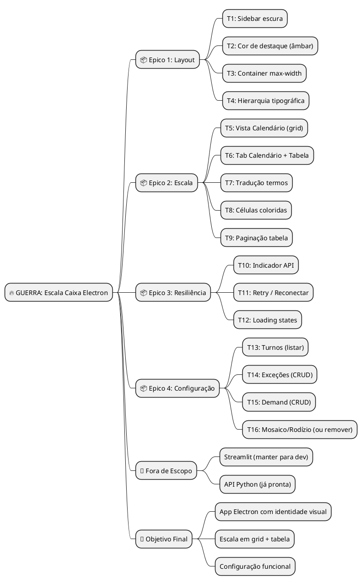
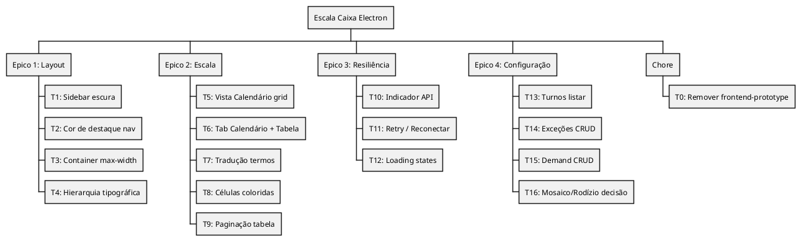
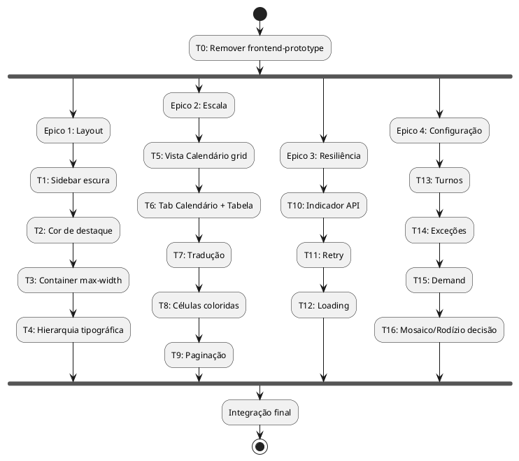

# WARLOG — Escala de Caixa Electron

> Product Owner Mode: Backlog completo, spec, plano e rastreamento.
> Data: 2026-02-12

---

## FASE 1 — VISAO GERAL

### Mind Map



### Definições

```
MISSAO: App Electron de gestão de escala de caixa com identidade visual,
        vista calendário para imprimir e resiliência à API.

OBJETIVO: RH consegue gerar escala, ver em grid/tabela, exportar e configurar
          sem esbarrar em layout genérico ou API offline sem feedback.

ESCOPO:
  ✅ FAZ PARTE:
     - Layout (sidebar escura, accent, container)
     - Escala (grid calendário, tabela, paginação)
     - Resiliência (API status, retry, loading)
     - Configuração (Turnos, Exceções, Demand)
  🚫 NÃO FAZ PARTE:
     - Reescrever API Python
     - Mosaico/Rodízio CRUD (API não expõe; seed via script)
     - Dark mode toggle (pode vir depois)

PRAZO: Sem data fixa; ordem de execução definida.
```

---

## FASE 2 — DUMP + CATEGORIZACAO

```
DUMP CATEGORIZADO:

✨ FEATURES:
- [ ] Sidebar escura (slate-900)
- [ ] Cor de destaque no nav ativo (amber)
- [ ] Vista Calendário (grid dia×colaborador)
- [ ] Tab Calendário como default
- [ ] Células coloridas por status
- [ ] Paginação na tabela de alocações
- [ ] Indicador API online/offline
- [ ] Botão Reconectar
- [ ] Skeleton/spinner durante generate
- [ ] Turnos: listar da API
- [ ] Exceções: listar + adicionar
- [ ] Demand: listar + adicionar slots

🔧 REFACTORS:
- [ ] Tradução WORK→Trabalho, FOLGA→Folga, ABSENCE→Ausência
- [ ] Container max-w-6xl no main
- [ ] Hierarquia tipográfica (H1/H2)

🧹 CHORES:
- [ ] Remover frontend-prototype (protótipo obsoleto)
- [ ] Limpar imports não usados
```

---

## FASE 3 — WBS (Work Breakdown Structure)



### Prioridade

```
🔴 NÚCLEO (sem isso não existe produto):
- T5: Vista Calendário (principal para imprimir)
- T6: Tab Calendário + Tabela
- T1: Sidebar escura
- T2: Cor de destaque

🟡 IMPORTANTE (melhora significativamente):
- T7: Tradução termos
- T8: Células coloridas
- T3: Container max-width
- T10: Indicador API
- T11: Retry
- T12: Loading
- T14: Exceções
- T15: Demand

🟢 NICE-TO-HAVE:
- T4: Hierarquia tipográfica
- T9: Paginação
- T13: Turnos
- T16: Mosaico/Rodízio
```

---

## FASE 4 — DEPENDENCIAS + SEQUENCIA

### Matriz

| Task | Depende de | Bloqueia | Paralelo? |
|------|------------|----------|-----------|
| T0  | -          | -        | -         |
| T1  | -          | -        | T2, T3    |
| T2  | -          | -        | T1, T3    |
| T3  | -          | -        | T1, T2    |
| T4  | T1, T2     | -        | -         |
| T5  | -          | T6       | -         |
| T6  | T5         | -        | -         |
| T7  | T6         | -        | T8        |
| T8  | T6         | -        | T7        |
| T9  | T6         | -        | -         |
| T10 | -          | -        | T11, T12  |
| T11 | -          | -        | T10, T12  |
| T12 | -          | -        | T10, T11  |
| T13 | -          | -        | T14, T15  |
| T14 | -          | -        | T13, T15  |
| T15 | -          | -        | T13, T14  |
| T16 | -          | -        | -         |

### Fluxo de Dependências



### Caminho Crítico

```
T0 → T5 → T6 → T7/T8 → Integração
(Remover proto → Calendário → Tabs → Tradução/Cores)
```

---

## FASE 5 — DASHBOARD DE GUERRA

```
════════════════════════════════════════════════════════════════════
🔥 GUERRA: Escala Caixa Electron
════════════════════════════════════════════════════════════════════

📊 STATUS GERAL: 5/17 tasks | 🟢 7 | 🟡 5 | 🔴 0 | ✅ 5

════════════════════════════════════════════════════════════════════
📋 BACKLOG
════════════════════════════════════════════════════════════════════

| ID  | Task                      | Tipo | Status    | Viab. | Dep.  | Est. |
|-----|---------------------------|------|-----------|-------|-------|------|
| T0  | Remover frontend-prototype| 🧹   | ✅ Done   | 🟢    | -     | P    |
| T1  | Sidebar escura            | ✨   | ✅ Done   | 🟢    | -     | P    |
| T2  | Cor de destaque nav      | ✨   | ✅ Done   | 🟢    | -     | P    |
| T3  | Container max-width      | 🔧   | ✅ Done   | 🟢    | -     | P    |
| T4  | Hierarquia tipográfica   | 🔧   | ✅ Done   | 🟢    | T1,T2 | P    |
| T5  | Vista Calendário grid    | ✨   | 📋 Backlog| 🟢    | -     | M    |
| T6  | Tab Calendário + Tabela  | ✨   | 📋 Backlog| 🟢    | T5    | M    |
| T7  | Tradução termos          | 🔧   | 📋 Backlog| 🟢    | T6    | P    |
| T8  | Células coloridas        | ✨   | 📋 Backlog| 🟢    | T6    | P    |
| T9  | Paginação tabela         | ✨   | 📋 Backlog| 🟢    | T6    | M    |
| T10 | Indicador API            | ✨   | 📋 Backlog| 🟢    | -     | P    |
| T11 | Retry / Reconectar       | ✨   | 📋 Backlog| 🟢    | -     | P    |
| T12 | Loading states           | ✨   | 📋 Backlog| 🟢    | -     | P    |
| T13 | Turnos listar            | ✨   | 📋 Backlog| 🟢    | -     | P    |
| T14 | Exceções CRUD            | ✨   | 📋 Backlog| 🟢    | -     | M    |
| T15 | Demand CRUD              | ✨   | 📋 Backlog| 🟢    | -     | M    |
| T16 | Mosaico/Rodízio decisão  | 🔍   | 📋 Backlog| 🟡    | -     | P    |

════════════════════════════════════════════════════════════════════
```

---

## FASE 6 — RFE (Tasks Complexas)

### RFE: T5 — Vista Calendário Grid

```
════════════════════════════════════════════════════════════════════
🔍 RFE: T5 - Vista Calendário (grid dia×colaborador)
════════════════════════════════════════════════════════════════════

GATILHO:
└── Usuário na EscalaPage, com assignments carregados

TRILHA DE EXECUCAO:
└── assignments (API) → agrupar por work_date →
    pivot: linhas=datas, colunas=colaboradores →
    célula = status + shift_code →
    renderizar <table> com classes por status

DADOS:
└── Entrada: assignments[] { work_date, employee_id, status, shift_code }
    Processamento: groupBy date, map employee→cell
    Saída: matrix[date][employee] = { status, shift }

CONFLITOS POSSÍVEIS:
└── ❌ assignments vazio → mostrar "Execute Atualizar escala"
    ❌ datas fora de ordem → sort por work_date
    ❌ colaboradores diferentes por dia → union de todos employee_id

CRITÉRIO DE DONE:
└── [ ] Grid renderiza com datas em linhas
    [ ] Colunas = colaboradores (ordenados)
    [ ] Célula mostra FOL/CAI1/DOM/AUS conforme status
    [ ] Cores: verde trabalho, âmbar folga, azul domingo, vermelho ausência
```

### RFE: T14 — Exceções CRUD

```
════════════════════════════════════════════════════════════════════
🔍 RFE: T14 - Exceções CRUD
════════════════════════════════════════════════════════════════════

GATILHO:
└── Usuário na ConfiguracaoPage, aba Exceções

TRILHA:
└── GET /exceptions → listar tabela →
    Form (employee_id, data, tipo) → POST /exceptions →
    reload list

API JÁ EXISTE: GET/POST /exceptions

CRITÉRIO DE DONE:
└── [ ] Lista exceções do período
    [ ] Form adicionar (employee, data, tipo: VACATION|MEDICAL_LEAVE|SWAP|BLOCK)
    [ ] Após criar, lista atualiza
```

---

## FASE 7 — TIMELINE (Gantt)

```plantuml
@startgantt
title Timeline Escala Caixa Electron

Project starts 2026-02-12

-- Sprint 1: Limpeza + Layout --
[T0: Remover prototype] lasts 0 days
[T1: Sidebar escura] lasts 1 day
[T2: Cor destaque] lasts 1 day
[T2] starts at [T1]'s end
[T3: Container] lasts 1 day
[T3] starts at [T1]'s end
[T4: Tipografia] lasts 1 day
[T4] starts at [T2]'s end

-- Sprint 2: Escala --
[T5: Vista Calendário] lasts 2 days
[T5] starts at [T0]'s end
[T6: Tab Calendário+Tabela] lasts 1 day
[T6] starts at [T5]'s end
[T7: Tradução] lasts 1 day
[T7] starts at [T6]'s end
[T8: Células coloridas] lasts 1 day
[T8] starts at [T6]'s end
[T9: Paginação] lasts 1 day
[T9] starts at [T6]'s end

-- Sprint 3: Resiliência --
[T10: Indicador API] lasts 1 day
[T10] starts at [T0]'s end
[T11: Retry] lasts 1 day
[T11] starts at [T10]'s end
[T12: Loading] lasts 1 day
[T12] starts at [T10]'s end

-- Sprint 4: Configuração --
[T13: Turnos] lasts 1 day
[T13] starts at [T0]'s end
[T14: Exceções] lasts 2 days
[T14] starts at [T13]'s end
[T15: Demand] lasts 2 days
[T15] starts at [T13]'s end
[T16: Mosaico decisão] lasts 1 day
[T16] starts at [T14]'s end

@endgantt
```

### Milestones

```
📍 MILESTONES:

M1: Limpeza + Layout (T0, T1–T4) — identidade visual
M2: Escala completa (T5–T9) — grid + tabela + tradução
M3: Resiliência (T10–T12) — API status + retry + loading
M4: Configuração (T13–T16) — Turnos, Exceções, Demand
```

---

## FASE 8 — LOG + RECALIBRAÇÃO

```
════════════════════════════════════════════════════════════════════
📜 LOG DE GUERRA
════════════════════════════════════════════════════════════════════

[2026-02-12] INÍCIO
└── Guerra iniciada: Escala Caixa Electron
    Objetivo: Layout + Escala grid + Resiliência + Config
    Spec: ANALYST_REVISAO_ELECTRON_ESCALA_CAIXA.md
    Backlog: 17 tasks

[2026-02-12] CHORE ✅
└── T0: Remover frontend-prototype — CONCLUÍDO
    Motivo: Sistema limpo, protótipo obsoleto

[2026-02-12] LAYOUT ✅
└── T1: Sidebar escura — CONCLUÍDO
    bg-slate-900, nav amber-600 ativo, ícones lucide

[2026-02-12] LAYOUT ✅
└── T3: Container max-width — CONCLUÍDO
    main com max-w-6xl mx-auto
└── T4: Hierarquia tipográfica — CONCLUÍDO
    h1 text-2xl font-semibold em todas as páginas

════════════════════════════════════════════════════════════════════
```

### Recalibração

```
RECALIBRAÇÃO [2026-02-12]:

PROGRESSO:
├── Tasks concluídas: T0, T1
├── Tasks em andamento: 0
└── Tasks bloqueadas: 0

DESBLOQUEIOS:
└── Nenhum; todas tasks iniciais podem iniciar (exceto T4 que depende de T1,T2)

NOVOS ITENS:
└── Nenhum

⚡ PRÓXIMO PASSO IMEDIATO:
└── T2: Já integrado em T1 (amber no nav ativo)
    T3: Container max-width no main
```

---

## RESUMO DA SPEC (referência)

| Doc | Conteúdo |
|-----|----------|
| FLUXO_USUARIO.md | Jornada do RH |
| DADOS_E_REVISAO_SISTEMA.md | Fixtures, processados, gaps |
| ANALYST_REVISAO_ELECTRON_ESCALA_CAIXA.md | Gaps, layout, roadmap |
| AUDITORIA_PRE_NEXT.md | Endpoints API |
| BUILD_ARQUITETURA_MOTOR_COMPLIANCE_ESCALA_CAIXA.md | Motor de compliance |

---

## CHECKLIST DE IMPLEMENTAÇÃO (por task)

| ID | Critério de Done |
|----|------------------|
| T0 | ✅ frontend-prototype/ removido |
| T1 | ✅ Sidebar: bg-slate-900, texto stone-100, nav amber |
| T2 | Nav ativo: bg-amber-600 ou amber-600/90 |
| T3 | ✅ Main: max-w-6xl mx-auto no container |
| T4 | ✅ H1 text-2xl font-semibold em páginas |
| T5 | Grid: linhas=datas, colunas=colaboradores, célula=status |
| T6 | Tabs: Calendário (default) + Tabela |
| T7 | WORK→Trabalho, FOLGA→Folga, ABSENCE→Ausência |
| T8 | Células: verde work, âmbar folga, azul DOM, vermelho ausência |
| T9 | Tabela com paginação (ex: 20 por página) |
| T10 | Badge "Conectado" verde ou "API offline" vermelho |
| T11 | Botão "Reconectar" quando fetch falha |
| T12 | Spinner ou skeleton durante scale.generate |
| T13 | GET /shifts → tabela turnos |
| T14 | GET/POST /exceptions → listar + form adicionar |
| T15 | GET/POST /demand-profile → listar + form adicionar |
| T16 | Tab Mosaico/Rodízio: conteúdo ou remover |
