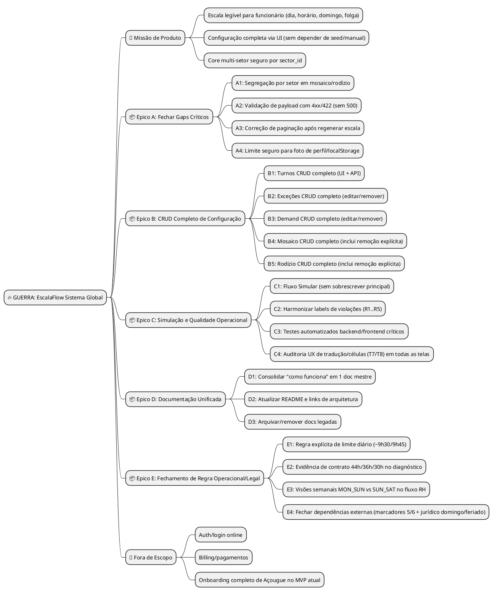
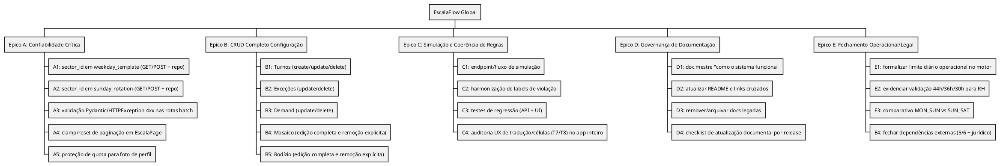
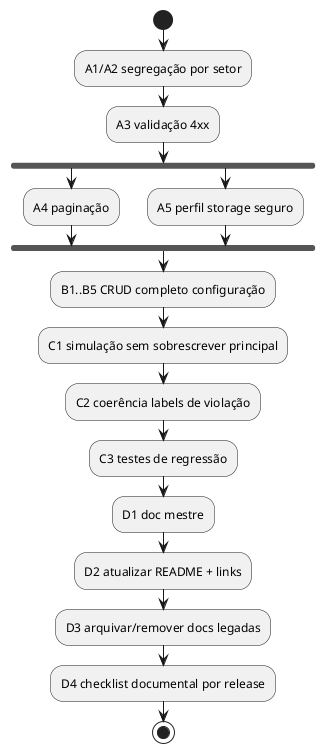
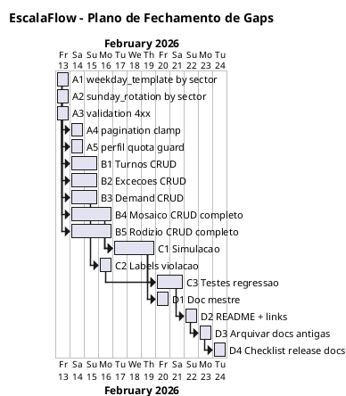

# WARLOG — EscalaFlow Sistema Global (MVP Caixa + Evolução)

> Product Owner Mode (execução contínua)  
> Data base: 2026-02-12  
> Fonte de contexto: `docs/SISTEMA_ESCALAFLOW.md`, `docs/BUILD_ARQUITETURA_MOTOR_COMPLIANCE_ESCALA_CAIXA.md`, review técnico atual.

---

## FASE 1 — VISÃO GERAL

### Mind Map



### Definições

```
MISSAO:
Entregar um sistema de escala de caixa que funcione de ponta a ponta em produção
local/offline, com configuração completa pela UI e saída legível para operação.

OBJETIVO (MÉTRICA DE VITÓRIA):
- 100% dos itens de configuração do piloto Caixa com CRUD via UI (sem seed manual)
- 0 endpoint crítico retornando 500 por erro de validação de cliente
- Segregação por sector_id aplicada nos fluxos de mosaico/rodízio
- Doc operacional única e atualizada para setup + fluxo + arquitetura + backlog

ESCOPO:
✅ FAZ PARTE:
- Backend FastAPI e frontend Electron/React atuais
- Correções de confiabilidade, clareza e completude de produto
- Unificação documental e limpeza de legado

🚫 NÃO FAZ PARTE:
- Reescrever stack
- SaaS cloud com autenticação e cobrança
```

---

## FASE 2 — DUMP + CATEGORIZAÇÃO

```
DUMP CATEGORIZADO

🐛 BUGS
- [ ] API de rodízio pode retornar 500 em payload inválido
- [ ] Paginação pode ficar em página inválida após nova geração
- [ ] Perfil com imagem grande pode falhar em localStorage
- [ ] Labels de regra podem divergir entre engine e apresentação

✨ FEATURES
- [ ] Turnos com CRUD completo na UI
- [ ] Exceções com editar/remover
- [ ] Demand com editar/remover
- [ ] Mosaico com edição completa e persistência segura por setor
- [ ] Rodízio com edição completa e persistência segura por setor
- [ ] Simulação de escala sem sobrescrever resultado principal
- [ ] Comparativo semanal MON_SUN vs SUN_SAT para RH
- [ ] Regra explícita de limite diário operacional (~9h30/9h45)

🔧 REFACTORS
- [ ] Isolar por sector_id no repositório de mosaico/rodízio (sem delete global)
- [ ] Padronizar contratos de API (schemas explícitos para batch)
- [ ] Organizar camada de apresentação para reduzir lógica de estado acoplada

📚 DOCS
- [ ] Consolidar documentação operacional e técnica em trilha única
- [ ] Atualizar WARLOG para refletir estado real do código
- [ ] Registrar política de "doc única ativa + docs legadas arquivadas"
- [ ] Evidenciar no doc a validação por contrato (44h/36h/30h) e decisões pendentes de negócio

🔍 RESEARCH
- [ ] Estratégia de armazenamento de foto local (compressão e fallback)
- [ ] Melhor formato de simulação (endpoint dedicado vs flag em /scale/generate)
- [ ] Fechar semântica operacional dos marcadores `5/6` com Product/RH
- [ ] Validar regra jurídica domingo/feriado (CCT/CNAE + vigência)

🧹 CHORES
- [ ] Limpar referências antigas (`api/`, `electron-app/`) em docs/especificações
- [ ] Arquivar/remover docs legadas já substituídas
```

---

## FASE 3 — WBS (WORK BREAKDOWN STRUCTURE)



### Prioridade

```
🔴 NÚCLEO
- A1, A2, A3
- B1..B5

🟡 IMPORTANTE
- C1, C2, C3
- D1, D2

🟢 NICE-TO-HAVE
- D3, D4 (após estabilidade de conteúdo)
```

---

## FASE 4 — DEPENDÊNCIAS + SEQUÊNCIA

### Matriz de Dependências

| Task | Depende de | Bloqueia | Pode paralelo? |
|---|---|---|---|
| A1 | - | B4 | A2 |
| A2 | - | B5 | A1 |
| A3 | - | C3 | A1/A2 |
| A4 | - | - | A5 |
| A5 | - | - | A4 |
| B1 | A3 | C1 | B2/B3 |
| B2 | A3 | C1 | B1/B3 |
| B3 | A3 | C1 | B1/B2 |
| B4 | A1 | C1 | B5 |
| B5 | A2 | C1 | B4 |
| C1 | B1..B5 | D1 | C2 |
| C2 | - | D1 | C1 |
| C3 | A3 + B1..B5 | D2,E1,E2 | C4 |
| C4 | C2 | D1 | C3 |
| D1 | C1 + C2 + C4 | D2 | - |
| D2 | C3 + D1 | D3 | - |
| D3 | D2 | - | D4 |
| D4 | D3 | - | - |
| E1 | C3 | E4 | E2 |
| E2 | C3 | E3,E4 | E1 |
| E3 | E2 | D1 | - |
| E4 | E1 + E2 | D1 | - |

### Fluxo (Activity)



### Caminho Crítico

```
A1/A2 → B4/B5 → B1..B5 completo → C1/C2 → C3/C4 → E1/E2 → D1/D2
```

---

## FASE 5 — DASHBOARD DE GUERRA

```
════════════════════════════════════════════════════════════════════
🔥 GUERRA: EscalaFlow Sistema Global
════════════════════════════════════════════════════════════════════

📊 STATUS GERAL: 21/22 pendências executadas nesta rodada

════════════════════════════════════════════════════════════════════
📋 BACKLOG OPERACIONAL
════════════════════════════════════════════════════════════════════

| ID  | Task                                      | Tipo | Status | Viab. | Dep.   | Est. |
|-----|-------------------------------------------|------|--------|-------|--------|------|
| A1  | Segregar weekday_template por sector_id   | 🔧   | ✅     | 🟢    | -      | M    |
| A2  | Segregar sunday_rotation por sector_id    | 🔧   | ✅     | 🟢    | -      | M    |
| A3  | Validar payload e responder 4xx/422       | 🐛   | ✅     | 🟢    | -      | P    |
| A4  | Clamp/reset paginação Escala              | 🐛   | ✅     | 🟢    | -      | P    |
| A5  | Proteção quota/localStorage no Perfil     | 🐛   | ✅     | 🟢    | -      | P    |
| B1  | Turnos CRUD completo                      | ✨   | ✅     | 🟢    | A3     | M    |
| B2  | Exceções update/delete                    | ✨   | ✅     | 🟢    | A3     | M    |
| B3  | Demand update/delete                      | ✨   | ✅     | 🟢    | A3     | M    |
| B4  | Mosaico CRUD completo                     | ✨   | ✅     | 🟢    | A1     | G    |
| B5  | Rodízio CRUD completo                     | ✨   | ✅     | 🟢    | A2     | G    |
| C1  | Simular escala sem sobrescrever principal | ✨   | ✅     | 🟢    | B*     | G    |
| C2  | Harmonizar labels de violação             | 🔧   | ✅     | 🟢    | -      | P    |
| C3  | Testes regressão backend/frontend         | 🧹   | ✅     | 🟢    | A3,B*  | G    |
| C4  | Auditoria UX tradução/células (T7/T8)     | 🔧   | ✅     | 🟢    | C2     | M    |
| D1  | Doc mestre unificada                      | 📚   | ✅     | 🟡    | C1,C2  | M    |
| D2  | README e links cruzados                   | 📚   | ✅     | 🟢    | C3,D1  | P    |
| D3  | Arquivar/remover docs legadas             | 🧹   | ✅     | 🟢    | D2     | P    |
| D4  | Checklist documental por release          | 📚   | ✅     | 🟢    | D3     | P    |
| E1  | Regra limite diário (9h30/9h45)           | ✨   | ✅     | 🟡    | C3     | M    |
| E2  | Evidência contrato 44h/36h/30h            | 🔧   | ✅     | 🟡    | C3     | M    |
| E3  | Visões MON_SUN vs SUN_SAT (RH)            | ✨   | ✅     | 🟡    | E2     | G    |
| E4  | Fechar 5/6 + jurídico domingo/feriado     | 📚   | 🔍     | 🟡    | E1,E2  | M    |

════════════════════════════════════════════════════════════════════
```

---

## FASE 6 — RFE (RASTREAMENTO FORENSE) DAS TASKS COMPLEXAS

### RFE C1 — Simulação sem sobrescrever escala principal

```
GATILHO:
└── RH clica em "Simular período"

TRILHA:
└── UI Simular -> POST /scale/simulate -> Orchestrator run(simulate_mode)
    -> gera assignments/violations temporários -> retorna payload
    -> UI mostra preview + diff vs última escala oficial

DADOS:
└── Entrada: period_start, period_end, sector_id, policy/version
   Processamento: execução sem escrita nos CSV oficiais
   Saída: preview_assignments, preview_violations, summary

CONFLITOS:
└── ❌ Simulação sobrescrever arquivos oficiais
   ❌ Divergência entre preview e geração oficial

CRITÉRIO DONE:
└── [ ] Simulação não altera `data/processed/...` oficial
   [ ] Preview reproduzível para mesmo input
   [ ] Botão "Aplicar como oficial" explícito (opcional fase 2)
```

### RFE B4/B5 — CRUD completo Mosaico/Rodízio com isolamento por setor

```
GATILHO:
└── Gestor abre Configuração e altera escalas base

TRILHA:
└── UI -> API batch (com sector_id obrigatório) -> repo scoped update
   -> commit transacional -> reload UI

DADOS:
└── Entrada: lista de linhas + sector_id
   Processamento: validação schema + replace/merge scoped
   Saída: estado atualizado daquele setor

CONFLITOS:
└── ❌ delete global afetando outros setores
   ❌ payload parcial apagando dados sem confirmação

CRITÉRIO DONE:
└── [ ] Query/insert/delete sempre filtrado por sector_id
   [ ] Teste automático cobrindo isolamento multi-setor
   [ ] UI impede salvar payload inválido
```

### RFE E1/E2/E3 — Fechamento operacional para uso real do RH

```
GATILHO:
└── RH precisa fechar escala respeitando jornada diária, contrato e visão semanal oficial

TRILHA:
└── Motor valida limite diário + meta contratual -> API retorna evidências claras
   -> UI apresenta diagnósticos legíveis -> RH alterna visão MON_SUN/SUN_SAT

DADOS:
└── Entrada: contrato (44/36/30), minutos por dia, semana oficial
   Processamento: regras legais/operacionais + comparação de cortes semanais
   Saída: violações explicáveis e decisão operacional segura

CONFLITOS:
└── ❌ Escala tecnicamente "válida" mas inviável para a operação real
   ❌ Sem consenso de corte semanal ou semântica 5/6
   ❌ Falta de lastro jurídico para domingo/feriado

CRITÉRIO DONE:
└── [x] Limite diário operacional formalizado e auditável no motor
   [x] Contrato 44/36/30 visível no diagnóstico de conformidade
   [x] RH consegue comparar MON_SUN vs SUN_SAT na prática
   [ ] Dependências externas (5/6 + jurídico) documentadas como resolvidas

### RFE E4 (continuidade operacional) — Modo Normal/Estrito sem travar operação

```
GATILHO:
└── Operação não pode parar na hora H, mas não pode aceitar impossível lógico.

TRILHA:
└── UI chama preflight -> backend classifica em LOGIC_HARD e LEGAL_SOFT
   -> LOGIC_HARD bloqueia (422) em qualquer modo
   -> LEGAL_SOFT alerta em NORMAL, e em ESTRITO exige ACK com motivo (409 se faltar)
   -> ACK aprovado grava evento de auditoria e segue geração/simulação

DADOS:
└── Entrada: período + setor + modo runtime + risk_ack (quando exigido)
   Processamento: preflight unificado + gate de execução compartilhado
   Saída: blockers, critical_warnings, can_proceed, ack_required, trilha auditável

CONFLITOS:
└── ❌ Travar operação por risco legal sem alternativa operacional controlada
   ❌ Permitir seguir sem justificativa em modo estrito
   ❌ Falta de rastreabilidade (quem assumiu risco, quando e por quê)

CRITÉRIO DONE:
└── [x] Endpoint `POST /scale/preflight` ativo e integrado à UI
   [x] `generate/simulate` com gate único: 422 (lógico), 409 (ack ausente), 200 (ack válido)
   [x] Runtime mode configurável (`GET/PATCH /config/runtime-mode`)
   [x] Trilha de auditoria persistida (`GET /config/governance/audit`)
   [ ] Decisão externa final de negócio/jurídico registrada na governança E4
```

---

## FASE 7 — TIMELINE (GANTT)



### Milestones

```
M1: Core confiável (A1..A5)
M2: Configuração completa (B1..B5)
M3: Simulação + testes (C1..C3)
M4: Governança documental final (D1..D4)
```

---

## FASE 8 — LOG CRONOLÓGICO + RECALIBRAÇÃO

```
[2026-02-12 23:00] INICIO
└── WARLOG global criado para fechar gaps técnicos e de produto.

[2026-02-12 23:05] BASELINE
└── Spec 001 sincronizado como concluído; revisão identificou riscos críticos
   em isolamento por setor, validação e completude de CRUD.

[2026-02-12 23:10] REPLANEJAMENTO
└── Backlog reorganizado em 4 épicos (A/B/C/D), com caminho crítico e
   dependências explícitas.

[2026-02-12 21:00] EXECUÇÃO ESCOPO A
└── A1..A5 concluídos no código:
   - isolamento por setor em mosaico/rodízio
   - validação 4xx/422
   - clamp de paginação
   - proteção de quota no perfil

[2026-02-12 21:05] AMBIENTE
└── Dependências Python instaladas em `.venv` via `requirements.txt`.

[2026-02-12 21:10] PRÓXIMA FASE
└── Início do Epico B com B1 (Turnos CRUD completo).

[2026-02-12 21:20] B1 CONCLUÍDO
└── CRUD de turnos implementado ponta-a-ponta:
   - API: POST/PATCH/DELETE em `/shifts`
   - Repositório: upsert/delete por setor
   - UI Configuração: criar, editar e remover turnos

[2026-02-12 21:35] B2/B3 CONCLUÍDOS
└── Exceções e Demanda com update/delete ponta-a-ponta:
   - API: PATCH/DELETE em `/exceptions` e `/demand-profile`
   - Repositório: remove com retorno booleano e validação 404
   - UI Configuração: editar/remover nas tabelas + cancelar edição
   - Validação real via curl para create/update/delete

[2026-02-12 21:45] B4/B5 CONCLUÍDOS
└── Mosaico e Rodízio com CRUD explícito na UI:
   - Mosaico: limpar linha por colaborador + limpar mosaico inteiro + salvar batch
   - Rodízio: editar/remover linhas locais + salvar batch
   - Mantido isolamento por `sector_id` na persistência existente

[2026-02-12 21:55] C2 CONCLUÍDO
└── Labels de violação harmonizadas no endpoint `/scale/violations`:
   - Mapeamento alinhado aos códigos reais do motor (R2_MIN..., R4_WEEKLY_TARGET, R5...)
   - Compatibilidade com códigos legados preservada
   - Normalização com `strip()` para eliminar `rule_label` nulo por sujeira no CSV

[2026-02-12 22:05] C1 CONCLUÍDO
└── Simulação sem sobrescrever oficial implementada:
   - API: `POST /scale/simulate` com preview de assignments/violations
   - Orchestrator: modo `persist_results=False` para não salvar CSV/HTML oficiais
   - UI Escala: botão "Simular período", badge/aviso de preview e alternância para oficial
   - Validação: hash de `final_assignments.csv` idêntico antes/depois da simulação

[2026-02-12 22:20] PIT STOP DOCUMENTAL (LEGACY vs WARLOG)
└── Revisão cruzada com fontes legacy/BUILD:
   - Confirmado: B2..B5, C1 e C2 já estão concluídos (ajuste no doc mestre)
   - Adicionado backlog faltante para fechamento real de operação:
     * limite diário operacional (~9h30/9h45)
     * evidência por contrato (44h/36h/30h)
     * visões MON_SUN vs SUN_SAT
     * pendências externas (marcadores 5/6 + jurídico domingo/feriado)
   - Adicionado C4 para auditoria final T7/T8 no app inteiro

[2026-02-12 22:35] C3 PARCIAL (backend)
└── Regressão automatizada inicial adicionada e validada:
   - `tests/test_scale_labels.py` (mapeamento labels atuais + legado)
   - `tests/test_scale_simulate_endpoint.py` (contrato preview sem persistência)
   - `pytest`: 3 passed

[2026-02-12 22:45] C3 CONCLUÍDO (frontend + backend)
└── Cobertura crítica de integração adicionada:
   - Frontend: `apps/frontend/src/renderer/pages/EscalaPage.test.tsx`
     (oficial ↔ simulação, render de alerta e toggle de preview)
   - Infra de testes frontend: Vitest + Testing Library (`npm run test`)
   - Backend: `pytest` verde com regressão de labels e simulate
   - Build frontend validado após inclusão de testes

[2026-02-12 22:55] C4 CONCLUÍDO
└── Auditoria transversal de UX técnica/didática:
   - Tradução de status validada com teste automatizado (`format.test.ts`)
   - Harmonização de label legado `R4_DEMAND_COVERAGE` para "Cobertura insuficiente"
   - Smoke da Escala cobre alternância oficial/simulação e alertas legíveis

[2026-02-12 18:40] E1/E2 CONCLUÍDOS
└── Fechamento operacional/contratual implementado e validado:
   - Motor: nova regra `R6_MAX_DAILY_MINUTES` com limites em policy
     (`max_daily_minutes_operational=585`, `max_daily_minutes_hard=600`)
   - Diagnóstico semanal: `R4_WEEKLY_TARGET` agora inclui `contract_code`
     no `detail` e no campo `evidence` para rastreabilidade RH
   - API/UI: mapeamento de label de `R6_MAX_DAILY_MINUTES`
   - Regressão: `pytest` e `vitest` verdes após adição de testes específicos

[2026-02-12 18:55] E3 CONCLUÍDO + E4 INSTRUMENTADO
└── Comparativo semanal operacional implementado ponta-a-ponta:
   - API: `POST /scale/weekly-analysis` (modo OFFICIAL/SIMULATION)
   - Cálculo paralelo por janela `MON_SUN` e `SUN_SAT` no mesmo dataset diário
   - UI Escala: tabela comparativa por colaborador/semana/contrato/meta/delta
   - E4: pendências externas agora são detectadas e exibidas (marcadores 5/6 UNKNOWN e CCT placeholder)
   - Regressão: novos testes backend de helpers de análise semanal e dependências

[2026-02-12 19:00] E4 GOVERNANÇA OPERACIONAL IMPLEMENTADA (PENDÊNCIA EXTERNA MAPEADA)
└── Camada de fechamento criada para decisão final:
   - API: `GET/PATCH /config/governance` para editar semântica 5/6, CCT e validação jurídica
   - UI Configuração: aba "Governança E4" com formulário e lista de pendências abertas
   - Weekly Analysis: agora reflete o estado jurídico/configurado em tempo real
   - Status E4 mantém 🔍 até confirmação externa (jurídico/negócio)

[2026-02-12 19:10] E4 MODO FECHAMENTO ATIVADO
└── Endurecimento de robustez para produção:
   - Default recomendado aplicado via API (`POST /config/governance/apply-defaults`)
     para preencher marcadores `5/6` quando estiverem `UNKNOWN`
   - Modo estrito em runtime (`ESCALAFLOW_ENV=production` ou
     `ESCALAFLOW_STRICT_GOVERNANCE=true`) bloqueia `generate/simulate`
     se houver pendências E4
   - Checklist de aceite final adicionado em `config/governance` e exibido na UI
   - Regressão adicional cobrindo defaults + bloqueio estrito em produção

[2026-02-12 19:25] E4 REFINO VISUAL/UX (GOVERNANÇA)
└── Polimento da aba Governança E4 para operação:
   - Header com ações rápidas: recarregar estado e aplicar defaults 5/6
   - Resumo visual de progresso do checklist (x/y) com mensagem de modo estrito
   - Melhoria de acessibilidade com `Label htmlFor` + `id` nos campos de governança
   - Tabela de checklist com legenda contextual para leitura de release

[2026-02-12 19:35] VALIDAÇÃO RUNTIME E4 (MODO ESTRITO) CONCLUÍDA
└── Prova operacional executada com API em `ESCALAFLOW_STRICT_GOVERNANCE=true`:
   - Com pendências abertas: `POST /scale/simulate` retornou `422` (bloqueio esperado)
   - Com pendências zeradas: `POST /scale/simulate` retornou `200` (liberação esperada)
   - Governança restaurada ao estado original após teste (sem forçar decisão jurídica)

[2026-02-12 19:45] E4 CONTINUIDADE OPERACIONAL IMPLEMENTADA (NORMAL/ESTRITO COM ACK)
└── Ajuste estrutural para operação robusta sem travar usuário:
   - Backend:
     * `POST /scale/preflight` com classificação `LOGIC_HARD` vs `LEGAL_SOFT`
     * Gate unificado em `generate/simulate`:
       - `422` para impossível lógico
       - `409` quando modo estrito exige ACK e motivo não foi informado
       - `200` quando ACK é informado e auditoria é registrada
     * Novos endpoints: `GET/PATCH /config/runtime-mode` e `GET /config/governance/audit`
     * Persistência SQLite de auditoria (`governance_audit_events`)
   - Frontend:
     * Escala: preflight antes de executar, banner de risco legal, bloqueio visual de lógico
     * Modal "Continuar com risco" com motivo obrigatório em modo estrito
     * Configuração: seletor NORMAL/ESTRITO + painel de trilha de auditoria
   - Qualidade:
     * `pytest`: 14 passed
     * `vitest`: 5 passed
     * `npm run build`: ok

[2026-02-12 20:00] PACOTE D1..D4 CONCLUÍDO (CONSOLIDAÇÃO DOCUMENTAL)
└── Governança documental fechada para release:
   - D1: `docs/SISTEMA_ESCALAFLOW.md` consolidado com fluxo de preflight,
     modos NORMAL/ESTRITO, ACK e trilha de auditoria
   - D2: `README.md` alinhado para warlog global + política documental
   - D3: legado explicitamente arquivado para rastreabilidade
     (`docs/WARLOG_ESCALA_CAIXA_ELECTRON.md` marcado como histórico)
   - D4: checklist por release reforçado em `docs/POLITICA_DOCUMENTACAO.md`
     para mudanças de governança/runtime

[2026-02-12 20:20] PRESET JSON ÚNICO DE SEED (SUPERMERCADO FERNANDES)
└── Seed consolidado e limpeza de legado de dados:
   - Novo arquivo canônico: `data/fixtures/seed_supermercado_fernandes.json`
   - `scripts/seed.py` reescrito para consumir JSON único (sem parser CSV legado)
   - Seed agora inclui:
     * setor, contratos 44h/36h/30h, colaboradores e ranking operacional
     * turnos, mosaico semanal, rodízio de domingos e folgas compensatórias
     * preferências/exceções de exemplo para homologação
     * patch de governança na policy (CCT draft Fernandes, semântica 5/6, limites operacionais)
   - Limpeza de artefatos old:
     * removidos CSVs antigos de `data/fixtures/`
     * removidos outputs antigos de `data/processed/real_scale_cycle/`
     * removido `data/compliance_engine.db` para recriação limpa via seed
   - Importante: preset não bloqueia customização; cliente continua alterando tudo via UI (CRUD)
```

### Recalibração atual

```
PROGRESSO:
- Concluído: implementação base do MVP (spec 001) + Escopo A (A1..A5)
- Concluído: B1..B5 (CRUD de Configuração completo no Caixa)
- Concluído: C2 (labels de violação)
- Concluído: C1 (simulação sem overwrite)
- Concluído: C3
- Concluído: C4
- Concluído: E1
- Concluído: E2
- Concluído: E3
- Concluído: D1
- Concluído: D2
- Concluído: D3
- Concluído: D4
- E4: framework técnico concluído (preflight, modo runtime, ack e auditoria),
  pendente decisão externa de negócio/jurídico para fechamento total
- Pendente: E4

DESBLOQUEIOS:
- A1/A2 liberam B4/B5 sem risco de cross-sector
- A3 libera CRUD seguro com feedback correto de erro

NOVOS ITENS:
- C1 (Simulação) promovido para prioridade de produto
- D4 (checklist de release documental) criado para evitar nova divergência

⚡ PRÓXIMO PASSO IMEDIATO:
1) Fechar decisão externa E4 na governança (semântica 5/6, CCT vigente, validação legal)
2) Executar smoke final com cenário real (NORMAL e ESTRITO com ACK) e registrar evidência no WARLOG
3) Encerrar E4 no warlog com status ✅ após validação externa (jurídico/negócio)

🔗 CONEXÃO COM O QUE JÁ FOI FEITO:
- E1/E2/E3 já garantem consistência operacional (limite diário, contrato, janelas semanais)
- E4 agora controla risco legal sem quebrar continuidade operacional
- D1..D4 já formam a camada de fechamento documental para operação assistida e governada em produção
```

---

## Decisão sobre documentação legada (política)

1. **Doc mestre funcional/técnico**: manter `docs/SISTEMA_ESCALAFLOW.md` como referência operacional.
2. **Arquitetura detalhada**: manter `docs/BUILD_ARQUITETURA_MOTOR_COMPLIANCE_ESCALA_CAIXA.md`.
3. **Warlog ativo**: este arquivo passa a ser o backlog mestre de melhoria contínua.
4. **Docs antigas**:
   - Arquivar em `docs/archive/` se tiver valor histórico.
   - Remover do índice principal e do README.
   - Manter apenas o mínimo necessário para rastreabilidade.

